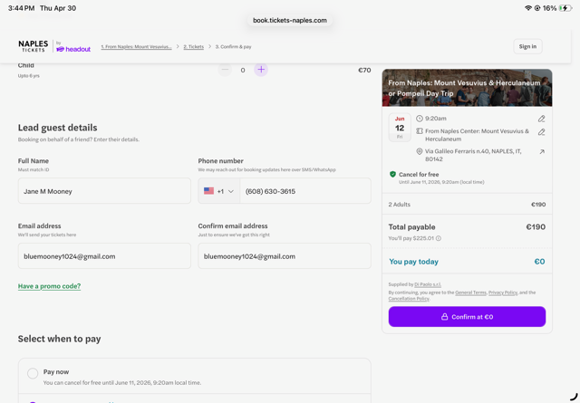
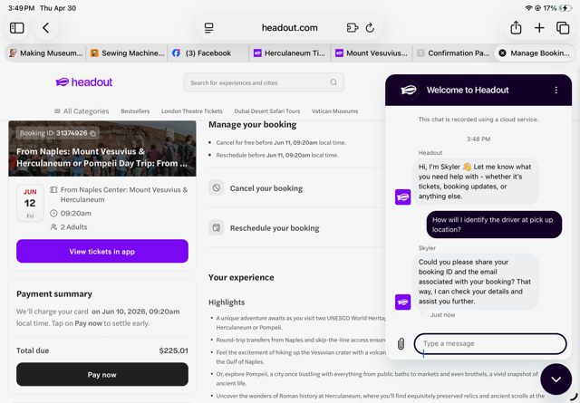

## Overview

**Confirmed booking: From Naples — Mount Vesuvius & Herculaneum Day Trip**

::: {.callout-important}
## Tour Logistics

| | |
|---|---|
| **Provider** | Naples Tickets by Headout |
| **Booking Reference** | #31374926 |
| **Meet** | 9:20 AM — Via Galileo Ferraris n.40, Naples IT 80142 (Naples Center) |
| **Free cancellation** | Until 9:20 AM, June 11, 2026 |
:::

::: {.layout-ncol=2}

:::

---

## Morning/Day: Herculaneum & Vesuvius Tour

Check your tour confirmation for the exact schedule. A typical Herculaneum + Vesuvius day:

**Herculaneum ruins (2–3 hours)**

Herculaneum was buried under a 20-meter lava flow when Vesuvius erupted in 79 AD — which preserved far more than Pompeii's ash burial.

| Site | Why It Matters |
|------|----------------|
| **The Boat Houses** | 300 skeletons of people who fled to the shore — the most emotionally powerful moment on the site |
| **House of Neptune & Amphitrite** | Vivid blue-and-gold mosaics, astonishingly preserved |
| **Casa dei Cervi** | Elite villa with original frescoes and garden statues |
| **Thermopolium** | Ancient fast-food counter with food residue still identifiable |
| **Wooden structures** | Actual original wood — doors, furniture, beams — impossible at Pompeii |

**Mount Vesuvius (1–1.5 hours)**

Drive up the volcano, then hike ~30 minutes to the crater rim. Looking down into the crater and back across the bay to Naples — this is the source of the destruction you just walked through.

- Wear sturdy shoes — the path is volcanic gravel
- Bring water and layers (wind at the top)
- Views of Naples, the bay, and Capri on clear days

---

## Afternoon: Optional (If Tour Ends Early)

If the tour finishes with time to spare before dinner:

- **Cappella Sansevero** — The Veiled Christ. Book timed entry in advance; €9; 30–45 min. Near Piazza San Domenico Maggiore.
- **MANN Museum** — Now that you've seen Herculaneum, the objects have context. €18; 2–3 hours; metro to Museo stop.
- **Rest** — A long day in the ruins and on the volcano earns a rest.

---

## Evening: Farewell Naples (7–10 PM)

::: {.callout-tip}
## Tonight: Concettina ai Tre Santi — Farewell Naples Pizza

**Rated #2 in Naples.** Confirm your reservation via the web form if not already done.

| | |
|---|---|
| **Address** | Via Arena della Sanità 137/bis, Rione Sanità |
| **Dinner hours** | 19:30 onwards; confirmed open until 23:30 (Fri) |
| **Getting there** | ~20 min taxi from Airbnb |
| **What to order** | Margherita — or explore the seasonal menu |

→ [Full Naples Pizza Guide](../research/naples-pizza.qmd)
:::

**After Dinner:**
- Final sfogliatella or pastiera (traditional Naples cake)
- Evening stroll
- **Pack tonight for Saturday's departure**

---

## Prepare for Tomorrow

**Saturday — Fly Naples → Rome → Brindisi (Day 9):**

- [ ] **Pack completely tonight** — bags closed and ready by morning
- [ ] Airbnb checkout: **10:00 AM SHARP** — hard checkout, no extensions
- [ ] Flight details: Reservation IXYZMT | AZ 1270 NAP→FCO departs 3:05 PM
- [ ] Leave for Naples Airport (Capodichino) by **1:30 PM** — 20–30 min taxi from centro
- [ ] Morning is free: final espresso, short walk — flight isn't until 3 PM

---

**Previous:** [Day 7: Naples Walking Tour](day-07-2026-06-11-florence-to-naples.qmd) | **Next:** [Day 9: Depart Naples to Brindisi](day-09-2026-06-13-naples.qmd)
