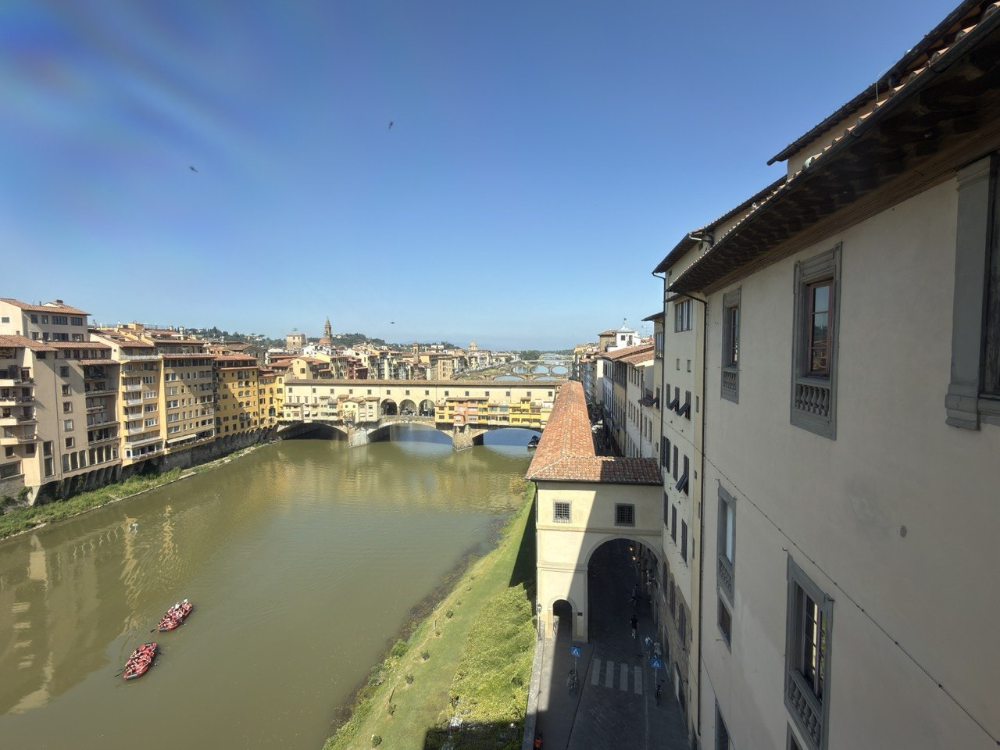

We spent June 9 sweeping across Florence's centuries: Renaissance painting and sculpture in the morning, modern color fields in the afternoon, and the practical business of leaving the city in the evening.

## Uffizi: The Medici Collection

We began the day at the Uffizi with a private tour in English focused on the Medici collection. Our guide used the rooms as a visual history lesson in the transition from medieval art to the Renaissance — religious forms, human bodies, space, perspective, patronage, and civic ambition all changing at once. Without context the Uffizi can become a long procession of gold halos and crowded rooms; with context, the shift in Western art becomes visible wall by wall.

The highlights included paintings by Botticelli, Michelangelo, and Leonardo da Vinci, along with sculpture connected to Donatello. What struck us most was not only the list of famous names, though the list was formidable. It was the sense of Florence as a workshop of transition, with the Medici collection serving as both treasury and argument.

{fig-alt="Elevated view from the Uffizi side of the Arno River in Florence, looking toward the Ponte Vecchio, with the Vasari Corridor and tiled roofs on the right, ocher riverside buildings on the left, small rowing boats on the water, distant bridges, and a clear blue sky."}

## Accademia: Prisoners and David

From there we continued to the Accademia. The Medici musical instrument collection made a quieter counterpoint to the morning's paintings — another reminder that Renaissance patronage was not confined to canvas and marble. Then came Michelangelo's unfinished Prisoners and finally David.

The Prisoners matter because they show the struggle still inside the stone: figures half-emerged, half-captive. Then David stands at the end of that argument, fully released, which is a rather good trick for a block of marble and a young sculptor with dangerous confidence.

## Afternoon: Gelato, Errands, Rothko

We turned the afternoon practical: a walk through Florence for last-minute business, with a gelato snack folded in because there are civilized ways to run errands and barbarous ways, and Florence rewards the civilized.

From there, we headed to Palazzo Strozzi for the Mark Rothko exhibition — a sharp change of register after the morning's Renaissance density. Fewer saints and patrons, more color, silence, and the modern problem of standing before a painting until it starts doing something back.

## Last Dinner: Del Fagioli

The evening was our last night in Florence, and Del Fagioli was exactly the right final dinner: one of the few remaining family trattorias in the city, small, quiet, and lovely in atmosphere. We had a properly Florentine dinner — Florentine steak, white beans, green beans, roast potatoes with rosemary, and fried squash blossoms — followed by lemon mousse for dessert, and a Tuscan rosé throughout.

Then the less glamorous but necessary rite of packing for the next day's train to Naples. A good final sequence, all told: Medici splendor, Michelangelo's stone, Rothko's color, gelato, a family trattoria dinner, and bags by the door before the road south.
