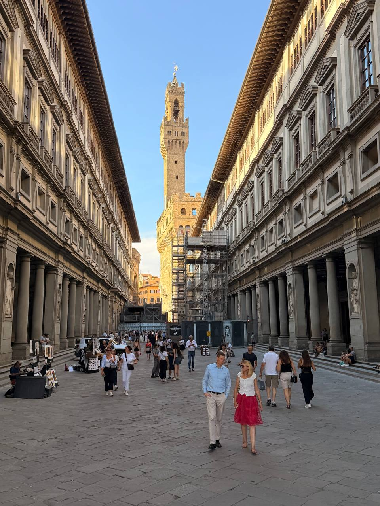
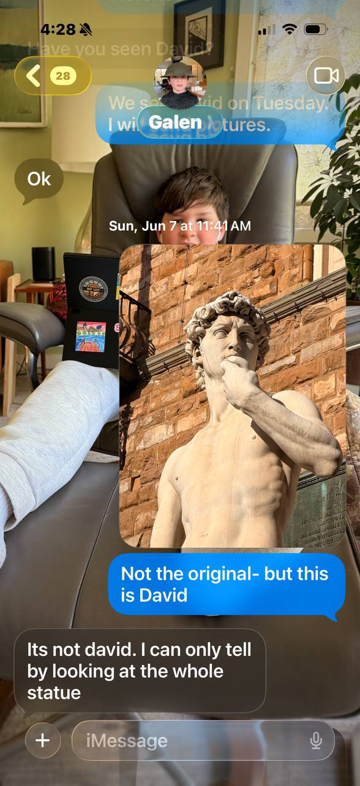
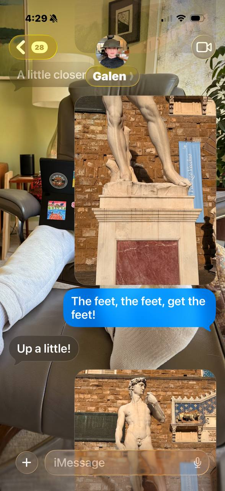
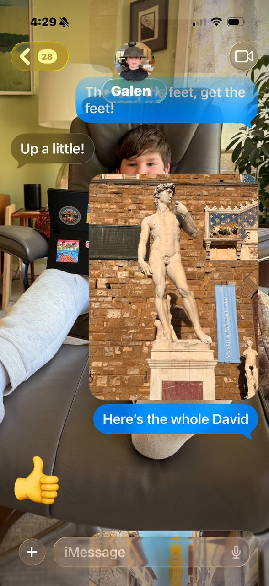

The first full morning in Florence began properly: out from the Airbnb and across the **Ponte Vecchio**, letting the city reveal itself at walking pace rather than schedule pace. The morning target was **Cappelli Antonio Gatto**, the hatmaker, though the shop was not open on this stroll — a small frustration, but hardly a defeat.

Coffee and pastry came at **Caffè Bellini**, across the street from the **Giardino di Boboli**. A good Florentine morning needs very little ceremony: a bridge, a café, something sweet, and enough time not to hurry.

Brunch was at **Osteria Belguardo**, with fried sage, calamari, spinach salad, and peas with prosciutto. That made the morning feel less like sightseeing and more like settling into the rhythm of the place: walk, look, eat well, keep a few possibilities open.

Later, the walk carried through the courtyard of the **Uffizi Gallery**, past the tower, and into the civic heart of Florence at **Palazzo Vecchio**. Outside, in **Piazza della Signoria**, stood the outdoor copy of Michelangelo's *David* — the sort of public art that makes a city feel less like a museum and more like a civilization that left its doors open.

{fig-alt="Evening view down the Uffizi courtyard in Florence, with long Renaissance arcades on both sides, people strolling through the stone-paved passage, and the Palazzo Vecchio tower rising in the warm light beyond."}

That statue also launched a small domestic correspondence. Earlier in the week, Galen — the grandson — had asked whether *David* had been seen yet. Sunday morning provided the answer, via photographs, through a negotiation that took several exchanges to resolve.

The opening gambit was a close-up of the head.

{fig-alt="iMessage screenshot: Dan sends a close-up photo of the David statue's head and upper body to grandson Galen, captioned 'Not the original- but this is David.' Galen responds: 'Its not david. I can only tell by looking at the whole statue.'"}

Galen was not satisfied. More angles were attempted.

{fig-alt="iMessage screenshot: Dan sends a close-up of David's feet and legs, writing 'The feet, the feet, get the feet!' Galen responds: 'Up a little!'"}

{fig-alt="iMessage screenshot: Dan sends a full-body photo of the David statue in the Piazza della Signoria, writing 'Here's the whole David.' Galen responds with a thumbs-up emoji."}

Dinner was outdoors by **Palazzo Vecchio**: pizza, burrata, salad, and rosé. The evening finished in the proper Italian manner, with gelato on the walk back to the Airbnb.
