Some trip details belong in the daily recaps. Wines do not. Wines deserve their own ledger, because otherwise a good bottle disappears into the soup of travel logistics and later no one remembers what was poured where. This post is the running list.

For the larger grape-by-grape lesson from Puglia — why Negroamaro, Primitivo, Susumaniello, Bombino Nero, and the rest make rosato such a serious regional style — see [The Rosés of Puglia](puglia/puglia-rose.qmd). This page remains the bottle ledger; that one is the field guide.

## Elia Rosarina Rosato 2025 — tonight’s rosé

**Where:** Evening of June 18 in Puglia.  
**Producer / label:** Elia.  
**Bottle:** **Rosarina 2025 Rosato**; back label identifies **Salento Susumaniello 2025**.  
**Visible label facts:** 12.5% vol.; 750 ml; contains sulfites.  
**Context:** Dan sent this as tonight’s rosé and noted the lovely color — a pink-gold rosato glowing through the bottle, which is enough reason to preserve it before the evening blurs.

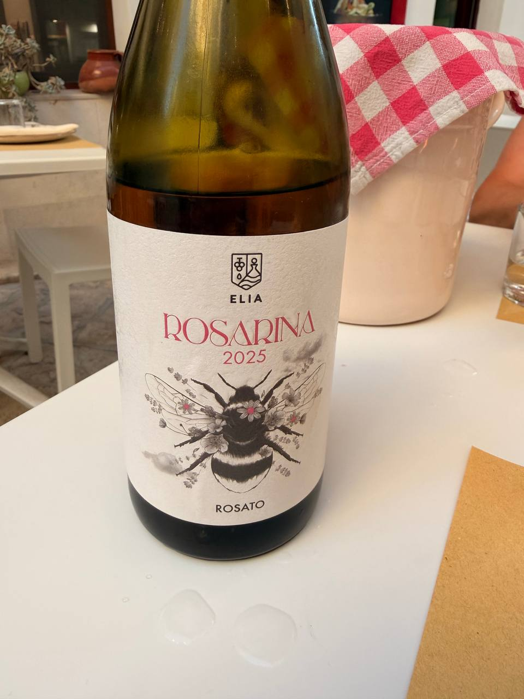{fig-alt="Front view of an amber glass wine bottle on a restaurant table, labeled Elia Rosarina 2025 Rosato with a bee illustration and pink lettering, beside a pale ice bucket draped with a red-and-white checkered cloth."}

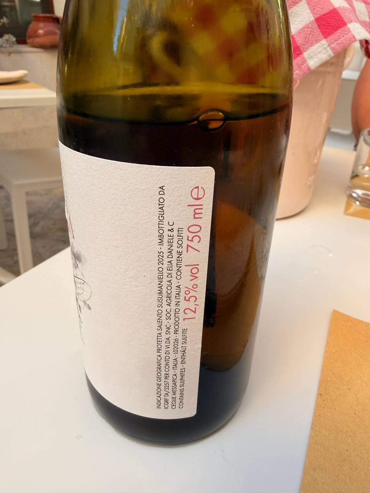{fig-alt="Back view of the Elia Rosarina wine bottle on a restaurant table, showing a narrow white label with text including Salento Susumaniello 2025, 12.5 percent alcohol by volume, 750 ml, and contains sulfites."}

A good rosé color is not a small thing. It is the bottle announcing itself before the glass does.

## Varvaglione IDEA Rosa di Primitivo — pizzeria lunch in Puglia

**Where:** Pizzeria lunch in Puglia, June 18.
**Producer:** Varvaglione.
**Bottle:** **IDEA Rosa di Primitivo**; back label reads **Rosato di Primitivo Puglia Indicazione Geografica Protetta**.
**Context:** A chilled rosato on the pizzeria table, with the label helpfully doing the archival work before lunch could turn into mere memory.

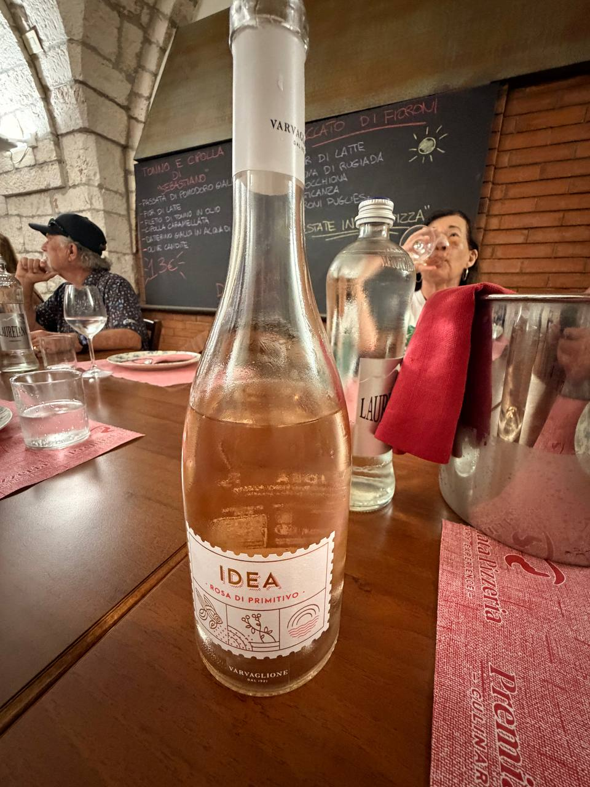{fig-alt="A clear bottle of pale rosé wine labeled IDEA Rosa di Primitivo by Varvaglione stands on a wooden restaurant table, with water bottles, a metal ice bucket, red placemats, and a chalkboard menu behind it."}

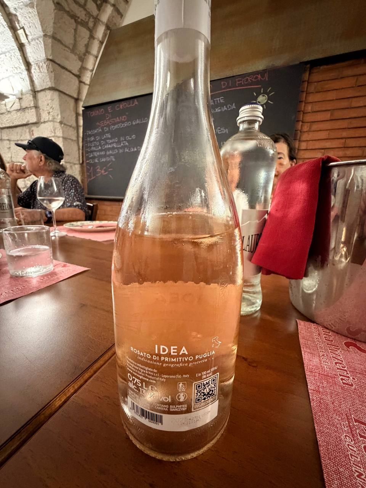{fig-alt="Back view of a chilled rosé bottle labeled IDEA Rosato di Primitivo Puglia Indicazione Geografica Protetta, with a QR code and small producer text visible on the lower label at a restaurant table."}

## Coppi Senatore Primitivo Gioia del Colle 2017 — pizzeria lunch in Puglia

**Where:** Pizzeria lunch in Puglia, June 18.
**Producer:** Coppi.
**Bottle:** **Senatore Primitivo Gioia del Colle 2017**; back label reads **Denominazione di Origine Controllata**.
**Context:** The red alongside the rosato: a Primitivo with the year, appellation, and producer all visible, which is civilized behavior from a bottle.

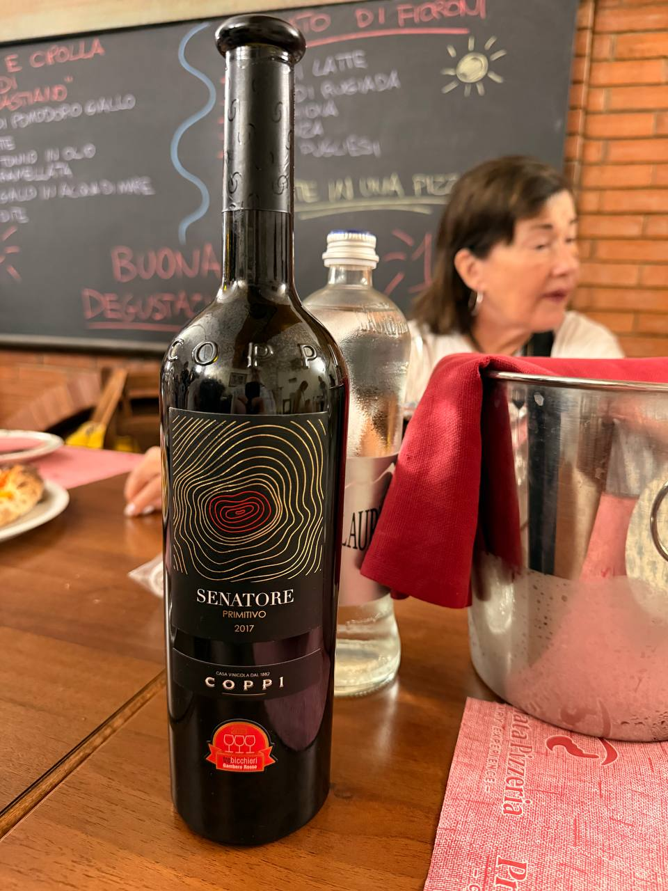{fig-alt="A dark wine bottle labeled Senatore Primitivo 2017 by Coppi stands on a wooden restaurant table, with gold contour-line artwork on the front label, a water bottle, metal ice bucket, red placemats, and chalkboard menu behind it."}

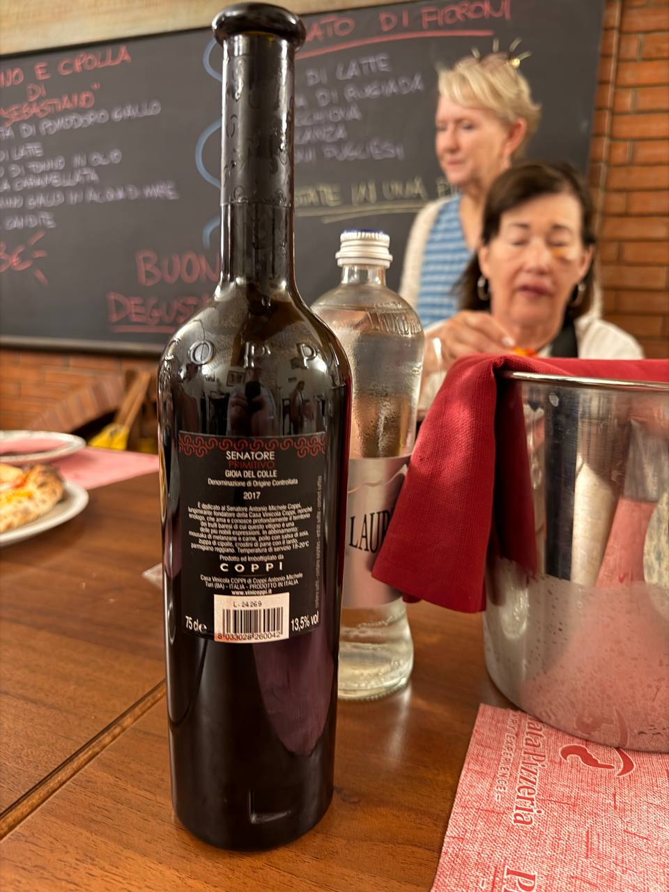{fig-alt="Back view of a dark wine bottle labeled Senatore Primitivo Gioia del Colle Denominazione di Origine Controllata 2017 by Coppi, showing 75 cl and 13.5 percent alcohol near the bottom of the label."}

## Masseria Busciglio Rosato — tonight’s first wine

**Where:** Evening of June 17 in Puglia.  
**Producer:** Masseria Busciglio.  
**Bottle:** **Rosato**; front label reads **Prodotto in Puglia**.  
**Context:** Dan identified this as tonight’s first wine, a rosé of Primitivo from Puglia.

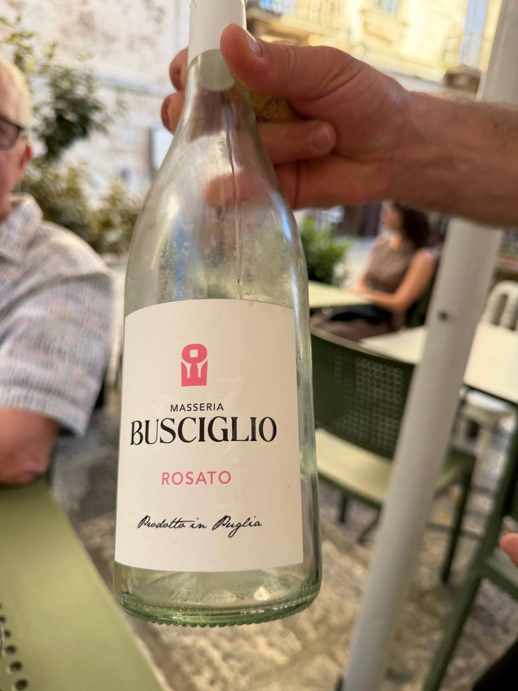{fig-alt="A hand holds an empty clear bottle labeled Masseria Busciglio Rosato, with the words Prodotto in Puglia visible on the front label, at an outdoor restaurant table with green chairs and diners blurred in the background."}

First wine of the evening duly saved before a second bottle has a chance to create historical confusion.

## Castello Frisari Negroamaro di Terra d’Otranto — Monday night at Skafé

**Where:** Monday night at **Skafé**, Porto Badisco, June 15.  
**Producer:** Castello Frisari.  
**Bottle:** **Negroamaro di Terra d’Otranto 2024**.  
**From the Skafé menu screenshot:** 100% Negroamaro; DOP Terra d’Otranto; €6 by the glass and €27 by the bottle.

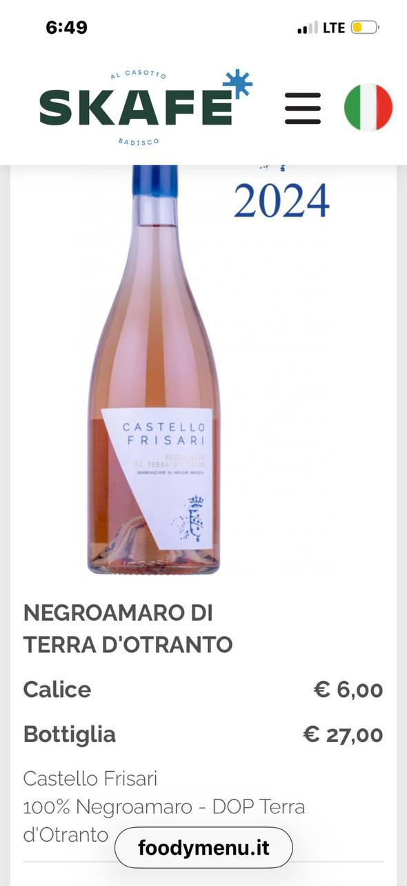{fig-alt="A Skafé foodymenu.it screenshot shows a pink bottle labeled Castello Frisari, vintage 2024, with menu text for Negroamaro di Terra d’Otranto, prices of 6 euros by the glass and 27 euros by the bottle, and notes reading 100% Negroamaro and DOP Terra d’Otranto."}

A useful screenshot: producer, grape, appellation, vintage, and restaurant context all in one place. Even barbarism has limits; this one goes in the ledger.

## Sanchirico Lutroc — lunch in Lecce

**Where:** Lunch at **Giardino Segreto**, Lecce, June 16.  
**Producer:** [Sanchirico Cantina e Vigneti nel Salento](https://sanchirico.net/tabella-lutroc/)  
**Bottle:** **Lutroc**; the label in the lunch photo appears to read **Malvasia Nera**.  
**From the producer’s linked nutrition page:** 14.00% ABV; 92 kcal per 100 ml; 4.0 g carbohydrates per 100 ml, including 0.9 g sugars.

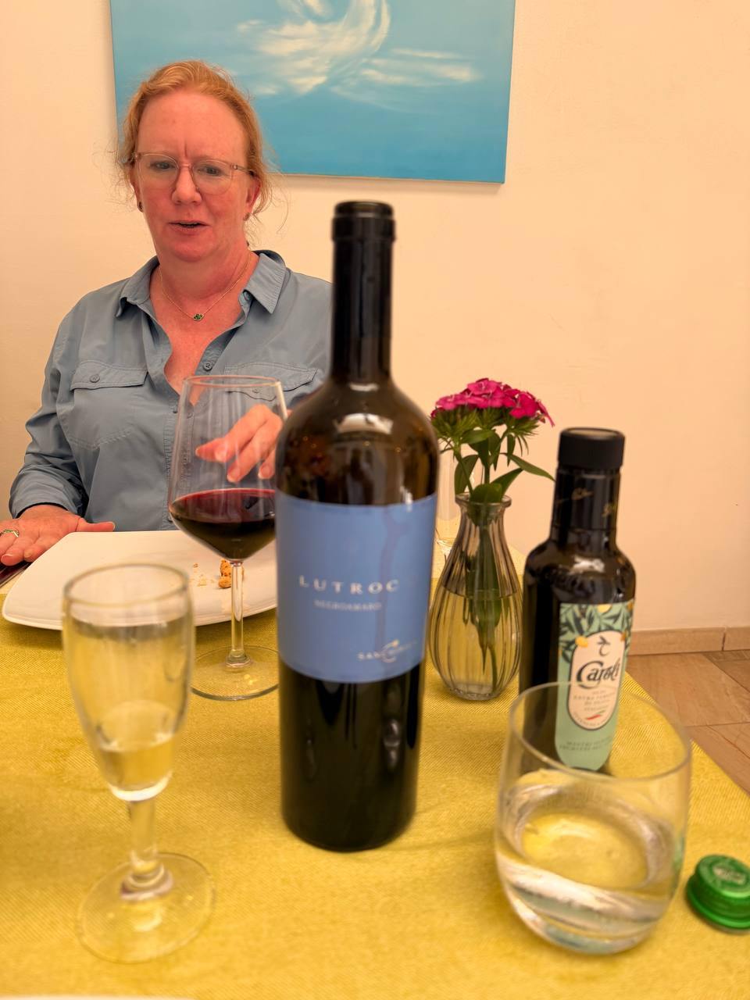{fig-alt="A bottle of Sanchirico Lutroc wine stands on a yellow tablecloth at lunch, with red wine in a glass, water glasses, a small vase of pink flowers, a bottle of olive oil, and a diner seated behind it."}

This was the lunch wine, and it deserves the same treatment as the churches: name it, place it, and do not let it vanish into the day’s recap like a receipt in a coat pocket.

## Tenute Rubino Oltremé Susumaniello Rosato Salento 2025 — first Puglian rosé

**Where:** Dinner at **Windsurf on the Harbor**, Brindisi, June 13.  
**Producer:** Tenute Rubino.  
**Bottle:** **Oltremé Susumaniello Rosato Salento 2025**.  
**Context:** The first Puglian rosé of the trip, cold on the harbor table after the long Naples-to-Brindisi travel day.

{fig-alt="A chilled bottle of Tenute Rubino Oltremé Susumaniello Rosato Salento stands on an outdoor restaurant table beside a metal wine bucket at dusk."}

{fig-alt="The back label of a Tenute Rubino Salento rosato bottle shows Susumaniello Rosato 2025, with the harbor terrace blurred behind it."}

## Masseria Rienzo P76 Primitivo I.G.T. — olive oil day in Puglia

**Where:** Masseria Rienzo / June 17 Puglia day, after Ostuni and the ancient olive trees.  
**Producer:** Masseria Rienzo.  
**Bottle:** **P76 Primitivo I.G.T.**; back label reads **Salento Indicazione Geografica Tipica Primitivo**.  
**Context:** A bottle from the Masseria Rienzo stop — exactly the sort of thing that would otherwise be swallowed by the phrase “olive oil tasting and lunch,” which would be barbarous.

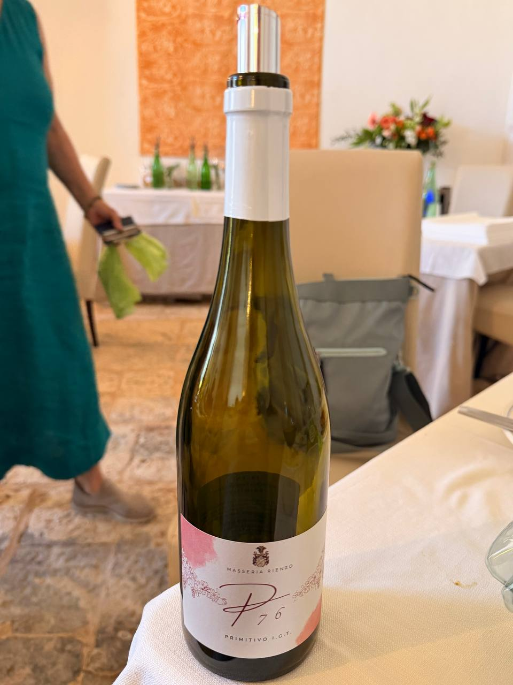{fig-alt="Front view of a green wine bottle labeled Masseria Rienzo P76 Primitivo I.G.T., standing on a white tablecloth in a bright dining room with cream chairs and a person partly visible at the left."}

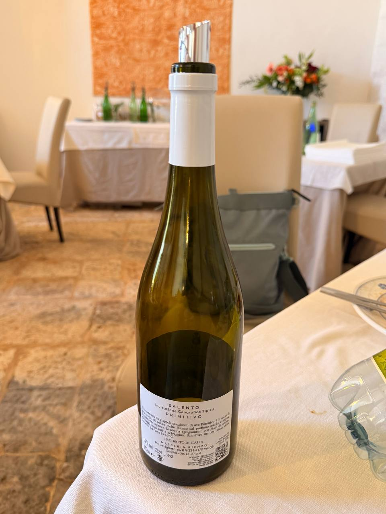{fig-alt="Back view of a green wine bottle on a white tablecloth, with a white label reading Salento Indicazione Geografica Tipica Primitivo and Masseria Rienzo, in a restaurant dining room with cream chairs and table settings."}

## Notes to update

- Add new bottles here as they appear, even if the daily post also mentions them.
- Keep bottle names, producer, place, date, and meal context together.
- Link producer pages when Dan supplies them or when they can be verified without guessing.
- Use photos as evidence, but do not invent vintage, grape, or tasting notes not visible or supplied.
