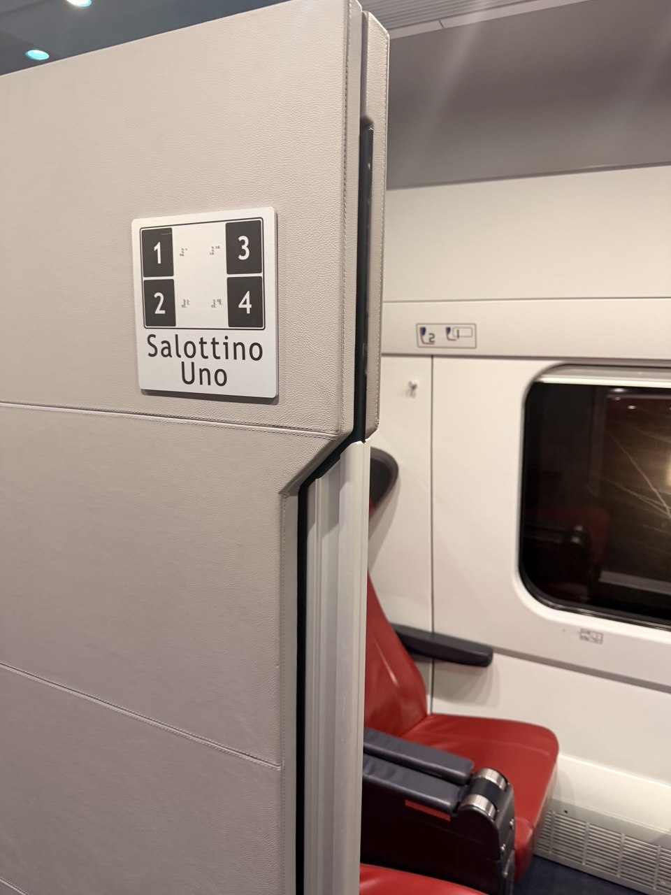

The day began pleasantly and practically: coffee, quiche, and packing in Florence before the train south. It was not a museum morning or a forced march through another checklist, just the civilized work of closing one chapter of the trip and getting the bags ready for the next.

The Italo ride to Naples was in the **club car / private Salotto cabin**, a three-hour pocket of calm for the trip south. It turned out to be the last quiet for a while. After Florence's composed stone and proportion, Naples announced itself with noise, speed, density, and hills: traffic moving through narrow streets at high speed and with rules that were not obvious to outsiders, climbing and dropping everywhere.

{fig-alt="Entrance to Salottino Uno on an Italo high-speed train, with numbered private cabin seats, red leather train seats, and a window visible inside the compartment."}

A car brought Dan and Jane from Napoli Centrale to **Casa Wenner Large — Naples Center Chiaia Plebiscito**, the Airbnb on Via Monte di Dio. The apartment is pretty great: quiet, with its own enclosed courtyard, a rustic garden, and a view over the Gulf of Naples. The plants here are tropical and big, which makes the enclosed garden feel more southern immediately — a different climate and a different city, not merely the next stop on the same itinerary.

Dinner was at **10 Diego Vitagliano**, Diego Vitagliano's flagship pizzeria. The "10" is a nod to Diego Maradona's jersey number — Maradona being nearly a patron saint in Naples — and also to the shared first name. It was a good first Naples dinner in exactly the right category: pizza, serious pizza, and outstanding.

## Retrospective Notes

- **Morning:** Coffee, quiche, and packing in Florence.
- **Transit:** Italo club car / private Salotto cabin for the three-hour train ride to Naples.
- **Mood of the train:** Quiet, comfortable, and probably the last calm for a while.
- **First impression of Naples:** Loud, frenetic, hilly, and full of fast traffic in narrow streets with seemingly no rules.
- **Arrival transfer:** Car from Napoli Centrale to the Airbnb.
- **Accommodation:** Casa Wenner Large — Naples Center Chiaia Plebiscito, Via Monte di Dio, 66.
- **Airbnb verdict:** Pretty great; quiet, with a view of the Gulf of Naples.
- **Courtyard/garden:** Enclosed courtyard with a rustic garden; tropical plants, and big ones.
- **Dinner:** 10 Diego Vitagliano, the flagship restaurant of Diego Vitagliano.
- **Name note:** The "10" refers to Diego Maradona's jersey number and to the shared name Diego; Maradona is nearly a patron saint in Naples.
- **Pizza verdict:** Outstanding.
