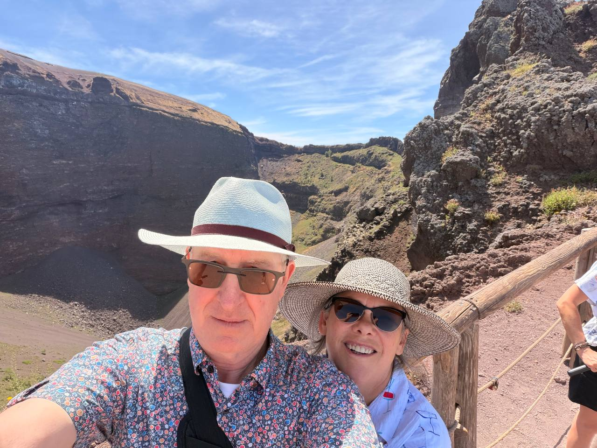
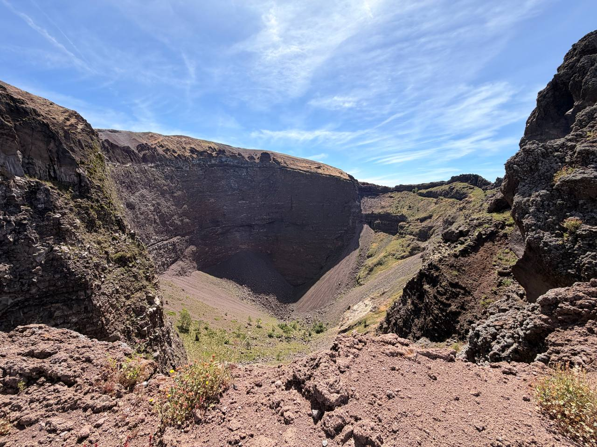
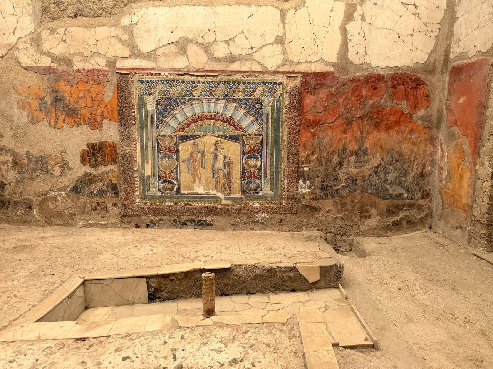
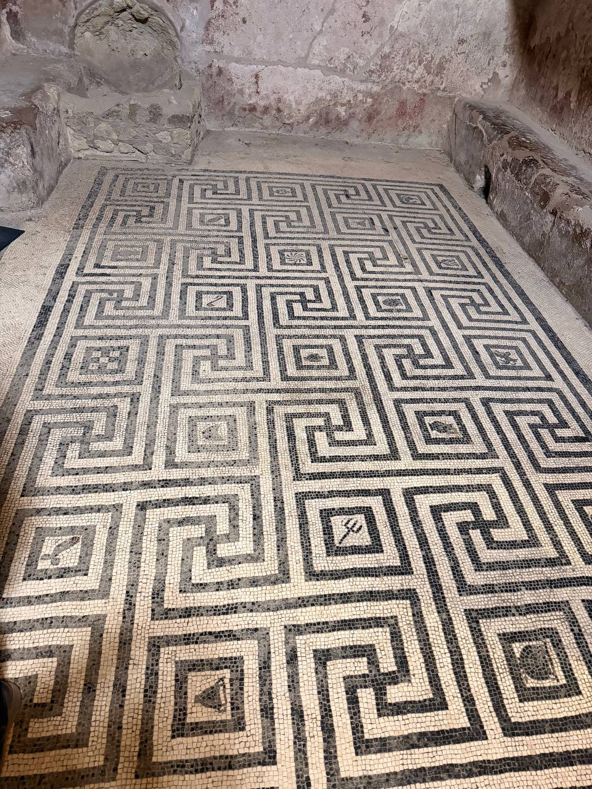

June 12 deserves two posts. The general Naples notes — food, logistics, and the rest of the day — are here: [Naples June 12: Between Volcanoes and Pizza](naples-june-12-general.qmd). This one keeps the main business: **Herculaneum and Mount Vesuvius**, catastrophe and source, city and mountain.

The day began with the practical wisdom that only reveals itself after it is too late: if you are going to hike **Mount Vesuvius**, you ought to bring along the hiking poles you packed and carried all the way to Europe for precisely such a purpose. A small lesson in logistics, paid for on volcanic gravel.

The itinerary paired the buried city with the volcano above it, which is the only honest way to understand the place. Herculaneum is not merely a ruin, and Vesuvius is not merely a scenic overlook. One explains the other. The city preserves rooms, floors, walls, color, domestic pattern, and ordinary human scale; the crater answers with geology, heat, height, and threat.

{fig-alt="Dan and Jane take a selfie on a sunny path at Mount Vesuvius, wearing hats and sunglasses, with steep dark crater walls, rough volcanic rock, a wooden railing, and blue sky behind them."}

## Vesuvius

The crater is hard country: dark rock, loose reddish gravel, steep walls, patches of scrub, and a sky doing its best to make the whole thing look innocent. It is not innocent. Even in bright sun, Vesuvius retains the useful habit of reminding visitors that scenery and danger are not opposites.

{fig-alt="Wide view into the crater of Mount Vesuvius, with dark layered volcanic walls, reddish gravel slopes, rough black rocks in the foreground, sparse green vegetation, and a bright blue sky with wispy clouds."}

## Herculaneum

Herculaneum brings the scale back down from mountain to room. The survival of color is the shock: wall painting, decorative panels, mosaic work, and the clear outlines of interior space. The place does not need much help from imagination. The walls still argue for themselves.

The other useful lesson was smaller, but it made the streets intelligible: the Roman grid. A **cardo** runs north--south; a **decumanus** runs east--west. The chief versions, the **Cardo Maximus** and **Decumanus Maximus**, formed the civic spine of a Roman town, with smaller cardines and decumani laying out the blocks, or *insulae*. Once we had that in hand, a guide saying “Cardo IV” stopped sounding like ritual Latin and started functioning as coordinates.

In Herculaneum, that grid pulls the ruin back into city life. The streets are not just corridors between preserved rooms; they are the organizing frame that connected houses, shops, baths, and public space. Find the forum and the main axes, and the site is no longer a picturesque scatter of walls. It becomes a town with a plan — imposed, walked, buried, and then uncovered again.

{fig-alt="Interior room at Herculaneum with cracked plaster walls, red and ocher painted sections, a colorful central wall mosaic showing two human figures beneath an architectural arch, and worn stone flooring in front."}

The floor mosaics make the same point in another register. Pattern survives. Domestic order survives. Someone chose geometry, borders, repetitions, and little centers inside the grid. Then the mountain did what mountains do, and the floor remained.

{fig-alt="Black-and-white geometric floor mosaic at Herculaneum, with repeating square spiral patterns and small central motifs, set between worn plaster walls and stone benches in a small ancient room."}

This is why pairing Herculaneum and Vesuvius works so well. The mountain gives the violence; the city gives the human measure. Between them, June 12 was not just sightseeing. It was a day spent walking between cause and consequence, with insufficient hiking poles and plenty of evidence.

## Retrospective Notes

- **Main subject:** Herculaneum and Mount Vesuvius tour from Naples.
- **Structure:** preserved Roman city below; volcanic crater above.
- **Vesuvius note:** hiking poles traveled all the way to Europe but did not make the hike.
- **Images added:** Dan and Jane at the crater; wide crater view; Herculaneum wall mosaic/fresco room; Herculaneum geometric floor mosaic.
- **Theme:** catastrophe paired with its source; human rooms and decorative survivals set against volcanic scale.
- **Roman grid note:** cardo = north--south; decumanus = east--west; Herculaneum reads more clearly once the street grid becomes coordinates rather than jargon.
- **Still needed:** guide details, order of visits, strongest Herculaneum impressions, actual difficulty of the Vesuvius walk, and any particular site names from Herculaneum worth naming precisely.
