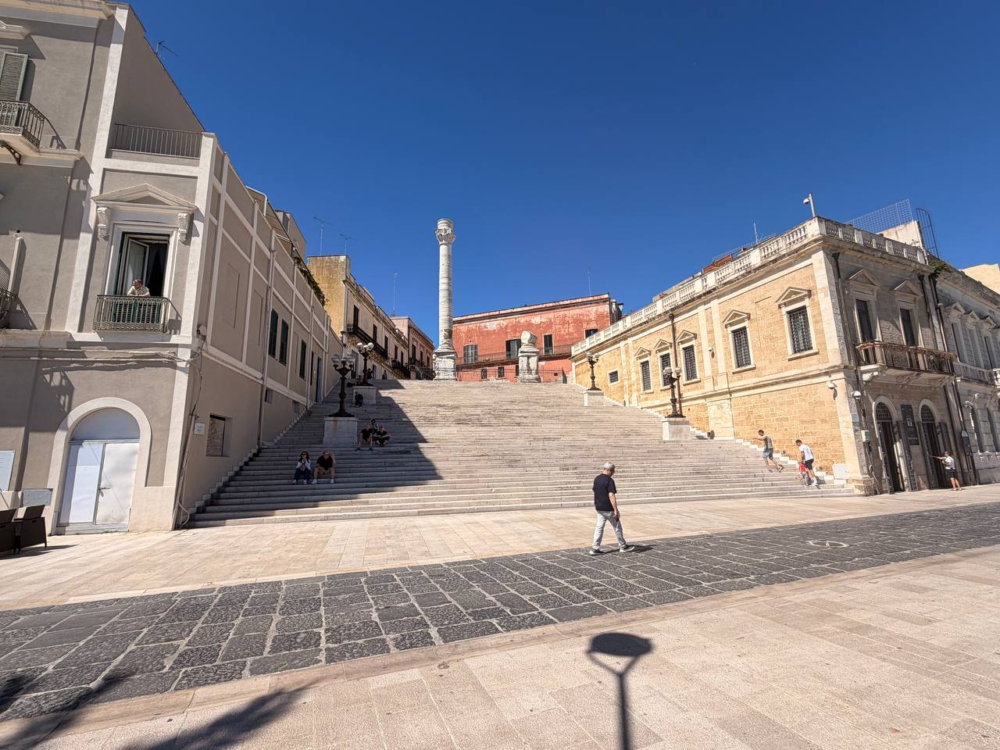
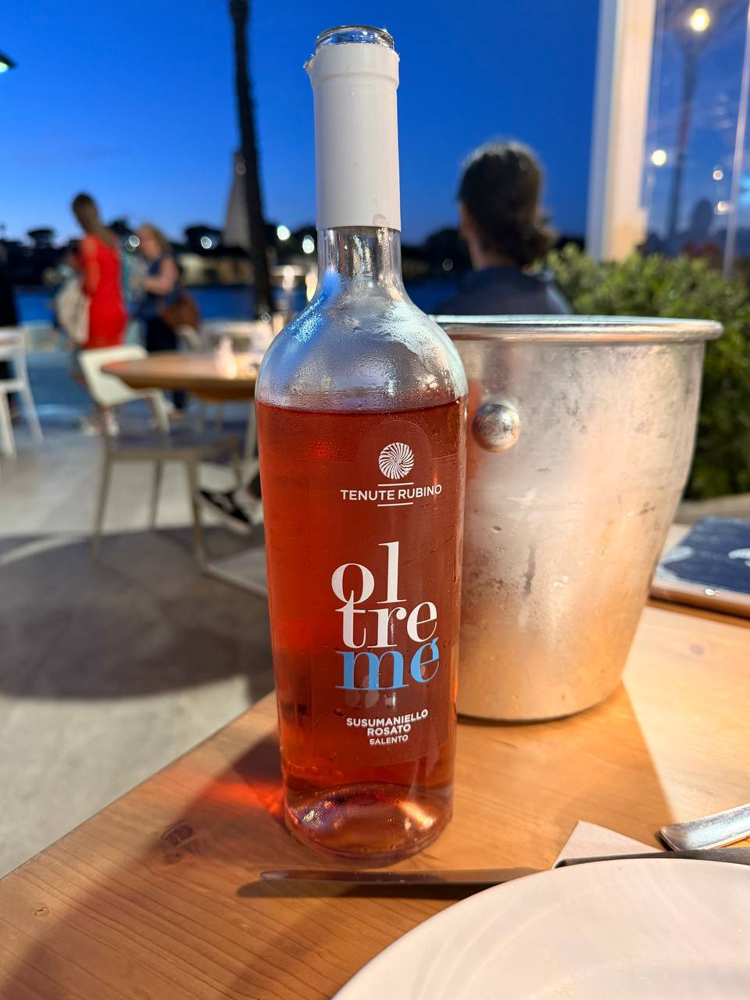
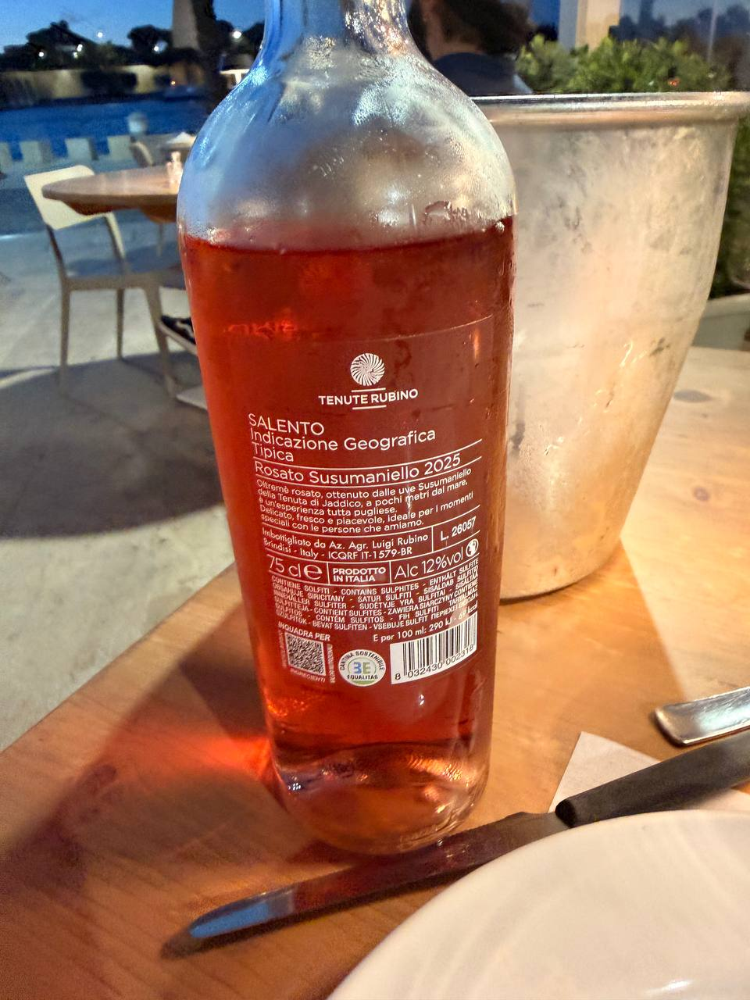

Naples airport was Naples distilled into airport form: frenetic, self-assured, and organized according to some native logic that makes sense to insiders and no one else. This is not necessarily a defect, but it is not exactly a comfort either.

ITA Airways — Alitalia in its older and more familiar skin — eventually got us from Naples to Brindisi after two delayed flights. It was a long travel day, but we made it.

Brindisi, by contrast, began quietly. **Hotel Executive Inn** is nice and quiet, and after Naples that is not a small virtue. Better still, it has a pillow menu: five different pillows to choose from. Civilization takes many forms; sometimes it is marble, sometimes Roman columns, and sometimes it is being allowed to choose the object on which your exhausted head will land.

{fig-alt="A broad stone stairway in Brindisi rises between pale buildings toward a tall Roman column beneath a deep blue sky."}

Dinner was at **Windsurf on the Harbor**, where we met **Pietro**, the owner. Both pastas were wonderful: ragù and vegetarian **orecchiette**. The wine was the first Puglian rosé of the trip: **Tenute Rubino Oltremé Susumaniello Rosato Salento 2025**, cold on the table by the harbor. A good first night in Puglia, after the usual aviation nonsense had been endured.

{fig-alt="A chilled bottle of Tenute Rubino Oltremé Susumaniello Rosato Salento stands on an outdoor restaurant table beside a metal wine bucket at dusk."}

{fig-alt="The back label of a Tenute Rubino Salento rosato bottle shows Susumaniello Rosato 2025, with the harbor terrace blurred behind it."}

## Retrospective Notes — Partial

- **Travel:** Naples → Rome Fiumicino → Brindisi on ITA Airways / Alitalia.
- **Air travel:** Two delayed flights; long travel day, but successful arrival.
- **Naples airport:** Frenetic, Naples-like, and organized according to rules that seemed clear only to locals and staff.
- **Accommodation:** Hotel Executive Inn, Brindisi — nice and quiet.
- **Hotel detail:** Pillow menu with five different pillows.
- **Dinner:** Windsurf on the Harbor.
- **Person met:** Pietro, the owner.
- **Food:** Pasta for both: ragù and vegetarian orecchiette.
- **Wine:** First Puglian rosé of the trip — Tenute Rubino Oltremé Susumaniello Rosato Salento 2025.
- **Status:** Partial; add any later detail when available.
