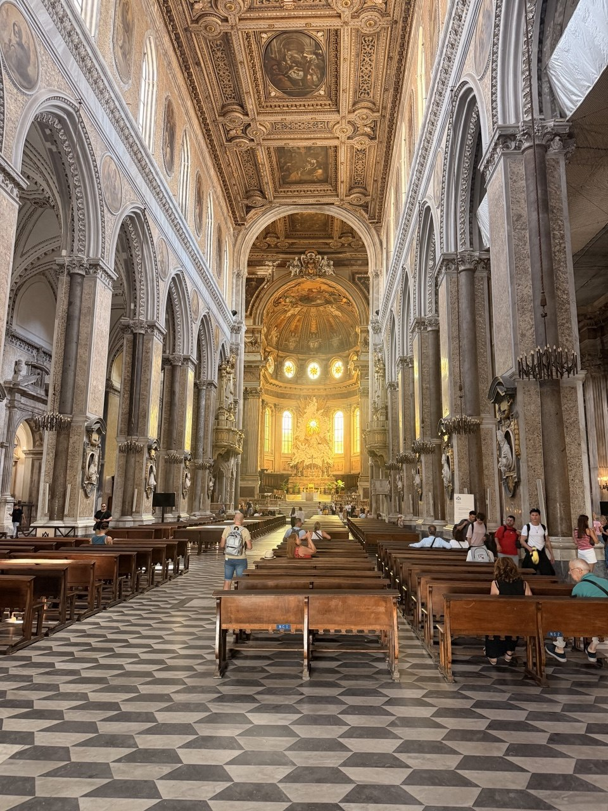

The Naples walking tour began and ended at **Fontana del Nettuno**, with Toledo folded into the route and the historic center doing what Naples does: narrow streets, crowds, vendors, people, artists, noise, and movement in every direction. It was the sort of city walk where the streets themselves seem to be talking over the guide.

A major stop was the **Cathedral of San Gennaro**, Naples' patron saint, who protects the city from disaster — with volcanic eruption always one of the great ever-present possibilities here. From there the tour moved through layers of the city above and below ground: present-day Naples on the surface, ancient Naples underneath.

{fig-alt="Interior nave of the Cathedral of San Gennaro in Naples, with rows of wooden pews, marble columns and arches, an ornate gilded ceiling, patterned stone floor, and sunlight glowing around the high altar."}

Along the way Dan and Jane took the Metro, entering through one of the newest and most artistic subway stations in the world, with incredible tile work and extensive new mosaics everywhere. The subway itself was nothing like Japan: far fewer people, trains not packed, and no sense of being carried along by a human river. Naples may be chaotic above ground, but the Metro was surprisingly uncrowded.

The underground portion was an archaeological tour through the ancient street plan: the **cardo**, the north-south avenues, and the **decumanus**, the east-west streets, forming the old grid of the city. It was another version of Naples' central fact: every modern street seems to have another city underneath it, still organizing the life above.

After the tour and lunch, they returned to the **Gallerie d'Italia** on Toledo to see **Caravaggio's _Martyrdom of Saint Ursula_** and **Artemisia Gentileschi's _Samson and Delilah_**. The day also covered the major surface landmarks — the castle, the opera house, and Galleria Umberto I — enough to feel that they had hit the highlights of Naples.

Dinner finished the day well: **Trattoria da Patrizia** on the marina, a lovely evening by the water with swordfish, grilled shrimp, and gnocchi with mussels in tomato sauce. Afterward, Naples granted one small practical victory: Dan and Jane were actually able to hail a taxi the old-fashioned way for the trip back to **Casa Wenner Large — Naples Center Chiaia Plebiscito**, rather than submitting to another round of app-mediated nonsense. A civilized end to a loud, layered, very Neapolitan day.

## Retrospective Notes

- **Tour start/end:** Fontana del Nettuno.
- **Main route:** Toledo and central Naples.
- **Street character:** Narrow, crowded streets full of vendors, people, and artists.
- **Religious/history stop:** Cathedral of San Gennaro, patron saint of Naples and protector from disasters including volcanic eruption.
- **Metro:** Entered through a new, highly artistic subway station with incredible tile work and extensive mosaics.
- **Metro comparison:** Far fewer people than Japan; trains not crowded.
- **Underground archaeology:** Ancient city grid organized by cardo north-south avenues and decumanus east-west streets.
- **Post-lunch museum return:** Gallerie d'Italia on Toledo.
- **Art seen:** Caravaggio's _Martyrdom of Saint Ursula_; Artemisia Gentileschi's _Samson and Delilah_.
- **Other Naples highlights:** Castle, opera house, and Galleria Umberto I.
- **Dinner:** Trattoria da Patrizia on the marina.
- **Dinner dishes:** Swordfish, grilled shrimp, and gnocchi with mussels in tomato sauce.
- **Evening verdict:** Lovely evening by the water.
- **Return to Airbnb:** Successfully hailed a taxi the old-fashioned way for the trip back to Casa Wenner Large — Naples Center Chiaia Plebiscito.
