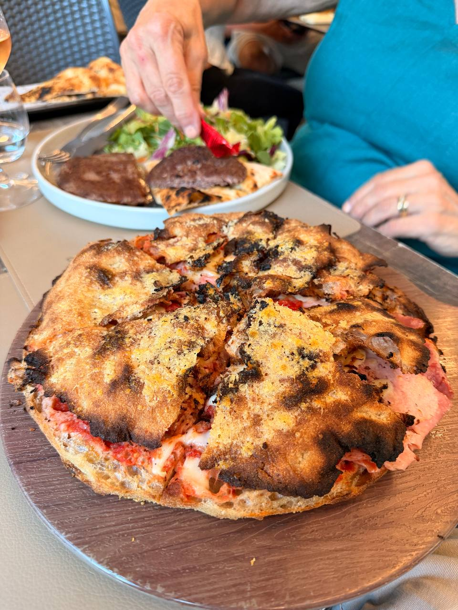

Naples required a proper pizza note, not a passing mention buried under trains, taxis, and volcanic logistics. **10 Diego Vitagliano** was the right place for that: Diego Vitagliano's flagship pizzeria, with the **10** doing double duty — Diego Maradona's shirt number, close to sacred in Naples, and the shared first name Diego.

The first-night verdict was simple: outstanding. After the quiet Italo Salottino cabin from Florence and the first blast of Naples traffic, serious pizza was the correct form of civic introduction. Some cities offer orientation walks. Naples offers noise, hills, and pizza, and expects visitors to keep up.

{fig-alt="A round Parigina-style pizza sits cut open on a wooden serving board, with a deeply browned and charred top crust and visible red sauce, melted cheese, and pink filling inside; a salad plate, wine glass, and diner are visible in the background."}

The later note names this one specifically: **Parigina**. It is the sort of pizza that argues against treating Naples food as merely famous. Famous is a tourist category. This was better than that: specific, charred, stuffed, messy, and worth documenting before the memory gets flattened into the useless word "pizza."

## Source

- **Trip notes:** June 10 Naples arrival notes recorded dinner at **10 Diego Vitagliano**, Diego Vitagliano's flagship pizzeria, with the Maradona number 10 explanation and the verdict that the pizza was outstanding.
- **Follow-up food note:** June 12 Naples general notes identified pizza at **10 Diego** — specifically **Parigina** — and expected a later picture.
- **Related posts:** [Florence to Naples](florence-to-naples.qmd) and [Naples June 12: Between Volcanoes and Pizza](naples-june-12-general.qmd).

## Retrospective Notes

- **Restaurant:** 10 Diego Vitagliano.
- **Context:** Naples pizza stop during the June 2026 trip.
- **Name note:** The "10" points to Diego Maradona's shirt number and to Diego Vitagliano's first name.
- **Food note:** Parigina at 10 Diego.
- **Verdict:** Outstanding — a separate post was justified, for once.
