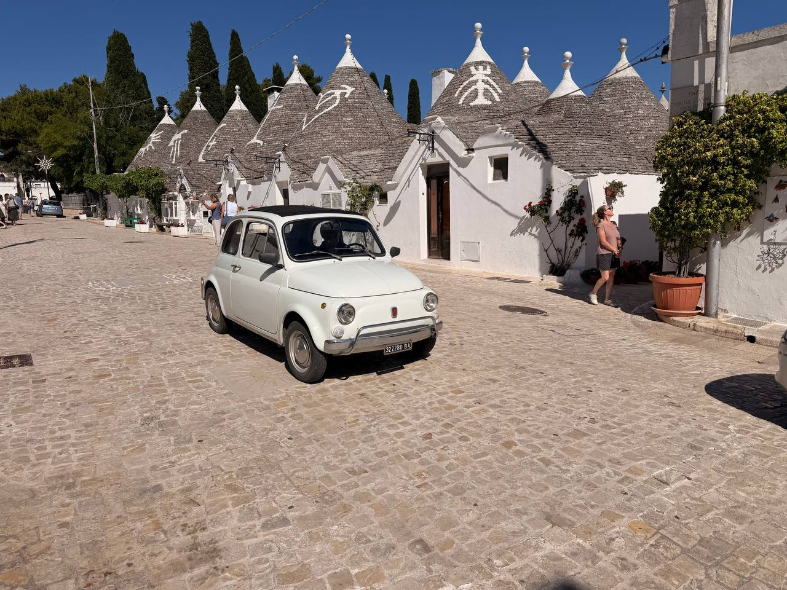
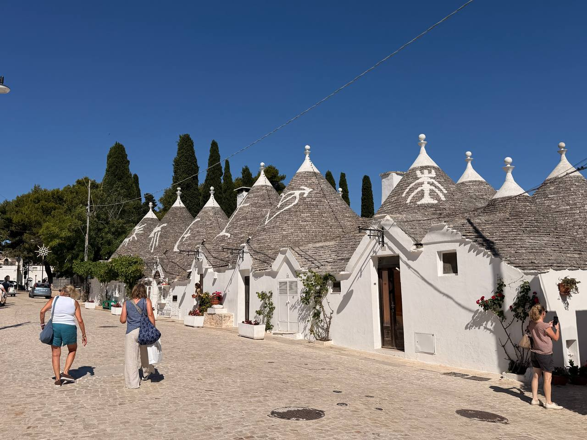
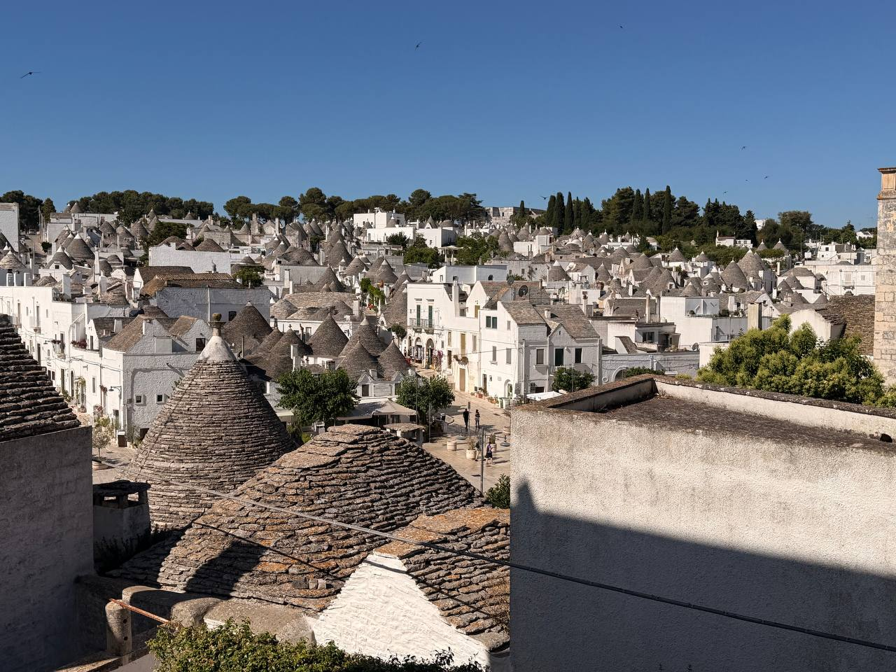
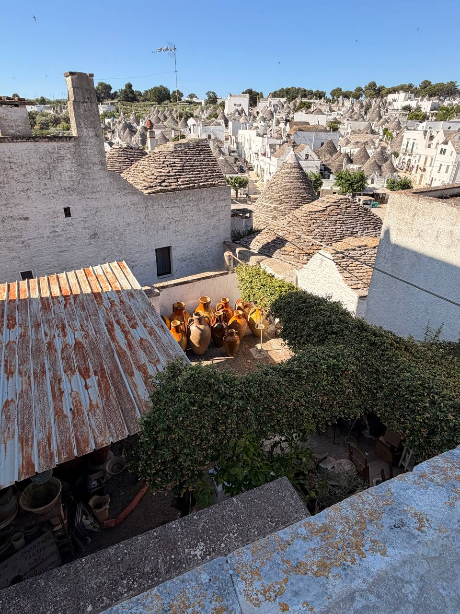
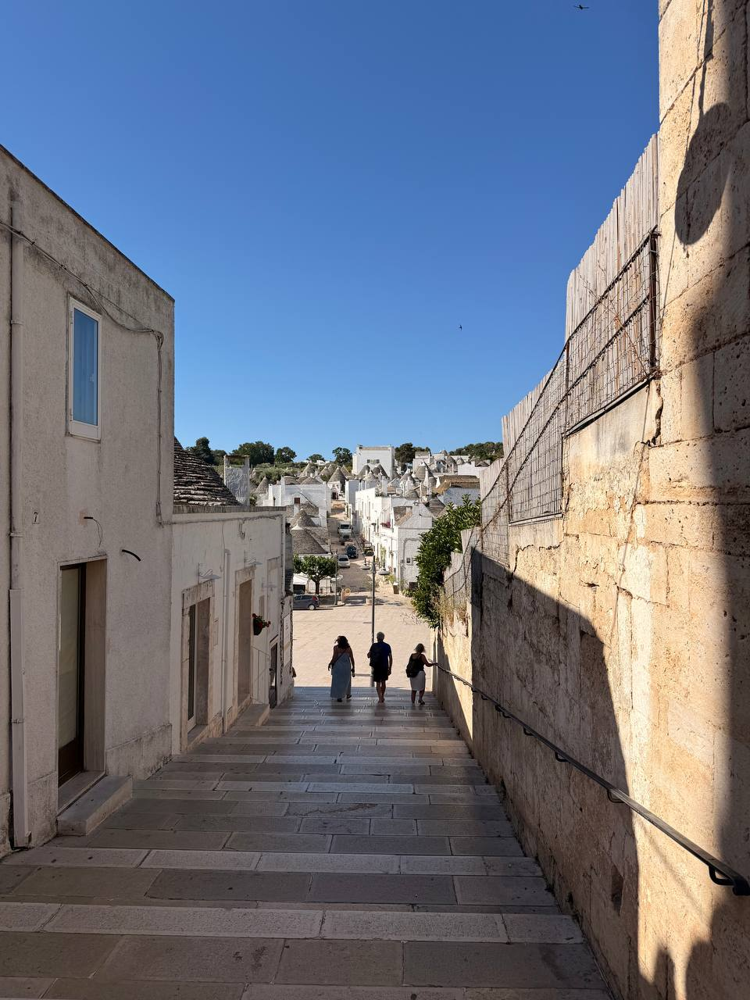
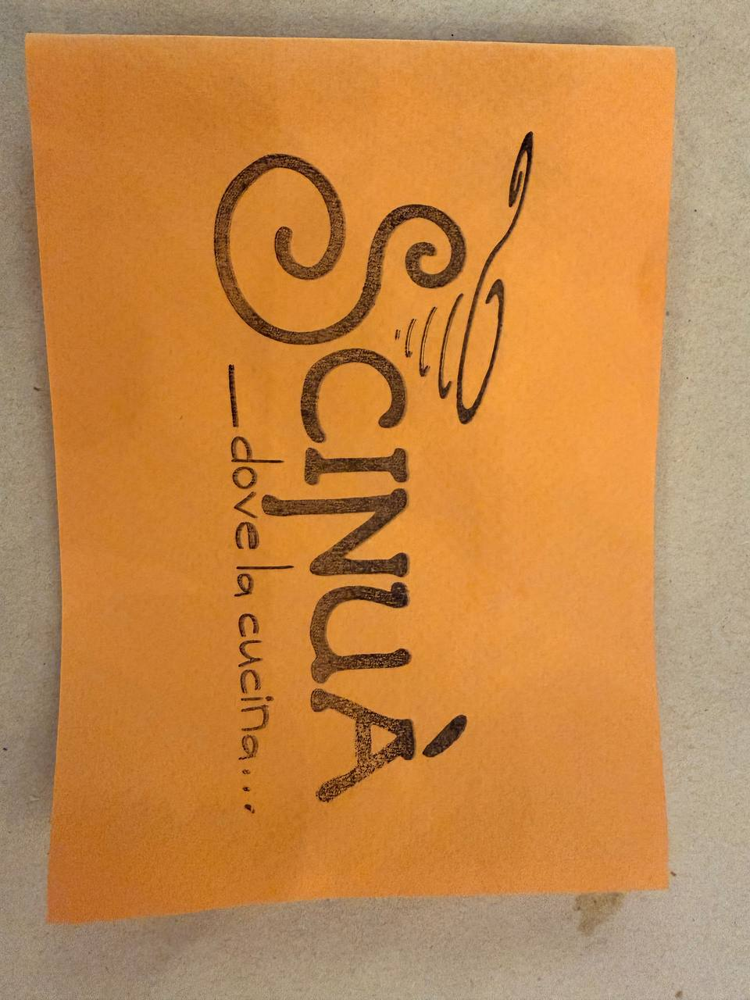
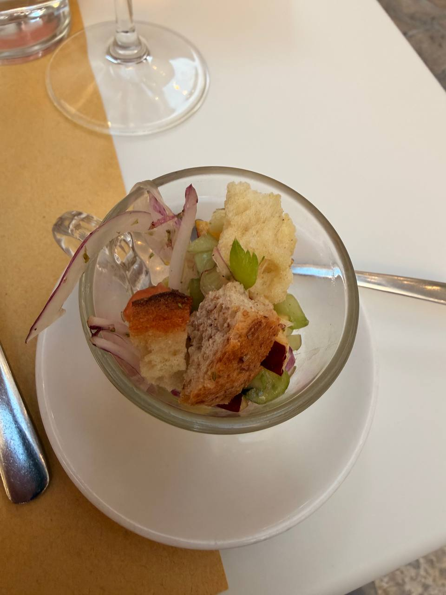
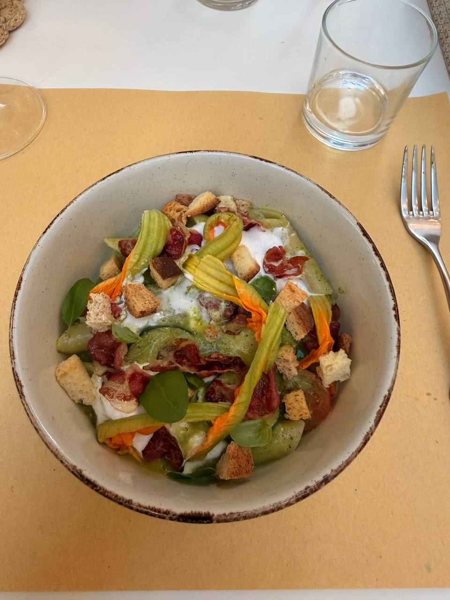

June 18 is the Alberobello day: out from **Petrantiche Albergo Diffuso** in Putignano after breakfast, into the trulli district for the morning, and then lunch on our own in Alberobello before returning to Putignano to cool down and gather strength for the evening food experience.

The morning tour was the trulli doing what trulli do best: whitewashed walls, dry-stone conical roofs, pale paving, hard blue sky, and roof symbols painted in white as if the town had decided ordinary architecture was insufficiently theatrical. A small white Fiat parked among the cones looked less like transportation than a prop left there by a competent stage manager.

{fig-alt="A small white Fiat is parked on a pale stone street in Alberobello, with whitewashed trulli buildings, gray conical stone roofs, white painted roof symbols, potted plants, pedestrians, and dark cypress trees under a clear blue sky."}

{fig-alt="Visitors walk along a pale cobbled street beside a row of whitewashed trulli buildings with gray conical stone roofs, white painted roof symbols, white finials, potted flowers, vines, and cypress trees under a deep blue sky."}

From above, Alberobello becomes a whole field of stone cones: white walls below, stacked gray roof courses above, the streets threading between them, and small birds cutting across the sky. The closer rooftop view shows the less polished working edges as well — pots gathered in a courtyard, a rusting corrugated roof, clipped greenery, and the trulli roofs still rising behind it all. That is often the better proof: the famous form not as postcard, but as neighborhood.

{fig-alt="Elevated view across Alberobello, showing many white buildings with gray conical trulli roofs, pale streets, trees, shadows on nearby rooftops, and small birds in a clear blue sky."}

{fig-alt="View from above a courtyard in Alberobello, with a rust-streaked corrugated roof, large clay pots, clipped greenery, whitewashed walls, nearby trulli roofs, and many more conical roofs across the town under a blue sky."}

The descent back toward the district narrowed the view into stone steps, high walls, deep shade, and a bright opening below where the trulli start again. Three people on the stairway give the scene its scale: the architecture is not just quaint; it channels you downhill like water.

{fig-alt="A broad stone stairway descends between pale stone and whitewashed walls toward Alberobello’s trulli district, with three people walking down, handrails along the walls, strong sun and shadow, and conical roofs visible in the distance under a clear blue sky."}

Lunch supplied an important dessert note: **[chocolate salami](https://en.wikipedia.org/wiki/Chocolate_salami)**. This is not salami, which would make it a poor dessert and a suspicious sausage. It is the chocolate-and-biscuit log sliced to look like salami, a trick that Italy has decided is entirely reasonable. On this point Italy is correct.

The lunch wines are already in the running bottle ledger — [Varvaglione IDEA Rosa di Primitivo and Coppi Senatore Primitivo Gioia del Colle 2017](../italy-wine-notes.qmd) — because wines belong in the wine post, not scattered around like crumbs after dessert.

Dinner moved the day back to **Scinuà**, **Via Santa Lucia 18**, in Putignano. The two of us went there for contemporary Apulian cuisine after making pasta during the cooking class and lunch earlier in the day, which is either excellent thematic continuity or a refusal to learn moderation. We both had pasta.

First came a small peach and red onion salad with croutons and a little finely chopped thyme — a compact, bright thing in a glass, and a useful reminder that even the small courses here were not just filler.

{fig-alt="An orange restaurant card on a gray tabletop reads Scinuà in large dark lettering, with smaller vertical text reading dove la cucina."}

{fig-alt="A small clear glass cup on a white plate holds a peach and red onion salad with croutons, finely chopped thyme, green vegetables, and a pale crisp garnish on a restaurant table."}

One pasta looked like rigatoni — round tubular noodles — though it had a different name. The sauce was a light cream with zucchini and squash or zucchini blossoms, green and generous under flowers, herbs, croutons, and crisp red pieces. The other pasta was **orecchiette**, with a braised tomato sauce and what seemed like spare rib meat. After a day that had already involved making pasta, this was not restraint. It was research.

{fig-alt="A bowl of tubular pasta sits on a tan paper placemat, topped with orange zucchini or squash blossoms, basil leaves, croutons, crisp red pieces, and streaks of light cream sauce, with a glass and fork nearby."}

## Schedule for Thursday, June 18

| Time | Plan |
|---|---|
| **Morning** | Breakfast, then drivers to **Alberobello** for the trulli district walking tour |
| **Afternoon** | Free time and lunch on your own in Alberobello; return to **Putignano** to relax and refresh |
| **Evening** | Dinner at **Scinuà**, **Via Santa Lucia 18**, in **Putignano** — contemporary Apulian cuisine, peach-red onion salad, and two pastas |

## Notes to expand

- **Alberobello:** Trulli district morning tour, dry-stone conical roofs, whitewashed walls, painted roof symbols, rooftop views, the stairway descent back toward the district, crowds/heat, guide notes, and any good visual details from the walk.
- **Lunch:** Pizzeria lunch in Alberobello; connect to the two wines already recorded in the wine ledger.
- **Dessert:** Chocolate salami — link saved, identify it plainly, and do not let the name confuse future prose.
- **Evening:** Scinuà dinner at Via Santa Lucia 18 in Putignano; contemporary Apulian cuisine after the pasta-making class/lunch earlier in the day; peach and red onion salad with croutons and finely chopped thyme; tubular pasta with light cream sauce, zucchini and squash or zucchini blossoms; orecchiette with braised tomato sauce and what seemed like spare rib meat.
