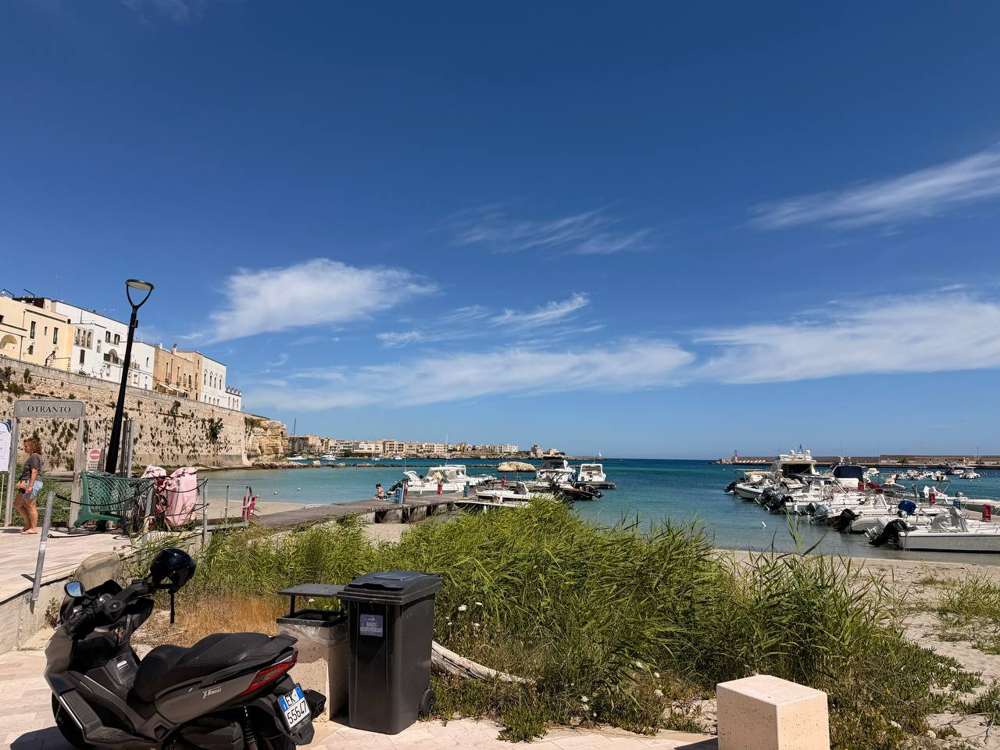

Yesterday was a travel day out of Brindisi and down toward Otranto, and the first clear impression is that Brindisi is a delightful harbor town — a working port with an unhurried waterfront, and a far cry from frenetic Naples. Naples had its force, its density, its noise, and its layers, but it may also be a place I do not need to hurry back to. Brindisi, by contrast, felt like the shoulders dropping: harbor water, boats, Mediterranean light, and enough historical depth to remind you that quiet places are not empty places.

From Brindisi we joined the Strada Toscana group and moved south toward our base near Otranto: **Masseria dei Monaci**, a restored masseria close to the Adriatic. The place has the right first-day geometry: big blue sky, hot dry air, stone, olive trees, and the sea opening eastward. From here the Adriatic is not just scenery but orientation. Albania sits out there across the water, visible enough on a clear day to make the coast feel less like the edge of Italy and more like one side of a narrow historical corridor.

{fig-alt="Otranto harbor on a clear day, with small boats moored in blue-green water below pale stone buildings and old harbor walls under a deep blue sky."}

This is only a start. More detail should be added later: the feel of the drive, first impressions of the masseria, dinner/welcome details, the group, and anything specific about the room, the view, the food, or the heat that should not be lost.

## Notes to expand

- Brindisi: delightful harbor town; calm, local, maritime, a relief after Naples.
- Naples contrast: frenetic; perhaps not a place to return to soon.
- Accommodation: **Masseria dei Monaci**, near Otranto.
- Setting: view of the Adriatic and, in clear conditions, Albania across the water.
- Weather: big blue sky; hot and dry.
- Tone: travel-day decompression, arrival into Puglia, shift from urban intensity to coastal spaciousness.

## Fact-check note: Naples and poverty

Initial check: the “Naples has the highest poverty rate in Italy” line came from a person on the trip, not from a source we have verified. We did see visible signs of poverty and economic strain in Naples, but the comment should not be taken at face value without a better source. ISTAT’s 2024 poverty release reports national and macro-regional poverty rates, not a simple city ranking naming Naples as highest. It says household absolute poverty remains highest in **the South and Islands** at **10.5%** of households, with Italy overall at **8.4%**. Naples is certainly in a poorer southern region and has long-standing unemployment/social-stress associations, but the exact claim “highest poverty rate in Italy” needs a city-level source before being stated flatly.

Possible wording for the finished piece: “Someone on the trip said Naples has the highest poverty rate in Italy. We saw signs of poverty and economic strain, but that is a claim to check rather than repeat as fact.”
