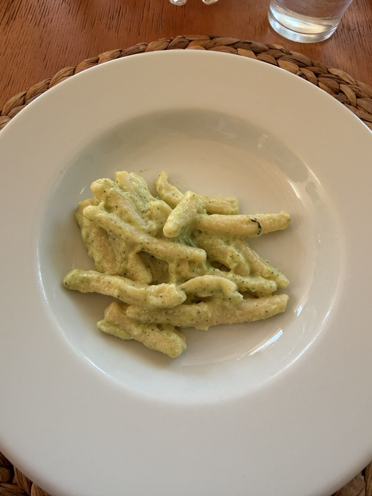

This is the courgette sauce from the June 18 cooking class / food experience: grated courgette gently stewed with onion, blended with mint and cheese, and then folded through pasta. The recipe is short, but it has one command worth treating as law: **stew, do not fry**.

For the pasta-flour side of the lesson, see the companion note: [Semolina Flours for Orecchiette](semolina-flours-for-orecchiette.qmd).

{fig-alt="Short hand-shaped pasta is coated in a pale green creamy courgette-zucchini sauce with flecks of herbs and black pepper, served in a wide white bowl on a wooden table with a woven placemat and a glass of water nearby."}

## Source

- **Recipe source:** Domenico Bianco, “Recipes for Courgette sauce for 4 people,” in **PK recipes**, PDF created in Canva, dated May 8, 2026.
- **Trip context:** June 18, 2026 cooking class / food experience during the Strada Toscana Puglia tour; Columbus itinerary context: `daily_itineraries/day-14-2026-06-18-puglia.qmd` and `regions/puglia.qmd`.
- **Original PDF:** [PK Courgette/Zucchini cream sauce recipe](files/pk-courgette-zucchini-cream-sauce-recipe.pdf)

## Ingredients

For **4 people**:

- 1 large courgette / zucchini, grated
- 1 onion; the source notes that shallot is better
- 10 mint leaves
- 2 tablespoons savory goat ricotta, Parmigiano, or Pecorino Romano
- Extra-virgin olive oil
- Salt, quanto basta / as needed
- Black pepper, if needed

## Kitchen equipment

- Grater
- Bowl
- Chef's knife
- Large pan
- Blender

## Preparation

Finely chop the onion or shallot.

In a large pan, add **2 tablespoons olive oil** and the chopped onion. Stew gently over a low flame, adding **2 tablespoons water**.

When the water is more or less absorbed, add the grated courgette. Let it stew for about **3 minutes**, uncovered, over low heat.

> Pay attention: only stew, do not fry.

When the courgette is cooked, let it cool down.

In a large bowl, combine the stewed courgette, mint leaves, and a pinch of salt. Blend. Add **2 tablespoons grated cheese** — savory goat ricotta, Parmigiano, or Pecorino Romano. If necessary, add a little more olive oil and black pepper.

When the pasta is ready, mix the sauce and pasta together in a large bowl.

## Notes

- The sauce depends on gentleness: low flame, a little water, and no browning.
- Mint keeps the sauce from becoming merely creamy; do not omit it unless you enjoy making food dull on purpose.
- The cheese choice changes the character: goat ricotta for tang and softness, Parmigiano for roundness, Pecorino Romano for salt and bite.
