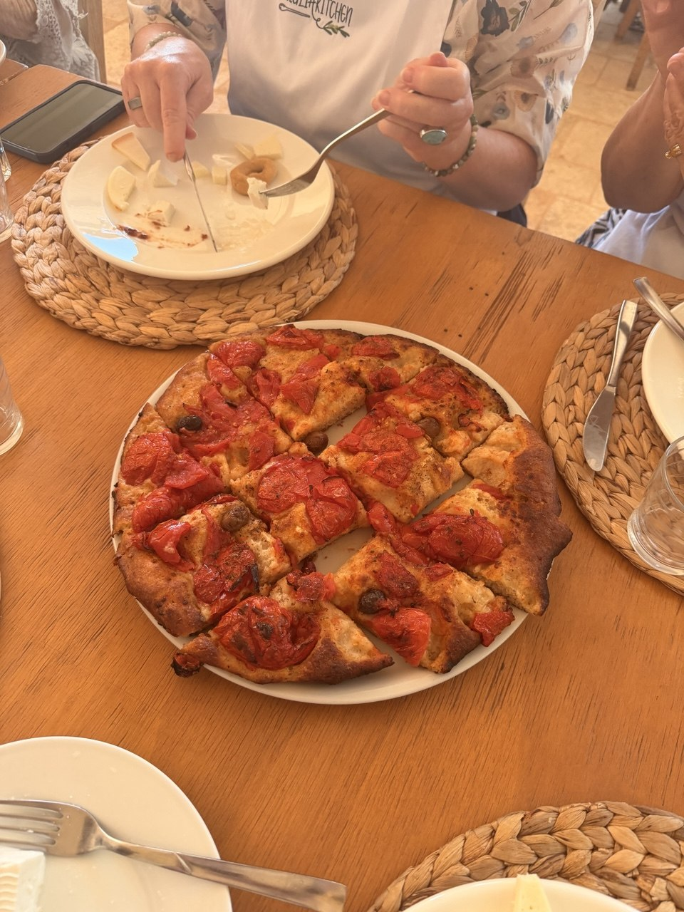

June 18 was the Alberobello / Putignano day of the Puglia tour: trulli in the morning, lunch and heat in the middle of the day, and the evening food experience that produced these recipes. This one is **la focaccia barese** — Bari-style focaccia with a semolina-and-flour dough, cherry tomatoes, olives, oregano, olive oil, and the practical instruction that the base must be well cooked.

The source PDF keeps Domenico's final blessing, which is not a measurement but may be the most Italian ingredient in the document: *be patient, let the energy of love become the best ingredient for any recipe.*

{fig-alt="A round focaccia cut into square pieces sits on a white plate on a wooden table, topped with roasted red tomatoes, olives, oregano, and browned edges, with plates, woven placemats, glasses, forks, and people eating nearby."}

## Source

- **Recipe source:** Domenico Bianco, “La focaccia barese,” in **PK recipes**, PDF created in Canva, dated May 8, 2026.
- **Trip context:** June 18, 2026 cooking class / food experience during the Strada Toscana Puglia tour; Columbus itinerary context: `daily_itineraries/day-14-2026-06-18-puglia.qmd` and `regions/puglia.qmd`.
- **Original PDF:** [PK Focaccia Barese recipe](files/pk-focaccia-barese-recipe.pdf)

## Ingredients

For a **32–35 cm round baking tray**:

- 150 g flour type “0,” “00,” or “1” — about 240–260 W
- 150 g remilled durum-wheat semolina
- 240 ml warm still water
- 3 g dry yeast, or 7 g fresh yeast
- 8 g fine salt
- 3 g sugar
- 30 ml extra-virgin olive oil, plus more for the tray and handling the dough
- 100 g black olives, pitted; Domenico notes that the Pugliese tradition prefers unpitted olives
- 300 g cherry tomatoes or Piccadilly tomatoes
- Oregano
- Rock salt, for finishing

Optional flour mix from the source:

- 100 g remilled durum-wheat semolina
- 100 g whole wheat flour
- 100 g type 1 flour, or type 00 flour

## Preparation

### 1. Mix the dough

Sift the flours into a large bowl. Add the olive oil, yeast, and sugar. Slowly add the warm water while kneading with a fork, spatula, or your hand.

If using fresh yeast, dissolve the yeast and sugar in the water first, then slowly pour that mixture into the flour while stirring.

### 2. Add salt and knead

When the dough has formed a sticky ball, add the fine salt. Knead vigorously so that air enters the dough.

### 3. First rise

Cover the bowl with cling film and leave it to rise:

- About 1 hour if the room is 28–30°C
- About 90 minutes if the room is 22–25°C

### 4. Prepare tomatoes and tray

While the dough rises, break the tomatoes apart by hand in a bowl, collecting their tomato water in the same bowl. Season the tomatoes and their water with extra-virgin olive oil and oregano.

Oil a large baking tray well with extra-virgin olive oil.

### 5. Shape and top

When the dough is ready, wet your hands with a mixture of olive oil and water, then pour the dough into the greased tray.

Very gently stretch the dough out, but do not force it completely across the tray. Cover the dough with the tomatoes and olives, making sure every space is covered. Cover again with cling film and let rise:

- 45 minutes at 25–28°C
- 60 minutes at about 22°C

### 6. Finish before baking

The dough is ready when it covers the whole baking sheet and has doubled in height. Remove the cling film, wet the focaccia with the seasoned tomato water, and add rock salt.

### 7. Bake

Preheat the oven to **250°C**.

Bake for about **20 minutes total**:

- 10 minutes in the lowest part of the oven
- 10 minutes in the middle of the oven
- Optional: another 3 minutes in grill mode to finish

The source emphasizes that the focaccia should be well cooked at the base. Take it out of the oven, let it rest for a few minutes, and eat it in good company with cold wine or beer and salami or ham.

## Notes

- The dough is deliberately sticky; oil-and-water hands are part of the method, not a sign that something has gone wrong.
- The tomato water is not waste. It becomes part of the focaccia's final seasoning before baking.
- The source uses both precise measurements and weather-dependent rising times, which is to say: measure carefully, then pay attention like a sensible person.
