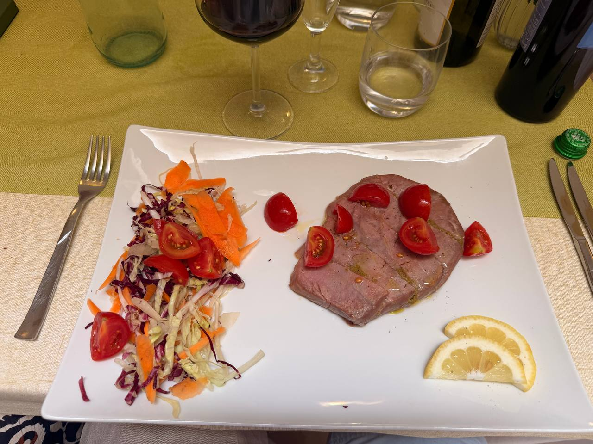
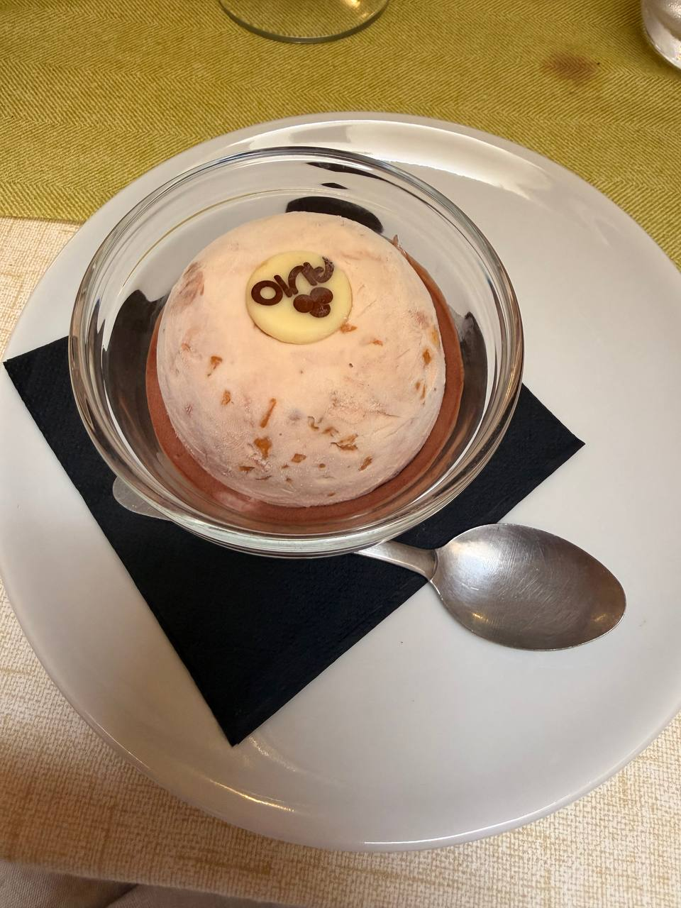
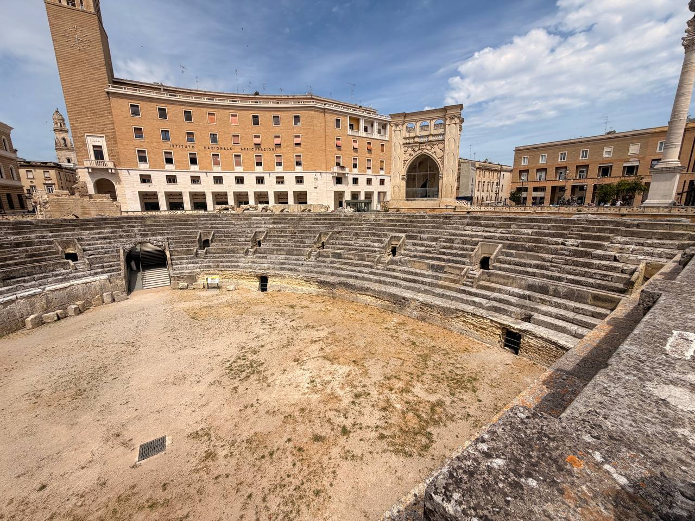

Today’s recap begins in Lecce, with Masseria dei Monaci as the base for the last night there. The morning’s architectural proof was **Basilica di Santa Croce** — properly a basilica, not the cathedral — now broken out into its own focused post: [Basilica di Santa Croce, Lecce](lecce-santa-croce-basilica.qmd).

After the Baroque stonework had done its best to exhaust the eye, lunch was at [**Giardino Segreto**](https://maps.app.goo.gl/G24HQPznRsA9eNyv7?g_st=ic), on Via Principi di Savoia. Sensibly enough, Lecce then supplied food, wine, shade, and the necessary evidence that civilization sometimes arrives on a white rectangular plate.

{fig-alt="A white rectangular lunch plate at Giardino Segreto with tuna topped with cherry tomatoes and oil, shredded cabbage and carrot salad, lemon slices, a fork and knife, a glass of red wine, water glasses, and bottles on a yellow tablecloth."}

{fig-alt="A round semi-freddo dessert with bits of fruit or nut inside, served in a clear glass bowl on a white plate with a black napkin and spoon, topped by a small white chocolate disc with chocolate writing."}

The lunch wine is already logged in [Wines of the Trip](../italy-wine-notes.qmd), where bottles belong instead of being allowed to vanish inside daily prose like fugitives.

Lecce also has the remains of its **Roman amphitheatre** sitting in the open city, half ruin and half civic interruption. Stone seating curves down toward the arena floor while modern buildings, a tall tower, and the ornate Sedile frame the excavation. It is the old Roman habit: leave something large enough in the ground that later centuries must plan their lunch walks around it.

{fig-alt="Wide view of the Roman amphitheatre remains in Lecce, showing curved tiers of stone seating around a sandy arena floor, with city buildings, a tall tower, the ornate Sedile, and blue sky above."}

## Detailed schedule

| Time | Plan |
|---|---|
| **8:40 AM** | Pickup for Lecce |
| **9:30 AM** | Pitstop, then guided tour with **Francesca** |
| **11:30 AM** | Free time in Lecce |
| **12:30 PM** | Lunch at **Giardino Segreto** |
| **2:30 PM** | Return to home base / Masseria dei Monaci |
| **5:20 PM** | **Pamela’s shuttle service** to the port of Otranto |
| **6:00 PM** | Boat tour with **Michele & co.** + aperitivo — **BRING YOUR PASSPORT** |
| **8:00 PM** | Return to the masseria |

This remains partly a schedule anchor for the June 16 recap and itinerary. Add details later: how the Lecce tour with Francesca went, the port transfer with Pamela, the boat tour with Michele & co., aperitivo, passport logistics, route/coastline, sea/weather, and whether the evening changed the feel of the Lecce day.

## Notes to expand

- **Day plan:** 8:40 pickup for Lecce; 9:30 pitstop and guided tour with Francesca; 11:30 free time.
- **Lunch:** 12:30 at [Giardino Segreto](https://maps.app.goo.gl/G24HQPznRsA9eNyv7?g_st=ic); lunch wine logged in [Wines of the Trip](../italy-wine-notes.qmd).
- **Return:** 2:30 PM return to Masseria dei Monaci.
- **Evening anchor:** 5:20 PM Pamela’s shuttle to the port of Otranto; 6:00 PM boat tour with Michele & co. + aperitivo; return to the masseria at 8:00 PM.
- **Must remember:** bring passport for the boat tour.
- **Base/accommodation:** Masseria dei Monaci.
- **Lecce highlights:** Basilica di Santa Croce in its own focused post; Roman amphitheatre remains in the city center.
