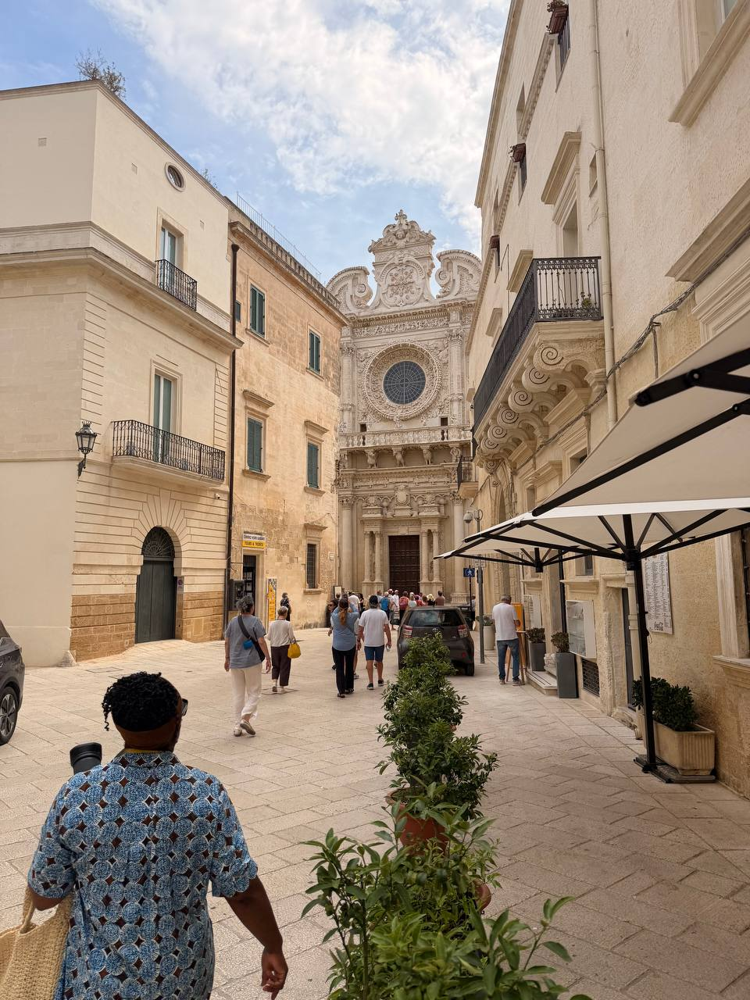
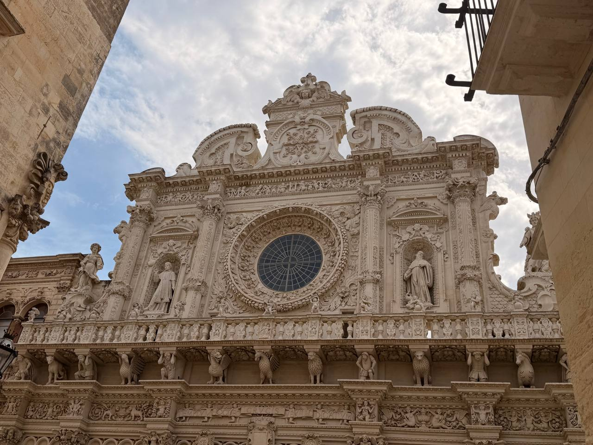

Today’s recap begins in Lecce, with Masseria dei Monaci as the base for the last night there. The morning’s architectural proof was **Santa Croce**, where Lecce’s Baroque stonework does not so much decorate the facade as overrun it — saints, scrolls, animals, columns, and a rose window all crowding forward like the building had been waiting centuries to show off.

{fig-alt="A narrow stone street in Lecce leading toward the ornate facade of Santa Croce, with pedestrians walking between pale buildings, café umbrellas on one side, and the church's rose window visible ahead."}

{fig-alt="Close view of the upper facade of Santa Croce in Lecce, showing a large circular rose window surrounded by elaborate carved stonework, statues, columns, animals, scrolls, and decorative reliefs beneath a cloudy sky."}

## Detailed schedule

| Time | Plan |
|---|---|
| **8:40 AM** | Pickup for Lecce |
| **9:30 AM** | Pitstop, then guided tour with **Francesca** |
| **11:30 AM** | Free time in Lecce |
| **12:30 PM** | Lunch at **Giardino Segreto** |
| **2:30 PM** | Return to home base / Masseria dei Monaci |
| **5:20 PM** | **Pamela’s shuttle service** to the port of Otranto |
| **6:00 PM** | Boat tour with **Michele & co.** + aperitivo — **BRING YOUR PASSPORT** |
| **8:00 PM** | Return to the masseria |

This should be treated as a schedule anchor for the June 16 recap and itinerary, not as a finished retrospective. Add details later: how the Lecce tour with Francesca went, what stood out during free time, lunch at Giardino Segreto, the port transfer with Pamela, the boat tour with Michele & co., aperitivo, passport logistics, route/coastline, sea/weather, photos, and whether the evening changed the feel of the Lecce day.

## Notes to expand

- **Day plan:** 8:40 pickup for Lecce; 9:30 pitstop and guided tour with Francesca; 11:30 free time.
- **Lunch:** 12:30 at Giardino Segreto.
- **Return:** 2:30 PM return to Masseria dei Monaci.
- **Evening anchor:** 5:20 PM Pamela’s shuttle to the port of Otranto; 6:00 PM boat tour with Michele & co. + aperitivo; return to the masseria at 8:00 PM.
- **Must remember:** bring passport for the boat tour.
- **Base/accommodation:** Masseria dei Monaci.
- **Lecce highlight:** Santa Croce — Baroque facade, rose window, carved saints, animals, columns, and the usual Lecce refusal to leave a surface undecorated.
