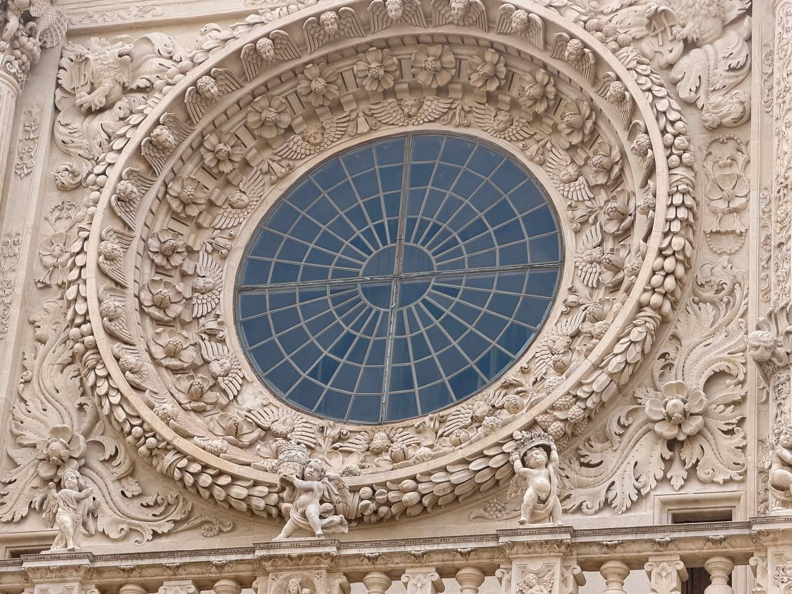
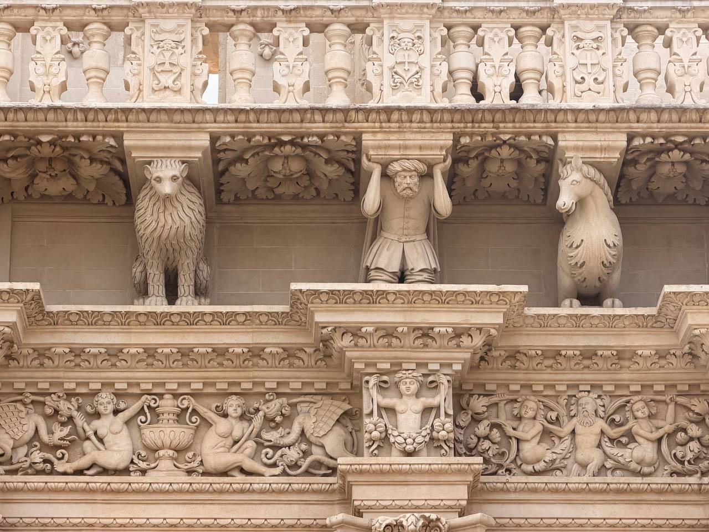
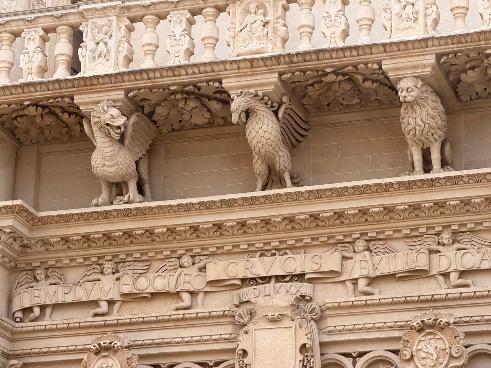
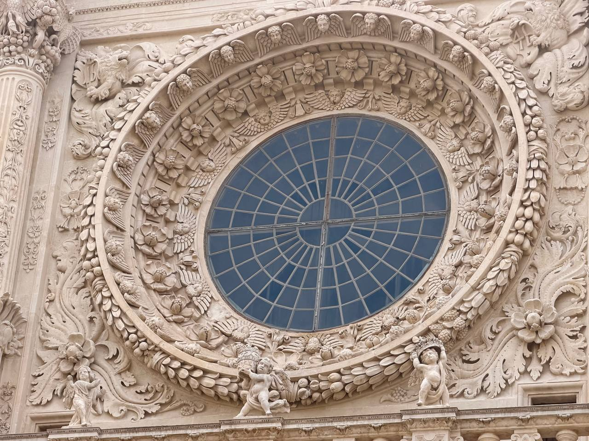
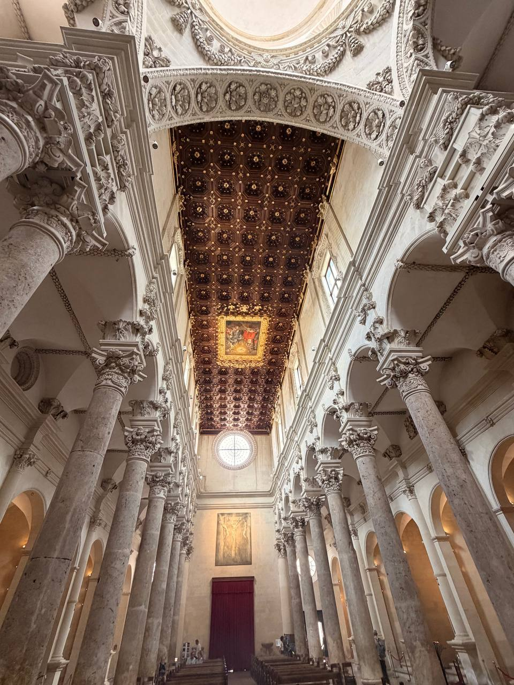
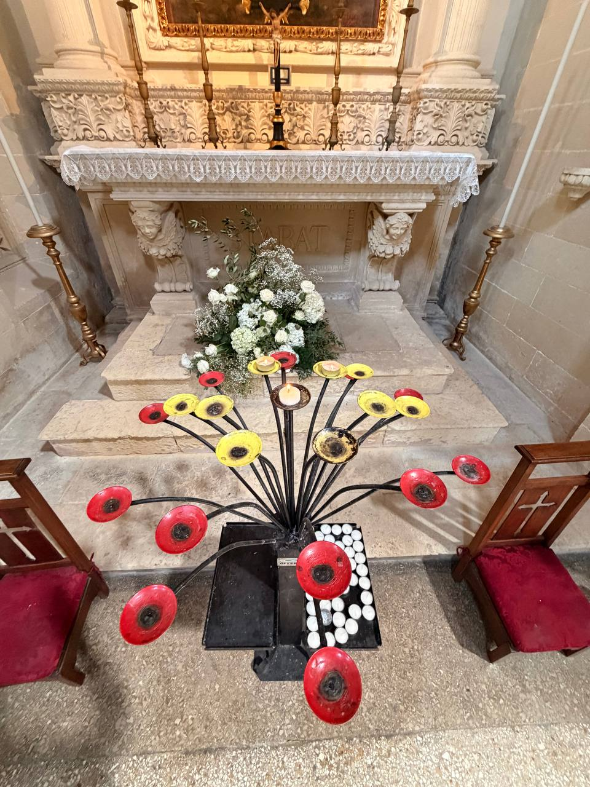
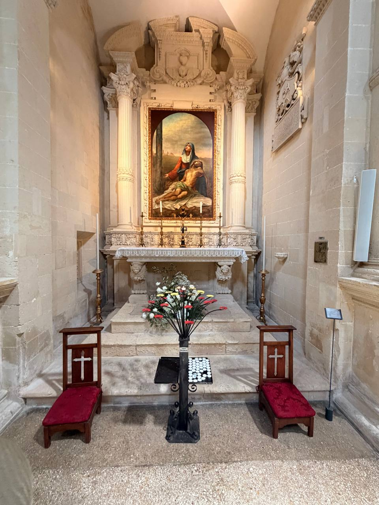
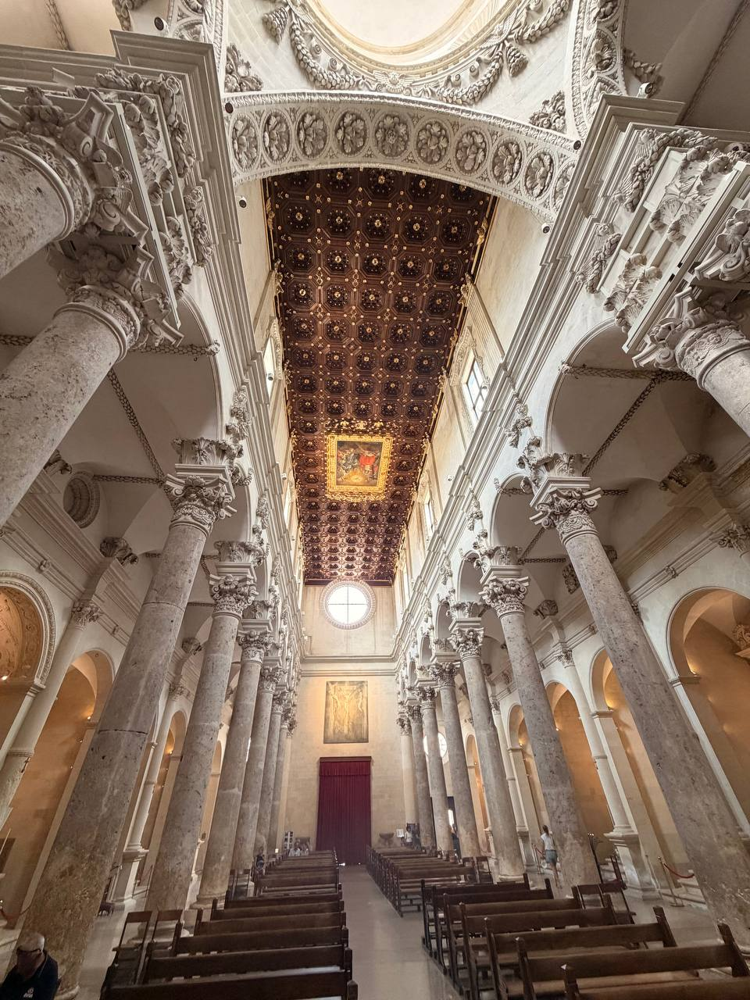
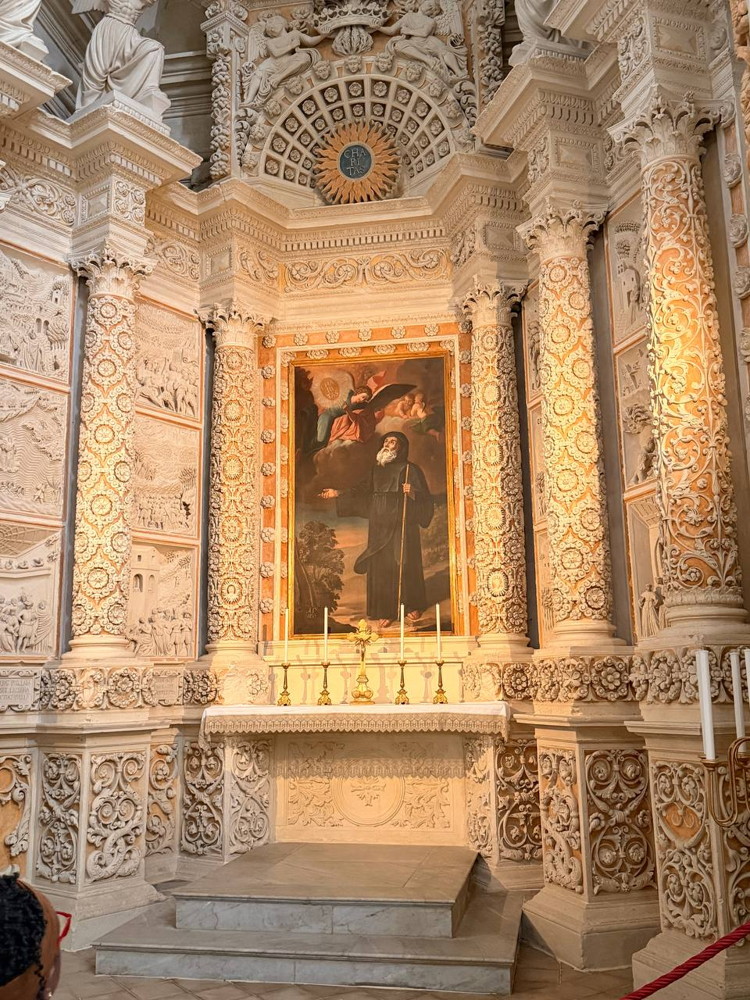

Lecce’s **Basilica di Santa Croce** is not just another ornate church facade. It is the city’s Baroque temperament made visible: pale local stone worked until it seems almost restless, with saints, scrolls, animals, columns, carved reliefs, and a great round window all pressing outward from the front of the building.

It is also, properly, a **basilica** — and one with a relic of the Cross. That matters. The exterior may look like stone exuberance for its own sake, but the name is not decorative: *Santa Croce*, Holy Cross, anchors the building’s identity as much as the facade announces Lecce’s appetite for carved abundance.

{fig-alt="A narrow stone street in Lecce leading toward the ornate facade of Santa Croce, with pedestrians walking between pale buildings, café umbrellas on one side, and the church's round window visible ahead."}

The first view comes almost theatrically, not from a grand open square but through the city’s narrow stone streets. That approach helps the building do its work. The facade appears framed between palazzi and balconies, as though Lecce has been holding it back until the last possible moment.

{fig-alt="Close view of the upper facade of Basilica di Santa Croce in Lecce, showing a large circular window surrounded by elaborate carved stonework, statues, columns, animals, scrolls, and decorative reliefs beneath a cloudy sky."}

Up close, the facade stops being a single composition and becomes a crowd. The round window centers it, but the surrounding stone refuses to stay quiet: figures, beasts, capitals, scrolls, and layered ornament all make their claims. Some churches aim for solemn restraint. Santa Croce, sensibly enough, decided that restraint was a northern disease.

{fig-alt="Close detail of the circular window on the facade of Basilica di Santa Croce in Lecce, surrounded by carved flowers, cherub heads, wings, garlands, leaves, and small putti in pale stone."}

The window is less a window than an argument. Around the glass, the stone blooms into flowers and cherub heads, fruit and wings, rings inside rings of decoration. The Baroque here is not coy. It piles up proof.

{fig-alt="Detail of the Basilica di Santa Croce facade showing a carved balcony with balusters, shield panels, a bearded human figure supporting the ledge, animal figures, floral carving, and small sculpted figures below."}

Look long enough and the facade begins to feel populated. A man strains under a projecting ledge. Animals stand watch. Putti, shields, leaves, and small bodies fill the bands beneath the balcony. It is architecture, yes, but also a stone menagerie with ecclesiastical responsibilities.

{fig-alt="Carved facade detail from Basilica di Santa Croce in Lecce showing fantastic animal figures, including a winged creature, a birdlike beast, and a lion, above a Latin inscription held by small winged figures."}

The carved creatures are not merely decorative punctuation. They keep the eye moving across the facade, from inscription to balcony to cornice, until the building feels less like a flat front than a whole theater of stone.

Inside, the basilica changes key. The exterior’s bright carved tumult gives way to a long nave, pale arches, side chapels, and a dark coffered ceiling overhead. It is still richly made, but the motion slows.

{fig-alt="Interior nave of Basilica di Santa Croce in Lecce with pale stone arches, side chapels, a dark coffered ceiling with gilded details, and a round window at the far end."}

The interior lets the building breathe. After the facade’s clamor, the nave feels almost calm — not plain, exactly, but ordered. The stone is still carved. The chapels still pull at the eye. But the ceiling and the long aisle give the whole thing a processional rhythm.

{fig-alt="Side chapel inside Basilica di Santa Croce in Lecce with an image of Mary holding the dead Christ, red kneelers, white flowers, and a black branching votive candle stand with red and yellow candle cups."}

The side chapels bring the basilica back to devotion at human scale. In one, a Pietà image stands above red kneelers and votive candles: grief, prayer, flowers, and small flames gathered into a compact grammar of Catholic attention.

{fig-alt="A decorated side altar in Basilica di Santa Croce with carved columns, relief panels, a central painting of a robed saint, and a bright Christogram-like monogram above."}

Another side altar returns to the Lecce habit of refusing blank space. Columns, reliefs, garlands, carved panels, a saint’s image, and a bright monogram crowd the frame. The basilica’s exterior may be famous, but the interior has not exactly taken a vow of silence.

{fig-alt="Interior view in Basilica di Santa Croce showing a circular window high on a pale wall, red drapery below, and carved stone arches and columns at the sides."}

{fig-alt="Close interior detail from Basilica di Santa Croce in Lecce showing a carved stone capital and surrounding ornament with layered foliage, scrolls, and pale architectural moldings."}

{fig-alt="Side chapel detail inside Basilica di Santa Croce in Lecce with carved architectural framing, religious paintings, columns, relief panels, and dense Baroque stone decoration."}

Santa Croce is a good corrective to the lazy phrase “too much.” Too much compared with what? The building knows what it is doing. It meets the visitor first as spectacle, then as sanctuary, and finally as a sustained lesson in how stone can be made to move without ever leaving the wall.
