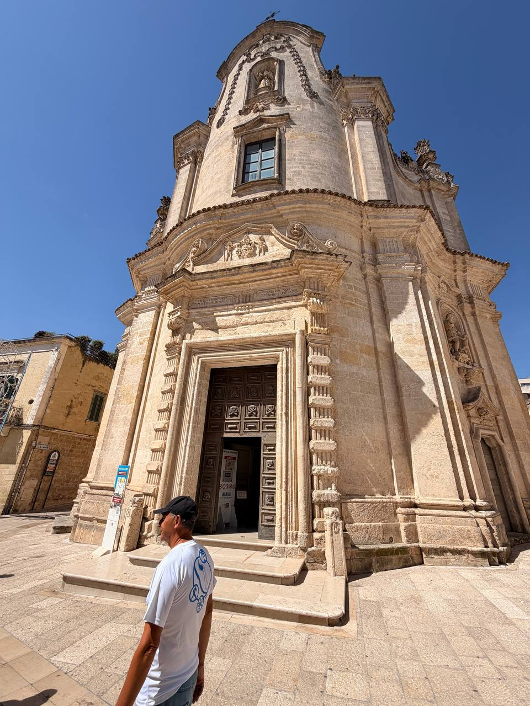
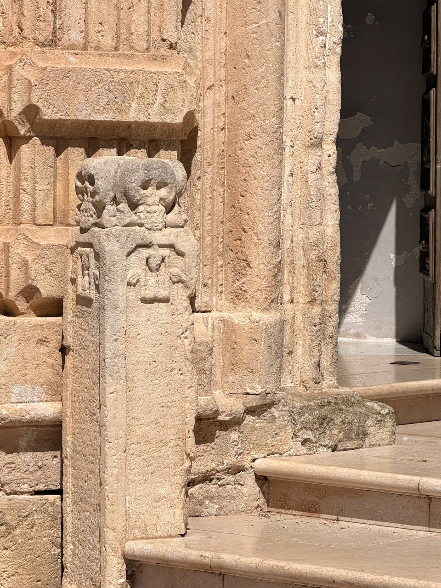
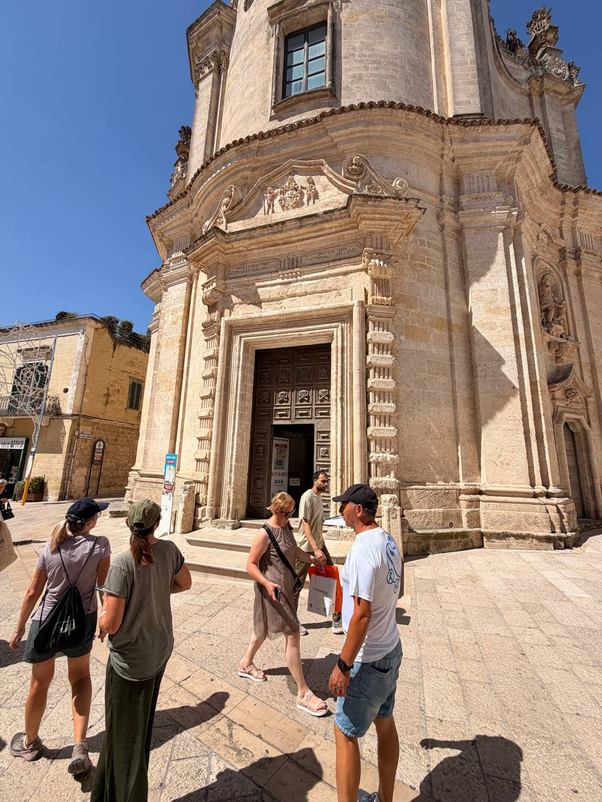
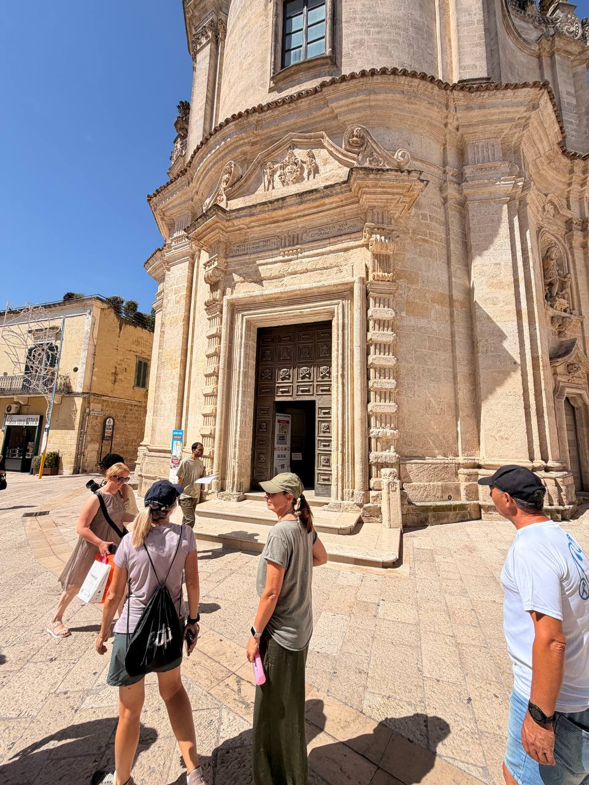
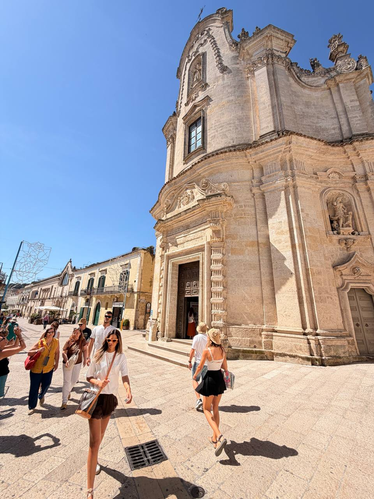

Matera's **Chiesa del Purgatorio** deserves its own post because it announces its subject before you cross the threshold. This is not a church that hides death in a side chapel. It puts skulls, bones, souls, angels, and redemption on the facade, right in the white heat of Via Ridola.

The Italian Wikipedia entry identifies it as a **Baroque** church on **Via Ridola**, built between **1725 and 1747** with funding from the **Confraternity of Purgatory**. The theme is exactly what the name promises: death, time, purification, and the hope of redemption. Subtle it is not. Nor should it be.

## Why a church of Purgatory?

The surprise for us was that this was not just one strange Matera church with a taste for skulls. It belongs to a wider Catholic pattern: **purgatorial societies** or **confraternities** devoted to praying for the souls in Purgatory. The point was intercession. The living offered Masses, prayers, charity, and remembrance so that the dead — especially those imagined as poor, abandoned, unnamed, or insufficiently aided — might be helped on the way to heaven.

That means the word “confraternity” matters. This was not, as far as the Matera source says, a single religious order dropping identical churches across Italy. It was a lay devotional and charitable form that flourished especially in the Counter-Reformation and Baroque world. Naples gives the loudest example: [Santa Maria delle Anime del Purgatorio ad Arco](https://www.purgatorioadarco.it/en/) was attached to a congregation founded in the early seventeenth century to offer daily Masses, sacred functions, and charitable works in suffrage for the souls of Purgatory. Its underground cult of the **anime pezzentelle** — anonymous “poor souls,” often represented through adopted skulls — shows the same theology in a more intensely Neapolitan key.

Matera's church is part of that family, but with its own local face. Other Italian examples use related names — **Purgatorio**, **Anime del Purgatorio**, **Anime Sante**, or **Santa Maria del Suffragio** — in places such as Naples, Ruvo di Puglia, Rome, and L'Aquila. The common thread is not tourism-gothic decoration. It is a whole devotional economy of suffrage: the living remember, pray, fund Masses, and perform charity; the dead remain present as souls still being purified.

{fig-alt="A vertical view of the pale stone Baroque facade of Chiesa del Purgatorio in Matera, with a tall curved upper section, ornate portal, dark wooden doors, sculptural details, and a man standing in the sunny square below."}

From below, the building rises in pale stone curves: a swelling facade, heavy portal, carved scrolls, niches, figures, and a dark doorway set back from the glare. Under a hard blue sky near 90°F, the Baroque drama did not need much help. The weather was already preaching mortality.

{fig-alt="A close view of a carved stone post beside the entrance of Chiesa del Purgatorio, topped with worn skulls and small relief panels, with sunlit stone steps and an open doorway behind it."}

The skulls are the bluntest sermon. A worn stone post by the entrance carries carved skulls and small relief panels, the memento mori language of the whole church reduced to something you pass at knee height on the way in. Baroque theology sometimes reaches for clouds and angels; here it also grabs you by the ankle.

{fig-alt="Several visitors stand in bright sun before the ornate entrance of Chiesa del Purgatorio in Matera, with carved pilasters, a decorated pediment, and dark wooden doors behind them."}

The portal is framed by carved pilasters and a broken, scrolling pediment crowded with figures and inscriptions. Even with tour groups passing through the square, the entrance keeps its force: a public doorway into a church built around purgation, intercession, and the uneasy arithmetic of death and mercy.

{fig-alt="Visitors gather in front of the lower facade and open doorway of Chiesa del Purgatorio, with pale stone carvings, dark wooden doors, and strong midday shadows across the paved square."}

The facade's decorations make the subject visible before any guide explains it. Wikipedia notes skulls above the facade and skulls represented in the wooden portal. The effect is a whole exterior program about the **caducity of time** — the Baroque's elegant way of saying that time eats everyone, even in a beautiful square.

{fig-alt="A wide view of Chiesa del Purgatorio on Via Ridola in Matera, showing its curving Baroque facade, side niche with a statue, pedestrians in summer clothing, sharp shadows, and a clear blue sky."}

Stepping back, the church sits firmly in the daily life of Matera: people crossing the street, festival-light frames nearby, the side niche and facade carvings catching the sun. That ordinary street life is part of the force. The church does not set mortality apart from the city; it carves it into the wall everyone walks past.

## Notes to expand

- **Site:** Chiesa del Purgatorio, Matera.
- **Location:** Via Ridola.
- **Style:** Baroque.
- **Construction:** 1725–1747.
- **Patronage/name:** funded by the Confraternity of Purgatory, from which the church takes its name; this seems to fit the wider Catholic pattern of purgatorial societies/confraternities rather than a single religious order.
- **Wider context:** purgatory churches and suffrage confraternities appear elsewhere in Italy, including Naples' Santa Maria delle Anime del Purgatorio ad Arco, Ruvo di Puglia's Chiesa del Purgatorio, Rome's Santa Maria del Suffragio, and L'Aquila's Anime Sante / Santa Maria del Suffragio.
- **Theological frame:** Masses, prayers, charitable works, and remembrance offered in suffrage for souls in Purgatory; especially vivid in Naples' cult of the `anime pezzentelle`, or anonymous poor souls.
- **Facade program:** skulls, death imagery, angels, and redemption motifs; the theme is the Baroque caducity of time.
- **Architecture:** Greek-cross interior; central octagonal dome on a circular drum with Corinthian capitals, according to the Italian Wikipedia entry.
- **Interior notes to verify/add if photographed:** 18th-century side-altarpiece paintings; high altar canvas with Saint Cajetan and the Madonna; statues of Madonna della Bruna and Sant'Eustachio; pipe organ by Leonardo Carelli, 1755.
- **Source used:** Italian Wikipedia, “Chiesa del Purgatorio (Matera)”; Catholic Encyclopedia / Wikisource, “Purgatorial Societies”; Purgatorio ad Arco official site pages on the monument, Opera Pia, and cult of the `anime pezzentelle`; plus Dan's field photographs and note from Matera.
