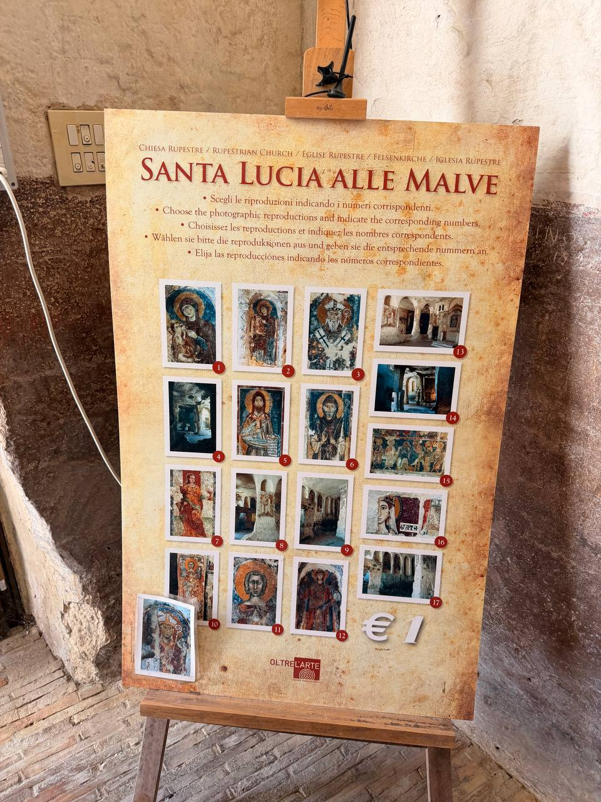
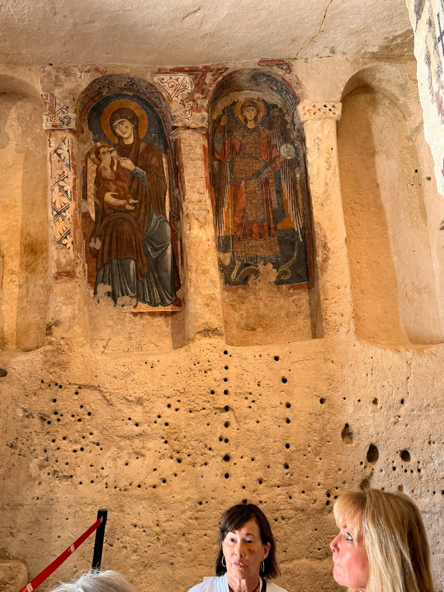
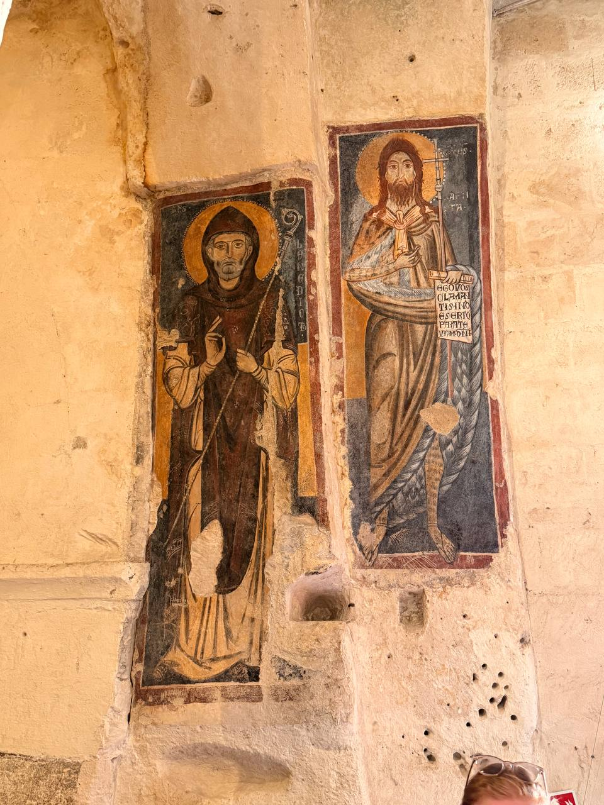
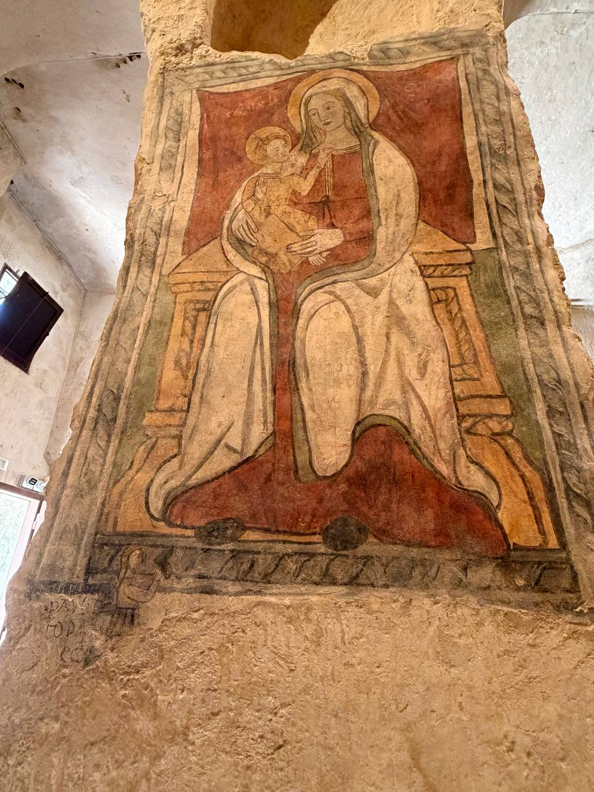
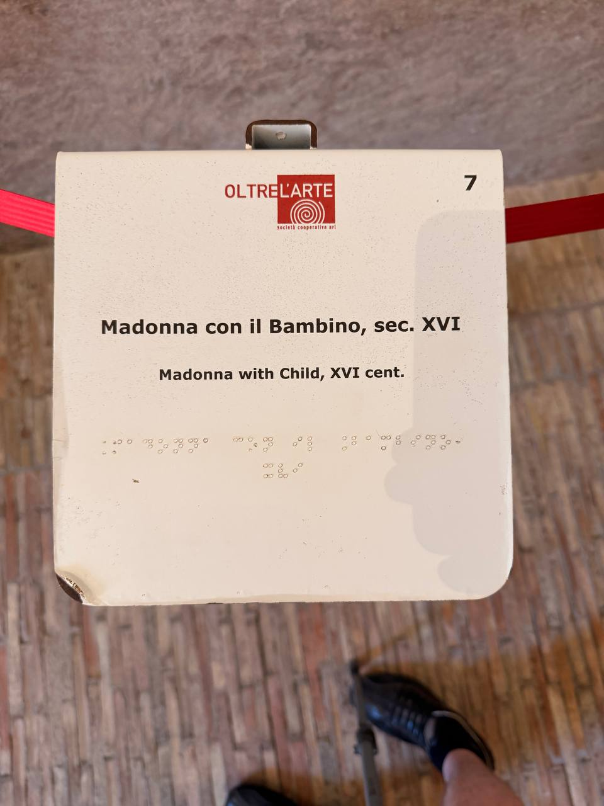
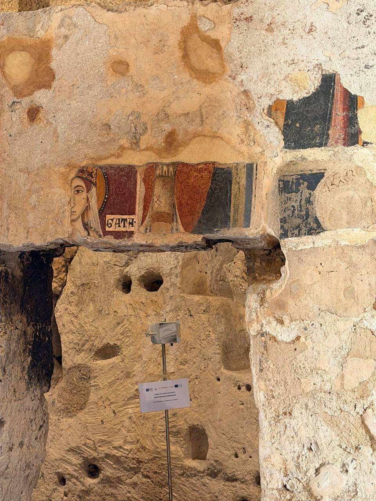
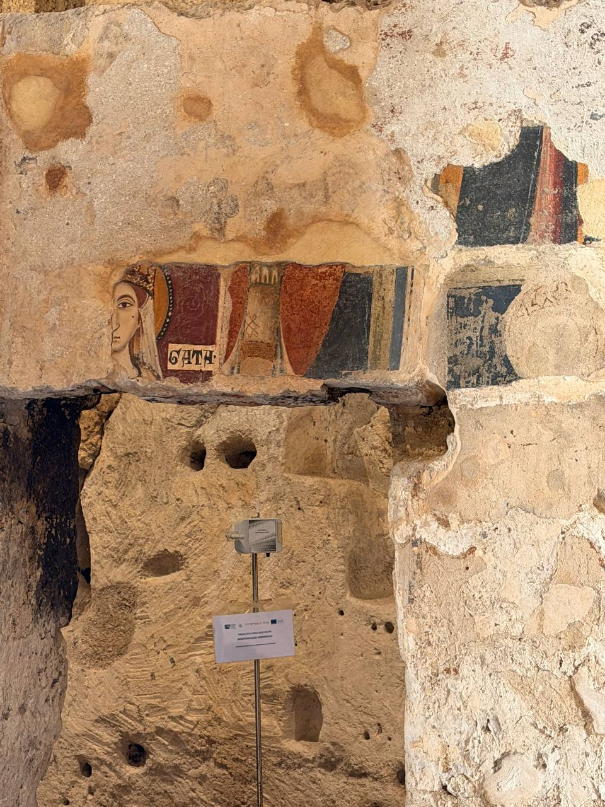
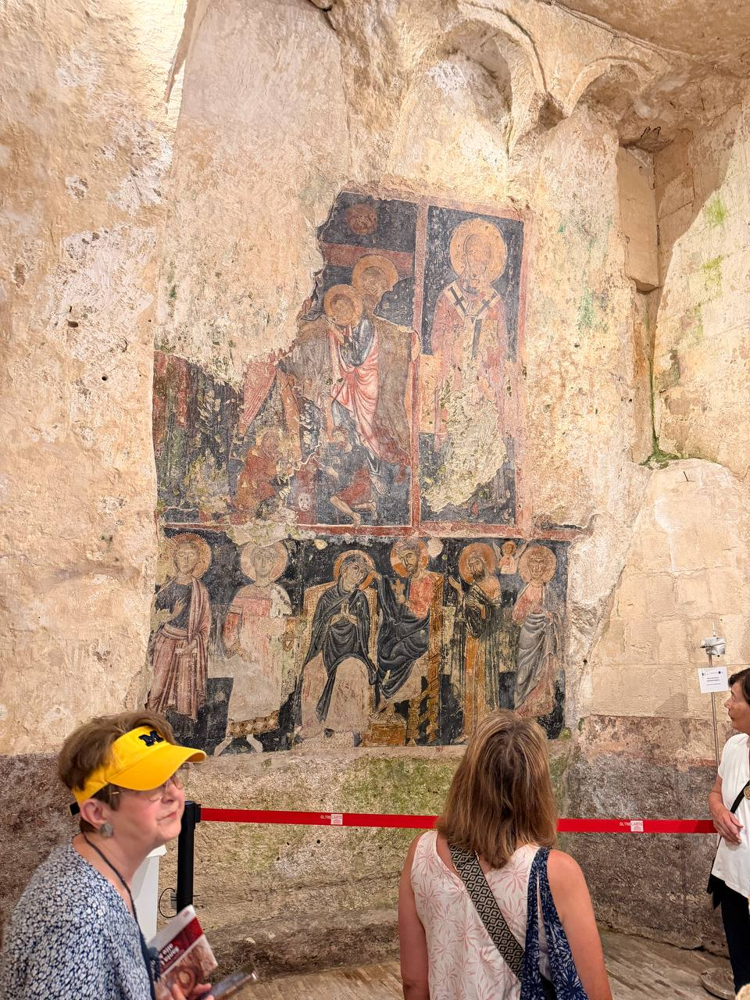

Matera's rock churches do not behave like ordinary churches. They are carved out of the city itself: tufa walls, uneven chambers, niches and columns cut from stone, and frescoes surviving where damp, smoke, damage, and time have not quite finished their work.

This one gets its own post because the wall is doing more than decoration. The on-site materials name the place **Santa Lucia alle Malve**, a *chiesa rupestre* — a rock-cut church. The frescoes belong to the long sacred life of the Sassi: Byzantine and Italo-Byzantine forms, monastic memory, Latin and Greek worlds rubbing shoulders, and the Norman presence in southern Italy not far away. Dan's field note was blunt: **William the Conqueror was here.** Whether taken literally or as shorthand for the Norman century, the point stands — this cave church belongs to the same rough medieval world in which Normans were remaking both England and the south of Italy.

{fig-alt="A display board titled Santa Lucia alle Malve shows numbered photographic reproductions of frescoes and interior views for visitors inside the rock church."}

The reproduction board is useful evidence in its own right. It names the site plainly — **Santa Lucia alle Malve** — and turns the cave wall into a numbered map of surviving saints, interiors, fragments, and devotional panels.

{fig-alt="Two frescoed arched niches in a rock-cut church show the Virgin Mary holding the Christ Child on the left and an armored haloed Saint Michael on the right, with carved stone columns and pitted tufa walls around them."}

The clearest pairing is the Virgin and Child beside Saint Michael. The Virgin sits solemnly under a painted arch, dark mantle and gold halo intact enough to hold the eye. Michael stands armed in the next niche, frontal and formal, the old protector of thresholds and combat still watching from a wall that has lost plenty but not its authority.

{fig-alt="Two narrow fresco panels on a pale stone wall show haloed bearded saints in long robes, one holding a staff and the other holding a scroll with writing, with damaged plaster around the figures."}

{fig-alt="A sixteenth-century fresco of the Madonna with Child painted on a rough stone pier, with Mary seated on a throne against a red background and holding the Christ Child on her lap."}

A separate label identifies this panel as **Madonna con il Bambino, sec. XVI** — **Madonna with Child, 16th century**. That late date matters. The cave is not just one medieval moment preserved in amber; it kept accumulating devotion, painting, damage, and repair.

{fig-alt="A white museum label from Oltre l'Arte reads 'Madonna con il Bambino, sec. XVI' and 'Madonna with Child, XVI cent.' with Braille below."}

Other panels show monastic saints — lean, frontal, severe, and haloed — with staffs, scrolls, and inscriptions. Their faces are not sentimental. They look like men who have been standing in the cave long enough to know that tourists eventually leave and stone remains.

{fig-alt="A damaged section of rock wall preserves part of a painted female saint's face, a small inscription fragment, colored bands, and other worn fresco remains above rough carved stone openings."}

Some fragments survive only as clues: half a female saint's face, a word fragment, borders, pieces of drapery, the ghost of a panel. The loss is part of the record. These are not clean museum panels but saints embedded in a cave wall, their survival negotiated inch by inch.

{fig-alt="A pitted tufa wall in a rock-cut church preserves damaged fresco fragments, including part of a woman's haloed face, red and dark painted panels, and an informational sign below."}

The damage also makes the place legible as a working sacred site across centuries. Paint, plaster, carved stone, repairs, erosion, and holes in the tufa all occupy the same surface. No one layer gets the whole wall to itself.

{fig-alt="Visitors stand behind a red barrier in a rock-cut chapel, looking at a large damaged fresco wall with upper and lower registers of haloed saints and a seated Virgin figure."}

{fig-alt="A large frescoed wall in a rock-cut chapel shows damaged upper and lower registers of haloed saints, including a seated Virgin figure in the lower row, with visitors standing behind a red barrier."}

The larger fresco wall gathers the whole problem together: upper and lower registers, bishops or saints, a seated Virgin figure below, and enough missing plaster to remind you that survival is never neutral. It is a wall of saints, but also a wall of absences.

## Notes to expand

- **Site:** Santa Lucia alle Malve, Matera; on-site board identifies it as a *chiesa rupestre* / rupestrian church.
- **Context:** Rock-cut sacred space in the Sassi, with frescoes painted directly onto tufa/plaster surfaces.
- **Visible iconography:** Virgin Mary and Child; Saint Michael; monastic saints with staff and scroll; damaged fragments of female saints and other holy figures.
- **On-site label:** “Madonna con il Bambino, sec. XVI” / “Madonna with Child, XVI cent.” for the Madonna-and-Child panel on the stone pier.
- **Style:** Byzantine / Italo-Byzantine visual vocabulary — frontal saints, gold halos, dark grounds, formal icon-like poses.
- **Historical thread:** Dan noted the Norman connection: "William the Conqueror was here." Worth checking whether this refers to a specific visit, a guide's Norman shorthand, or the broader Norman presence in southern Italy.
- **Still needed:** official dating for the fresco cycles beyond the labeled 16th-century Madonna with Child; whether individual saints in the damaged fragments are identified on site.
