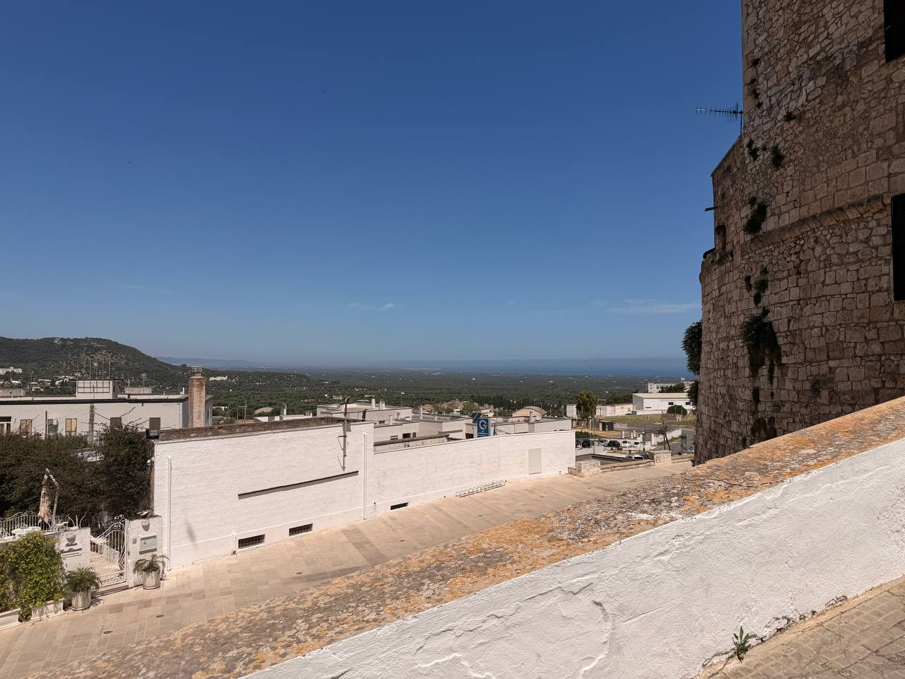
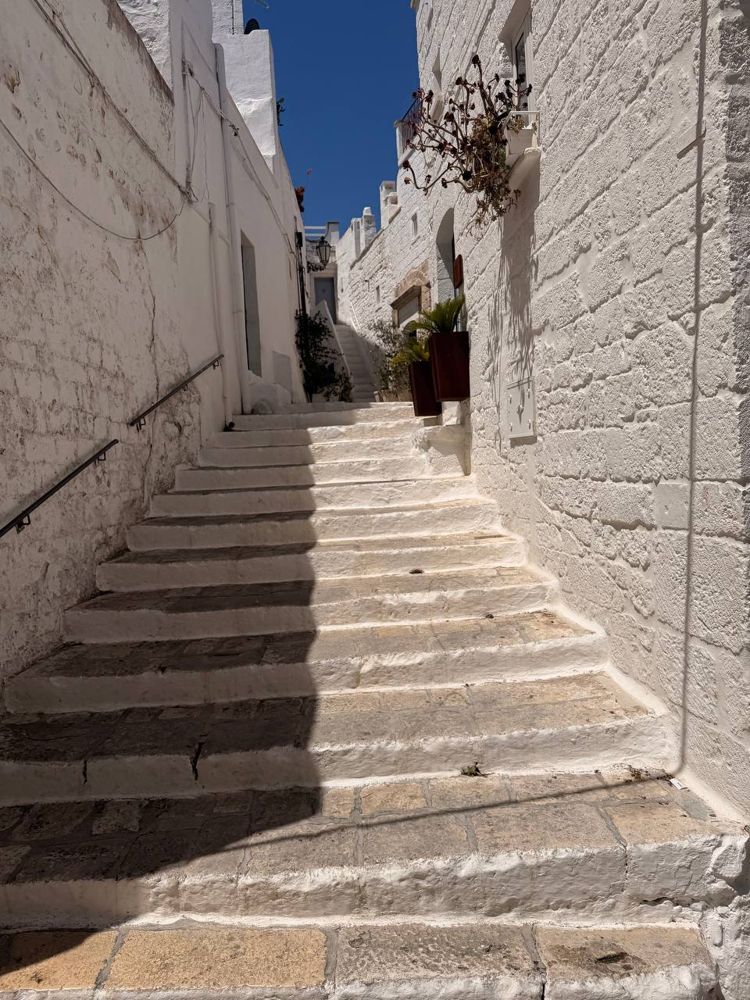
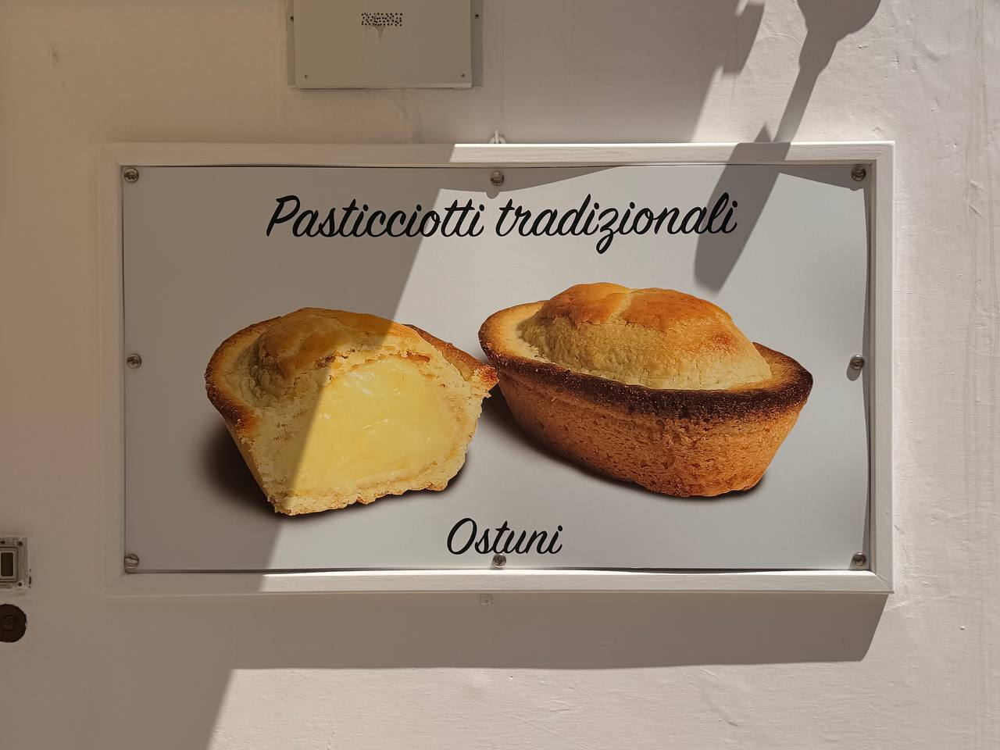
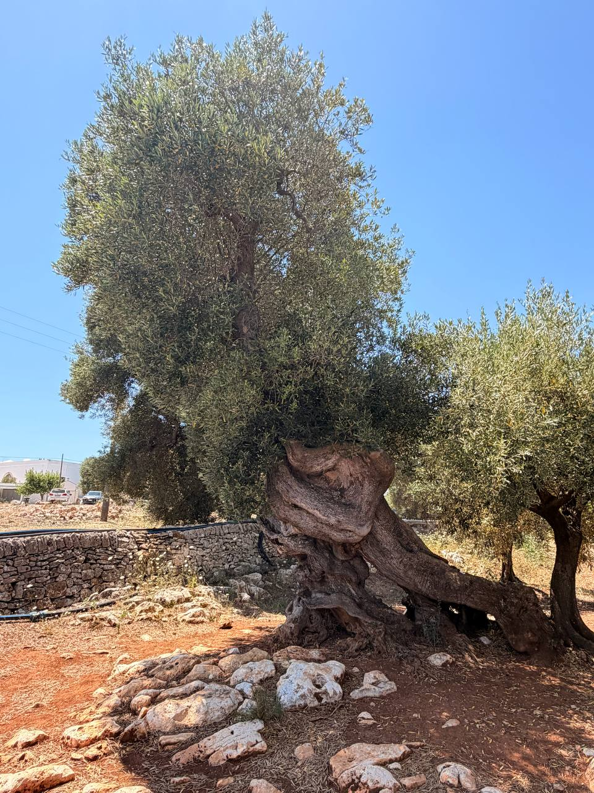
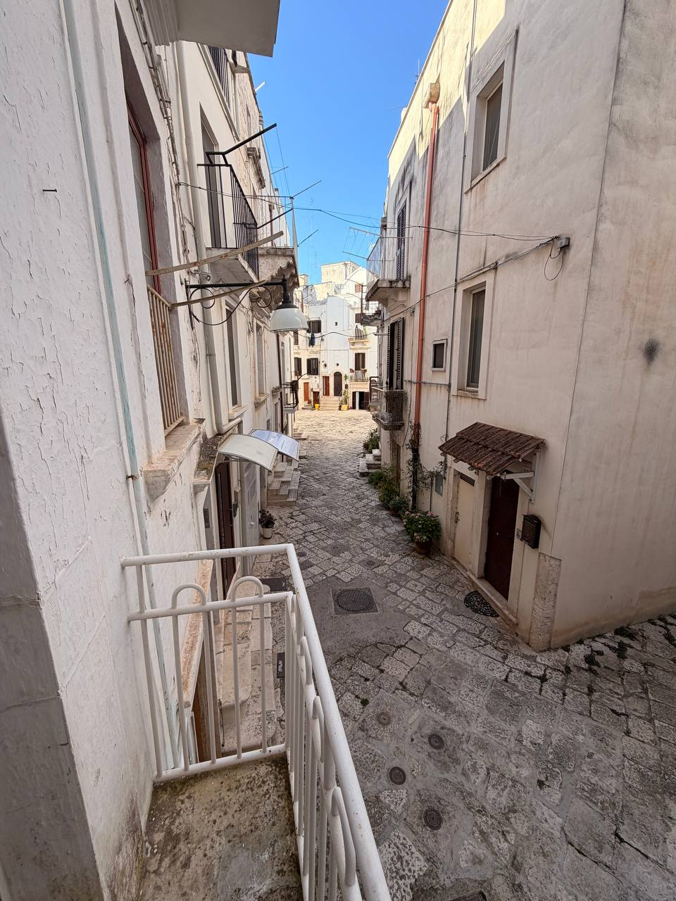
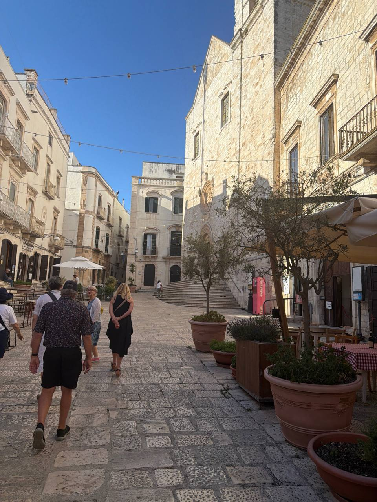
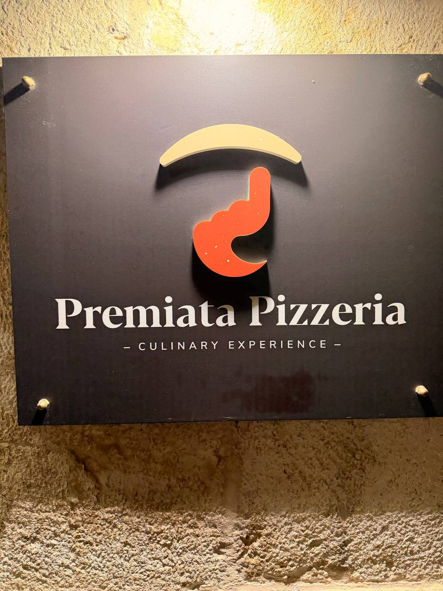
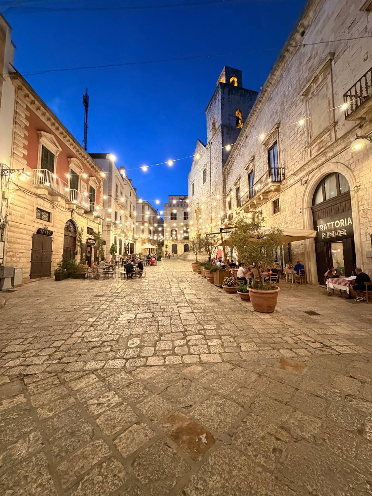
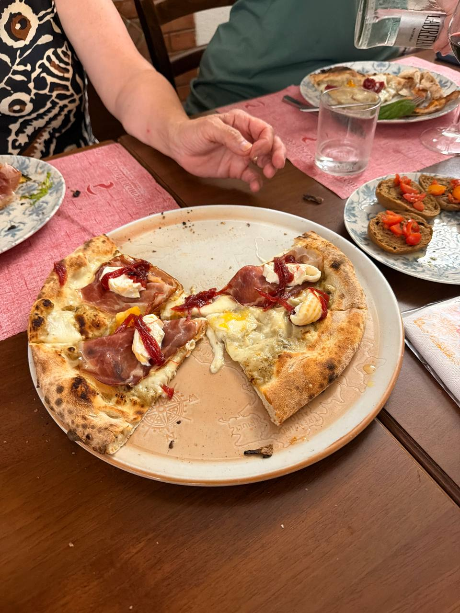

June 17 begins as a working day-post, to be filled in as the evidence arrives. The route is north through **Ostuni**, onward to **Masseria Rienzo** for olive oil and lunch, and then into **Putignano** for the next base. A sensible plan, provided no one lets aperitivo become a committee meeting.

Ostuni did what Ostuni is supposed to do: white stone, hard sunlight, steep lanes, and views out over the lower country toward the Adriatic. The city’s whiteness is not subtle. It bounces the sun back at you like a civic policy.

{fig-alt="View from Ostuni across white buildings and a pale stone wall toward a broad green plain, distant hills, and a faint blue Adriatic horizon under a clear sky, with an old stone building at the right edge."}

{fig-alt="Narrow Ostuni stairway climbing between rough whitewashed stone walls, with potted plants, railings, sharp sun and shadow, and a deep blue sky above."}

There was also a cream-filled pastry at a gas station — proof, if any more were required, that Italy has an unfair advantage in even its utilitarian food infrastructure. The sign in town names the thing properly: **pasticciotti tradizionali**, Ostuni. A gas-station pasticciotto with crema is still a cream-filled pastry worth remembering, because civilization occasionally appears beside a fuel pump and refuses to apologize.

{fig-alt="Wall sign reading 'Pasticciotti tradizionali' and 'Ostuni,' with photos of a cut-open pastry filled with yellow cream and a whole golden-brown pastry, mounted on a white wall in sunlight."}

Then came the proper deep-time argument for the day: a **3,000-year-old olive tree**, its trunk twisted, hollowed, and folded back on itself, still carrying a full crown of silver-green leaves. The Romans look recent beside a tree like that. So do most arguments.

{fig-alt="Ancient olive tree in a rocky Puglian grove, with a huge gnarled and hollow trunk, exposed roots among white stones and red soil, dense silver-green foliage, nearby olive trees, a low stone wall, and a clear blue sky."}

After the move came the room in the historic center: a narrow whitewashed lane below the balcony, stone paving underfoot, wires and railings overhead, and a wedge of blue sky between the buildings. The accommodations in Putignano are in buildings more than **1,000 years old**. Our driver is from Putignano; his ancestors may have lived in some of these same stone rooms, which is a better check-in fact than any hotel welcome card has managed lately. Apulia does not always announce itself with grand monuments. Sometimes it gives you a quiet street out the window and lets the stone do the explaining.

{fig-alt="View from a small balcony down onto a narrow stone-paved lane between pale white and cream buildings, with metal railings, balconies, overhead wires, shuttered windows, potted plants near doorways, and a bright blue sky above."}

The historic center also has the **Seat of the Knights of Malta**: pale stone buildings gathered around a small paved square, with outdoor tables, potted trees, and the bright blue sky doing its usual Puglian work. Not a bad way for a medieval military order to leave a footprint.

{fig-alt="Sunlit stone-paved square in a historic center, with pale limestone buildings, balconies, a large churchlike facade with steps and a circular window detail, outdoor cafe tables, potted trees, overhead string lights, and several people walking under a clear blue sky."}

Dinner was at **Premiata Pizzeria**, properly announced by a black sign promising a “culinary experience,” and then delivered in the more reliable language of hot crust, cheese, cured meat, red peppers, and a table that had already begun to look lived-in. The walk there through Putignano’s historic center was nearly as good: stone paving underfoot, pale facades on either side, string lights overhead, and the evening sky going deep blue above the tower.

{fig-alt="A black wall sign mounted on rough stone reads 'Premiata Pizzeria' and 'Culinary Experience,' with a red and cream logo above the lettering and warm light falling across the sign."}

{fig-alt="A stone-paved street in Putignano at dusk, lined with pale historic buildings, restaurant tables, potted plants, string lights, and a square tower with illuminated openings under a deep blue evening sky."}

{fig-alt="A partly eaten pizza sits on a ceramic plate at a restaurant table, topped with melted cheese, slices of cured meat, small white cheese pieces, and red pepper strips, with water glasses, another plate, and small bruschetta-style bites nearby."}

## Schedule for Wednesday, June 17

| Time | Plan |
|---|---|
| **8:00** | Breakfast |
| **9:00** | Pickup for Ostuni |
| **10:45** | Ostuni historic center shopping and exploring |
| **12:20** | Pickup for **Masseria Rienzo** for olive oil tasting and light lunch |
| **14:00** | Continue to Putignano |
| **After arrival** | Check in at **Hotel Pietrantiche** |
| **Afternoon** | Free time |
| **18:00** | Aperitivo somewhere 😂 |
| **19:30** | Pizza night at **Premiata Pizzeria** |

## Notes to expand

- **Morning:** Breakfast, pickup, and first impressions of Ostuni.
- **Ostuni:** Historic center shopping, wandering, whitewashed stone lanes, views over the plain, and whatever the White City decides to reveal.
- **Gas-station pastry:** cream-filled pasticciotto / pasticciotti tradizionali; good enough to deserve a note, which says something about Italian gas stations.
- **Masseria Rienzo:** Olive oil tasting, light lunch, the 3,000-year-old olive tree, and any bottle-worthy details.
- **Putignano:** Arrival, check-in at Hotel Pietrantiche, room/base notes, historic-center balcony view, accommodations in 1,000-plus-year-old buildings, driver/ancestral-local connection, Seat of the Knights of Malta, and free time.
- **Evening:** Aperitivo reconnaissance, followed by pizza night at Premiata Pizzeria.
