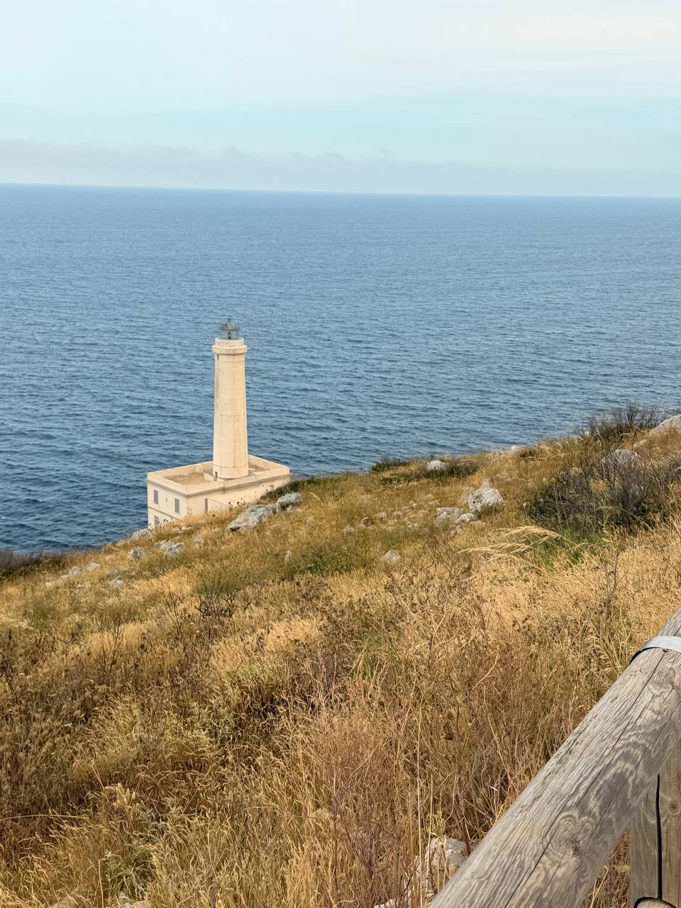

Today’s note begins with the **Tree of Life** in **Otranto Cathedral** — the great medieval floor mosaic that turns the cathedral pavement into a whole world of stories, beasts, scripture, legend, and moral imagination. A cathedral floor is usually something you walk across on the way to the altar; here it insists on being read.

The itinerary had Otranto as an ancient Adriatic port town: Greek Hydrus, Roman port, a place facing the Balkans and Greece, with Albania visible across the water on a clear day. The cathedral’s mosaic belongs to that same sense of crossings. It is Christian, but not narrow; medieval, but not simple. The Tree of Life holds together biblical scenes, animals, monsters, and older narrative matter — the sort of visual encyclopedia that reminds you the Middle Ages were not intellectually small, merely organized by different maps.

A source check notes that the pavement mosaic was executed in **1163–1165**, under a group headed by **Pantaleone / Pantaleon**, a Basilian monk from the monastery of San Nicola di Casole near Otranto. The scenes are arranged alongside the Tree of Life and include Old Testament episodes, bestiary imagery, chivalric and legendary material, and the Alexander Romance. That mix is worth remembering: the floor is not just decoration, but a medieval system for holding many kinds of knowledge in one sacred space.

There is also the paradox of the thing: this priceless work of art is still a **floor**, walked by thousands and thousands of people. Apparently that use is not merely tolerated but bound up with its preservation. The stone absorbs the salt and salt air; covering it, however protective it might sound to modern museum instinct, would apparently ruin it. A very old object survives not by being sealed away from human passage, but by remaining in contact with place, air, feet, and the conditions that made it.

Lunch was in the harbor overlooking the Adriatic in Otranto: fresh vegetables, sea bream, a light torte, and lots of fruit. It sounds exactly right for the place — water in front of you, clean food, and nothing heavy enough to deaden the afternoon.

But the cathedral was the highlight beyond a doubt. The mosaic is the most remarkable Dan has ever seen: not a panel, not a chapel detail, not one decorative field, but the entire cathedral floor, with each section depicting different stories. **Pictures will be added later**, because this is one of those cases where prose can point, but the eye has to do its own work.

The evening plan added one more coastal turn to the day. At **17:00**, the group met in the courtyard for pickup. The first stop was **Il Faro** at **Punta Palascia / Cape Otranto**, the easternmost point of Italy; the second was **Porto Badisco**, for bar food, drinks, fun friends, and great sea views. Return to Masseria dei Monaci was scheduled for **19:30**. It makes a good closing shape for the day: cathedral floor in the morning, harbor lunch at midday, and then lighthouse, inlet, drinks, and sea views before returning home.

This is still a partial note. More can be added later from the day itself: first impression of Otranto, the guide, the cathedral interior, the feel of standing over the mosaic, the evening’s actual atmosphere at Il Faro and Porto Badisco, and any dinner or return details worth keeping.

## Notes to expand

- **Core image:** Tree of Life, Otranto Cathedral.
- **Place:** Otranto, ancient port town on the Adriatic, facing Albania/Balkans/Greece.
- **Cathedral detail:** medieval pavement mosaic, not merely wall art or decoration — a floor to read and a floor still walked on.
- **Preservation paradox:** the mosaic is a priceless work of art, but apparently depends on remaining uncovered; the stone absorbs salt/salt air, and covering it would reportedly damage it.
- **Historical anchor:** mosaic executed in 1163–1165 by artists headed by Pantaleone / Pantaleon, Basilian monk of San Nicola di Casole.
- **Interpretive theme:** sacred space as encyclopedia; biblical, legendary, animal, and moral imagery held together in one visual field.
- **Lunch:** harbor meal overlooking the Adriatic in Otranto — fresh vegetables, sea bream, light torte, lots of fruit.
- **Cathedral verdict:** highlight of the day beyond a doubt; the most remarkable mosaic Dan has ever seen, covering the entire cathedral floor section by section.
- **Photo pending:** pictures will be added later, especially to document the Tree of Life, the floor’s scale and texture, and the fact that this priceless work remains walked on.
- **Evening plan/photo:** 17:00 courtyard pickup; first stop Il Faro at Punta Palascia / Cape Otranto, the easternmost point of Italy; second stop Porto Badisco for bar food, drinks, fun friends, and great sea views; return to Masseria dei Monaci scheduled for 19:30. Photo staged as `images/punta-palascia-lighthouse-easternmost-italy.jpeg`.
- **Still needed:** Dan’s own sensory details — guide, light, crowd, cathedral atmosphere, what stood out beyond the mosaic, and how the evening at Il Faro / Porto Badisco actually felt.
