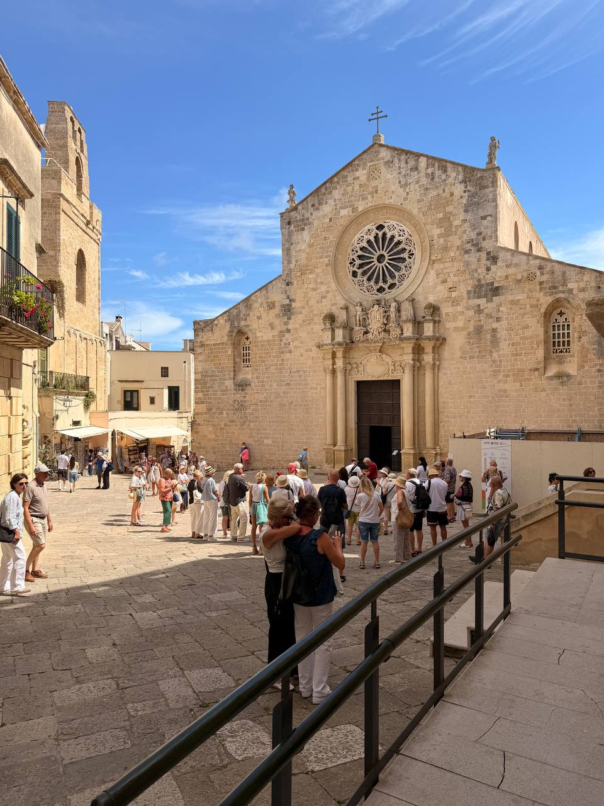
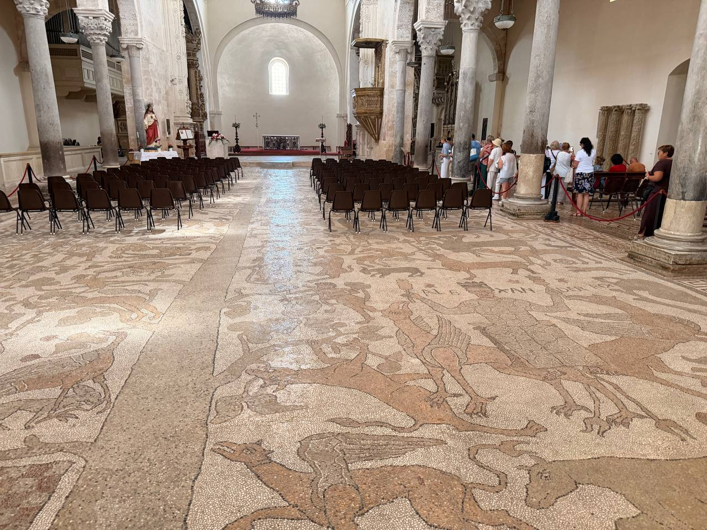
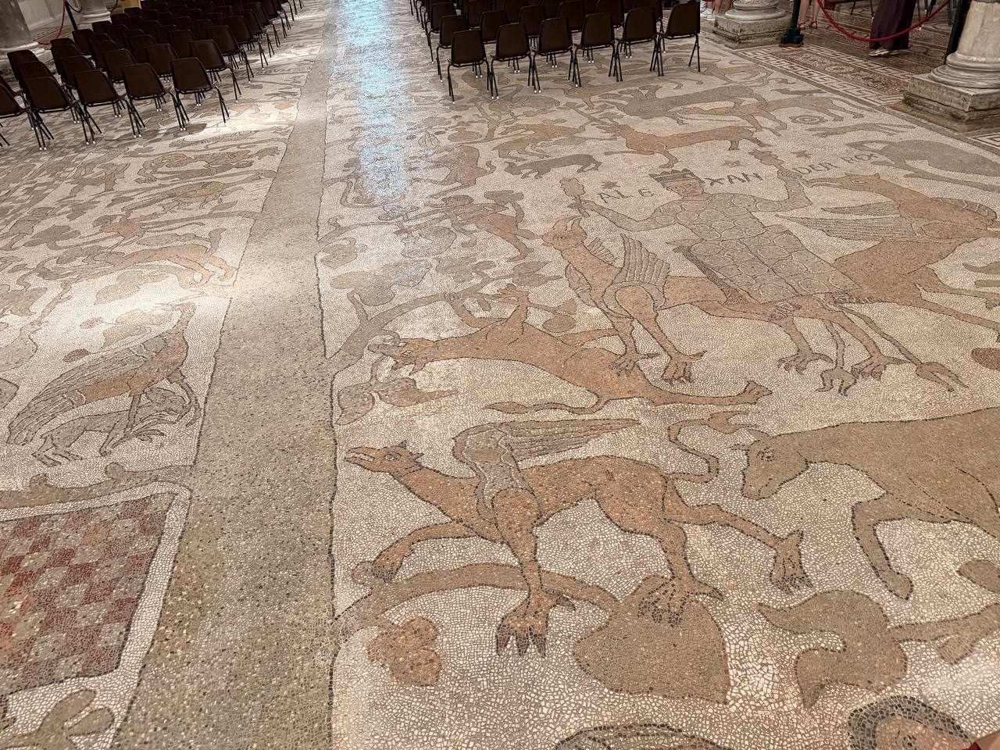

**Otranto Cathedral**, officially the **Basilica of the Annunciation of the Virgin Mary**, is the great sacred center of Otranto: a Roman Catholic cathedral in the Apulian city, consecrated in **1088**, and the archiepiscopal seat of the **Archdiocese of Otranto**. It is also one of those buildings where history refuses to arrive in a single tidy layer. Early Christian, Byzantine, and Romanesque elements all remain in conversation with one another, while the facade’s rose window and the interior’s wooden coffered ceiling keep the eye from settling too easily in one century.

The heart of the place, though, is the floor.

{fig-alt="The pale stone facade of Otranto Cathedral with a large rose window, an open doorway, and visitors gathered in the sunlit square outside."}

## The Tree of Life underfoot

The nave holds an immense 12th-century floor mosaic created by the monk **Pantaleone**. It is not a small devotional panel, not a decorative border, and not a museum object safely isolated behind glass. It is a world laid into the floor: the **Tree of Life**, biblical scenes, animals, monsters, historical figures, legendary matter, and the kind of medieval visual intelligence that assumes sacred space can also be an encyclopedia.

A cathedral floor is usually something you cross on the way to the altar. Here it insists on being read.

{fig-alt="The interior of Otranto Cathedral with rows of chairs and columns above a broad medieval floor mosaic filled with animals, figures, and branching forms."}

A source check notes that the pavement mosaic was executed in **1163–1165**, under a group headed by **Pantaleone / Pantaleon**, a Basilian monk from the monastery of San Nicola di Casole near Otranto. The scenes are arranged alongside the Tree of Life and include Old Testament episodes, bestiary imagery, chivalric and legendary material, and the Alexander Romance. That mix is worth remembering: the floor is not just decoration, but a medieval system for holding many kinds of knowledge in one sacred space.

There is also the paradox of the thing: this priceless work of art is still a **floor**, walked by thousands and thousands of people. Apparently that use is not merely tolerated but bound up with its preservation. The stone absorbs the salt and salt air; covering it, however protective it might sound to modern museum instinct, would apparently ruin it. A very old object survives not by being sealed away from human passage, but by remaining in contact with place, air, feet, and the conditions that made it.

{fig-alt="A close view of Otranto Cathedral's floor mosaic showing stylized animals and branching shapes made from small pale, tan, and reddish stone tesserae."}

## Martyrs, architecture, and memory

The cathedral is not only the Tree of Life mosaic. The **Chapel of the Martyrs** houses the remains of **813 local inhabitants** who were beheaded by the Ottoman Turks in **1480** for refusing to convert to Islam. That history gives the building another register altogether: not only visual splendor, but civic memory, violence, faith, and endurance.

The architecture carries its own layered testimony. The structure blends early Christian, Byzantine, and Romanesque elements, with the rose window outside and the wooden coffered ceiling inside framing the encounter between stone, story, and worship. It is a cathedral, a basilica, an archive, and a warning against thinking that a beautiful floor is merely a beautiful floor.

For planning a visit, check opening times and liturgical schedules directly on the **Archdiocese of Otranto** website.

The rest of June 15 — harbor lunch, Punta Palascia / Cape Otranto, and Porto Badisco — now lives in a separate day post: [Otranto Harbor, Punta Palascia, and Porto Badisco](otranto-harbor-punta-palascia-porto-badisco.qmd).

## Notes to expand

- **Official identity:** Otranto Cathedral, officially the Basilica of the Annunciation of the Virgin Mary.
- **Status:** Roman Catholic cathedral; archiepiscopal seat of the Archdiocese of Otranto.
- **Consecration:** 1088.
- **Core image:** Tree of Life mosaic by Pantaleone, covering the nave floor.
- **Mosaic date:** 12th century; source check gives 1163–1165.
- **Mosaic themes:** Tree of Life, biblical scenes, bestiary imagery, historical figures, legendary/chivalric material, and moral imagination.
- **Martyrs:** Chapel of the Martyrs holds remains of 813 Otranto inhabitants beheaded by Ottoman Turks in 1480 for refusing conversion.
- **Architecture:** early Christian, Byzantine, and Romanesque elements; rose window; wooden coffered ceiling.
- **Visit planning:** check Archdiocese of Otranto website for opening times and liturgical schedules.
- **Still needed:** Dan’s own sensory details — guide, light, crowd, cathedral atmosphere, what stood out beyond the mosaic, and the feel of walking over a medieval floor that remains a floor.
