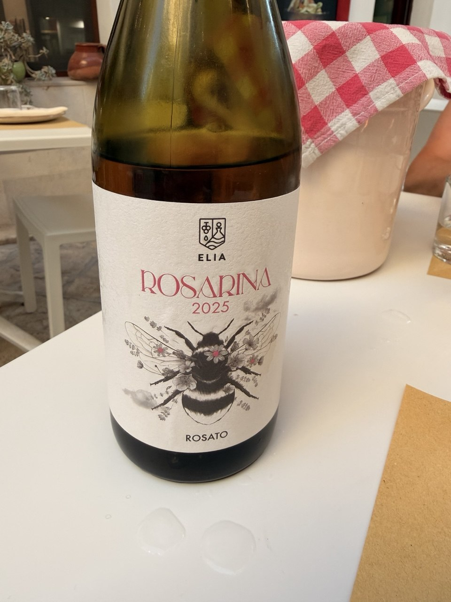

We got back from Puglia yesterday, and before we lose the thread, we should write down what we learned about the wine — specifically the rosé, which turned out to be the story of the whole trip.

We knew Puglia had rosé. We didn't know it had *this much rosé*, or that it had been doing serious rosé before Provence made it fashionable. The famous Five Roses from Leone de Castris, bottled in 1943, is often cited as Italy's first commercially important rosato. That's not a quirky footnote — it tells you something about how deeply rosé is woven into the region's wine culture.

Here is what we found worth knowing. For the actual bottles we drank and photographed, see the running ledger: [Wines of the Trip](../italy-wine-notes.qmd).

{fig-alt="A bottle labeled Elia Rosarina 2025 Rosato stands on a white table, with a bee illustration on the label, a red-and-white check cloth over a container behind it, water drops on the tabletop, and glasses and place settings nearby."}

## The Grapes

| Grape | Where in Puglia | Rosé Color | Typical Flavors | Structure |
|-------|----------------|------------|-----------------|-----------|
| Negroamaro | Salento, Lecce, Brindisi | Deep salmon to cherry pink | Cherry, raspberry, pomegranate, herbs | Medium-bodied, savory |
| Primitivo | Manduria, Gioia del Colle | Bright pink | Strawberry, watermelon, spice | Fuller, richer |
| Susumaniello | Brindisi | Pale to medium pink | Red currant, citrus, rose petals | Fresh, elegant |
| Bombino Nero | Castel del Monte | Pale salmon | Strawberry, peach, flowers | Light and delicate |
| Nero di Troia | Northern Puglia | Medium pink | Cranberry, wild berries, herbs | Structured, mineral |
| Malvasia Nera | Throughout Salento | Usually blended | Plum, violets | Softens blends |

## Negroamaro — The One You'll See Everywhere

This is the signature grape for Puglian rosé, and the name is a little misleading — "black and bitter" — because the rosés are vibrant and food-friendly, not harsh. What you get:

- Cherry and raspberry fruit
- Mediterranean herbs
- A slight savory bitterness on the finish
- Enough body to actually pair with food

Think Provence rosé with more personality. It's great with seafood pasta, burrata, grilled octopus, pizza — basically everything you're going to eat in Puglia.

Look for: Five Roses (Leone de Castris), Salice Salentino Rosato DOC.

## Primitivo — Rich and Fruity

Primitivo is genetically almost identical to Zinfandel, which we did not know going in. In rosé form it becomes much fresher than you'd expect — strawberry, watermelon, red cherry, white pepper, with a fuller mouthfeel and slightly higher alcohol than a typical Provence pour.

Think: White Zinfandel's sophisticated Italian cousin. Works well with charcuterie, grilled pork, tomato dishes. Wines from Manduria tend to be bigger than those from Gioia del Colle.

## Susumaniello — The One Worth Seeking Out

Nearly extinct not long ago, Susumaniello is now one of Puglia's most exciting grapes. The rosé is pale to medium pink and tastes like red currants, pink grapefruit, rose petals, and a salty sea-breeze minerality. Less heavy than Primitivo, more elegant than Negroamaro.

Think: somewhere between Provence and Etna rosé. Fantastic with shellfish, raw tuna, shrimp risotto.

Look for: Tenute Rubino Susumaniello Rosato.

## Bombino Nero — Light and Floral

The grape of the Castel del Monte Rosato DOC. Bombino Nero gives color quickly without excessive tannin, which makes it ideal for pale, delicate rosés — wild strawberry, peach, white flowers, citrus. Light body, crisp acidity. Think Italian rosé with a touch of Pinot Noir character.

Look for: Rivera Pungirosa.

## Nero di Troia — The Structured One

Common in northern Puglia. Cranberry, red cherry, herbal notes, mineral finish. These rosés can actually age, and they have more tannic structure than anything else in the category. Think rosé with some of the seriousness of a red wine.

## The Regional Styles

| Style | Grape | Character |
|-------|-------|-----------|
| Salento | Negroamaro | Darker pink, savory, best with meals |
| Manduria | Primitivo | Rich, fruity, higher alcohol |
| Brindisi | Susumaniello | Fresh and elegant |
| Castel del Monte | Bombino Nero | Pale, refined |

## Bottles Worth Seeking Out

**Easier to find:**

- Leone de Castris Five Roses — the Negroamaro blend that started it all

**More serious:**

- Cantele Negroamaro Rosato
- Tormaresca Calafuria
- Tenute Rubino Susumaniello Rosato
- Rivera Pungirosa (Bombino Nero)
- Varvaglione 12 e Mezzo Rosato

## Puglia vs. Provence

One thing that kept coming up: Puglian rosato isn't really an aperitif wine. Compared to Provence:

| | Provence | Puglia |
|-|----------|--------|
| Color | Pale | Often deeper pink |
| Fruit | Delicate | Riper |
| Body | Very light | More texture |
| Character | Mineral | Savory and herbal |
| Role | Poolside sipper | Built for food |

Puglia's rosé is less about looking good on a terrace and more about sitting down to a meal — which suits the food perfectly. It might be one of Italy's most underrated wine styles, and we say that having now drunk a fair amount of it at lunch.
