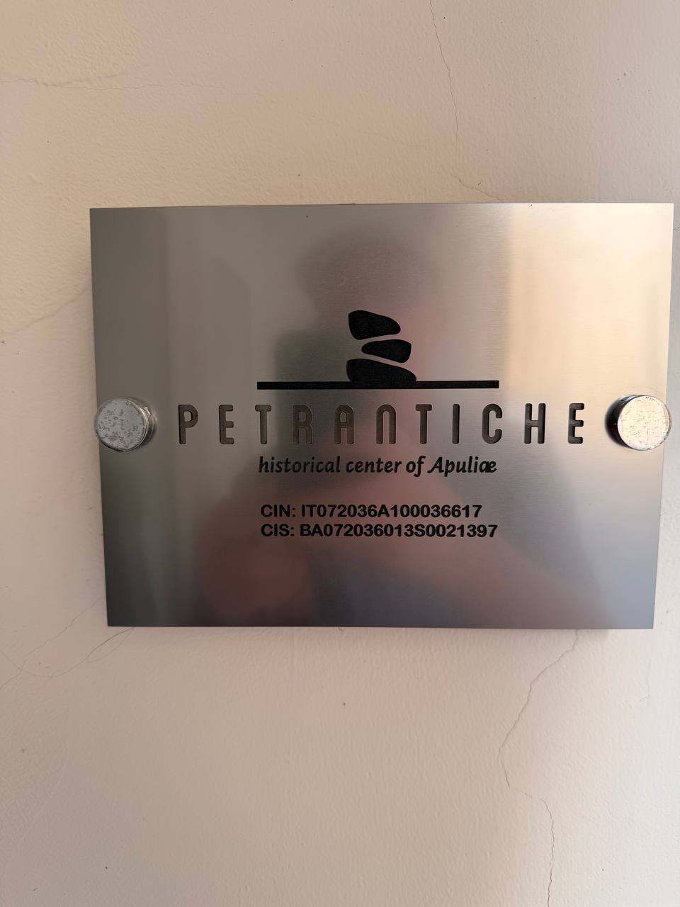
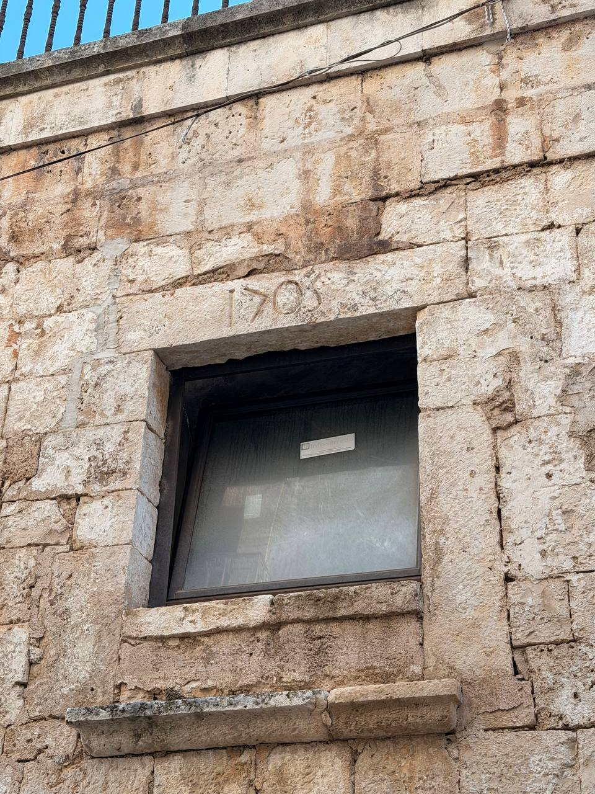
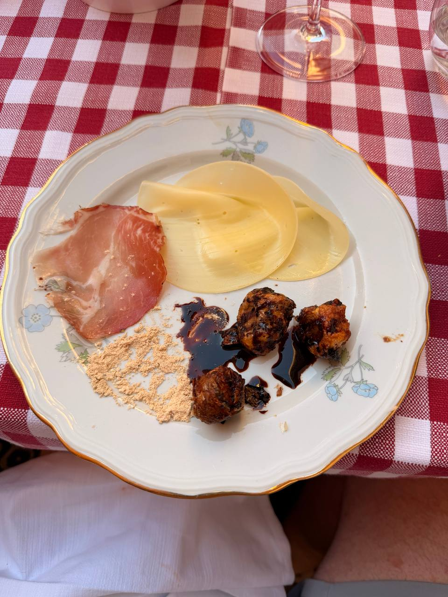
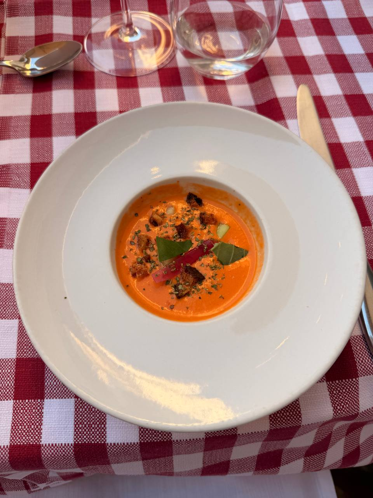
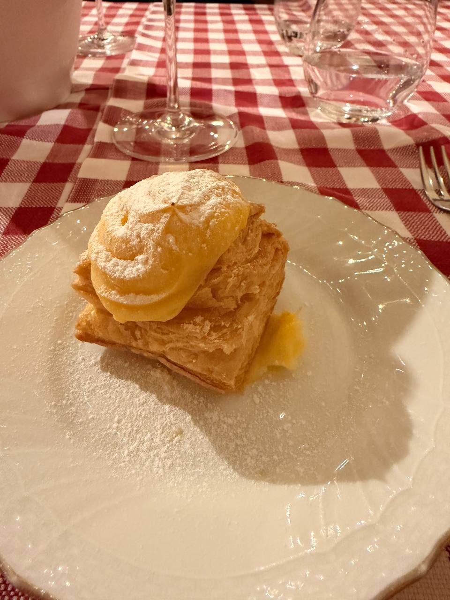

After Matera, the last full night came back to **Putignano** for the group dinner at **Osteria Botteghe Antiche**, **Piazza Plebiscito 8**. The piazza is the heart of old town, with a few bars and restaurants directly in it, and **San Pietro Apostolo** nearby — considered the main church of Putignano. The original church dated to around the year **1000**, but by the fifteenth century it had become too old, too dilapidated, and too small for the town's needs. In **1477**, it was rebuilt by **Balì Carafa**, the local ruler from the **Knights of Jerusalem**, later the Knights of Malta.

The order's name carries a great deal of medieval geography in a small phrase. The **Knights Hospitaller** began as the Order of St. John in Jerusalem, built around a hospital for pilgrims and recognized by Pope Paschal II in **1113**. After the Crusader states fell, the order shifted its base westward: first through Cyprus and Rhodes, and then to **Malta** in the sixteenth century. So “Knights of Jerusalem” and “Knights of Malta” are not two unrelated groups, but different historical names for the same long-lived Catholic military-hospitaller order as its center of gravity moved across the Mediterranean.

That gave the square more weight than a pleasant dinner setting alone would have done. Piazza Plebiscito was not just a convenient place to eat; it was the old town's center of gravity, with the church, the bars, the restaurants, and the Friday-night life all gathered together. The square was full of people and families, warm, lively, and inviting: a truly marvelous place for the last night of the trip.

Our own lodging in Putignano had already been making the same point in a quieter way. The sign read **Petrantiche**, historical center of Apulie — a very modern metal plaque for a place built into old stone.

{fig-alt="A brushed metal wall plaque for Petrantiche, with the words historical center of Apulie and registration numbers below, mounted on a pale interior wall."}

Then there was the window inscription: **1702**, not as the building's beginning, but as a marker of when it had been updated. Once that one appeared, others began to show up too. Putignano was not performing oldness for visitors; it was simply old, and the stones kept saying so if one bothered to look.

{fig-alt="A weathered stone wall in Putignano with a dark window set into it and the number 1702 carved above the window opening."}

We ate outside with the group: red-and-white checked tablecloths, wine glasses, the old town around us, and the trip beginning to understand that it was almost over.

The most interesting plate was the one with the fried “balls.” They turned out to be **hyacinth bulbs** — not meatballs, not croquettes, not some harmless anonymous fritter, but bulbs. This is why one takes notes. Italy can still produce a small culinary ambush after two weeks of evidence.

{fig-alt="A plate on a red-and-white checked tablecloth holds a slice of cured meat, several pale round slices of cheese, a small pile of tan powder, dark sauce, and three browned fried hyacinth bulbs, with a wine glass above the plate."}

There was also a bright orange soup or sauce course, served in a broad white bowl with herbs, small crisp bits, and red and green garnish. The exact name can wait for a menu or memory to rescue it; visually, it belongs to the same final-night table.

{fig-alt="A wide white bowl on a red-and-white checked tablecloth holds a small pool of bright orange soup or sauce, topped with herbs, crisp browned bits, and red and green garnish, with wine and water glasses above the bowl."}

Dessert was pastry, powdered sugar, and yellow cream: a square layered pastry base with a curled yellow topping, served on a pale plate under the indoor-or-evening restaurant light. A proper sweet ending, and less alarming than the bulbs.

{fig-alt="A square layered pastry dessert dusted with powdered sugar sits on a pale plate, topped with curled yellow cream, with red-and-white checked tablecloth, wine glass, water glasses, and fork around it."}

The wine from this dinner is entered separately in the running ledger: [Tormaresca Calafuria Salento IGT 2023](../italy-wine-notes.qmd). The bottle did its archival duty. The hyacinth bulbs did the stranger work of making the meal memorable.

## Notes to expand

- **Date:** Friday, June 19, 2026 — final full night of the trip.
- **Place:** Osteria Botteghe Antiche, Piazza Plebiscito 8, old Putignano.
- **Piazza:** Piazza Plebiscito, the heart of old town, with bars and restaurants directly in the square.
- **Nearby church:** San Pietro Apostolo, considered the main church of Putignano; original church dated to around the year 1000; rebuilt in 1477 by Balì Carafa, local ruler from the Knights of Jerusalem / later Knights of Malta, because the earlier church had become too old, dilapidated, and small for the town's needs.
- **Knights context:** Knights of Jerusalem / Knights of Malta refers to the Knights Hospitaller / Order of St. John: founded around a pilgrim hospital in Jerusalem, papally recognized in 1113, later based successively in Cyprus, Rhodes, and Malta.
- **Lodging:** Petrantiche in Putignano; modern sign at the place we stayed in the historical center.
- **Old-town fabric:** window inscription “1702” marks an update to the building rather than its origin; after noticing it, similar dated inscriptions appeared elsewhere.
- **Setting:** Outdoor group dinner with red-and-white checked tablecloths; Friday night square full of people and families, warm and inviting.
- **Sources checked:** Sovereign Military Order of Malta history page; Wikipedia summary for Knights Hospitaller for the basic Jerusalem → Cyprus/Rhodes → Malta sequence.
- **Key food note:** fried “balls” on the large plate turned out to be hyacinth bulbs.
- **Wine:** Tormaresca Calafuria Salento IGT 2023, already logged in the wine post.
