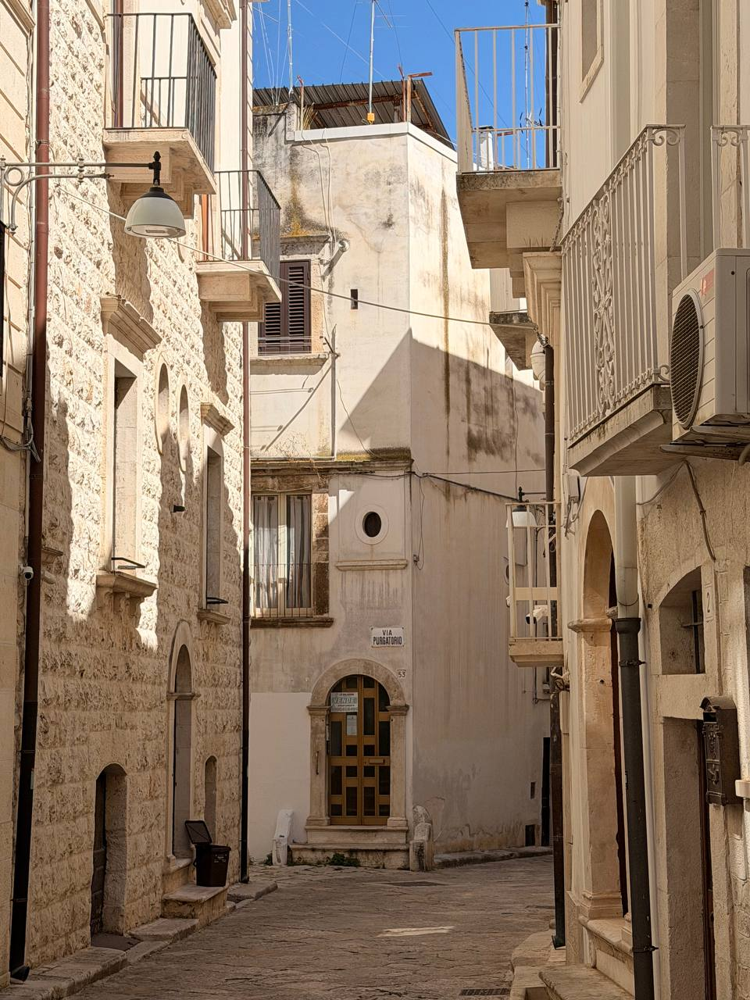

The last morning of the trip began not with a monument, but with the neighborhood: **Via Purgatorio** in Putignano, pale walls, balconies, stone paving, overhead wires, a hard blue sky, and the little street sign doing more theological work than a street sign has any obligation to do.

{fig-alt="A narrow stone-paved street in Putignano under a clear blue sky, lined with pale stone and stucco buildings, small balconies, shuttered windows, wall lamps, overhead wires, and a visible street sign reading Via Purgatorio above an arched doorway."}

After Matera's [Chiesa del Purgatorio](matera-chiesa-del-purgatorio.qmd), the name felt less like coincidence and more like Italy muttering the same theme from another doorway. There was the formal Baroque version in Matera — skulls, souls, intercession, carved theology — and then this quieter Putignano version: a lived-in lane in the neighborhood, with laundry balconies and morning light, carrying the same word into ordinary street life.

That is a fair last-day image. Not the airport, not the boarding pass, not the exhausted march through terminals. A narrow street called Purgatorio, seen before leaving Puglia, with the trip's last morning still bright on the walls.

## Notes to expand

- **Date:** June 20, 2026 — last day of the trip.
- **Place:** Via Purgatorio, Putignano, in our neighborhood.
- **Connection:** echoes the Matera Chiesa del Purgatorio post; purgatory as both formal church subject and ordinary street name.
- **Use:** last-day / departure post; neighborhood image before Brindisi airport and the long trip home.
