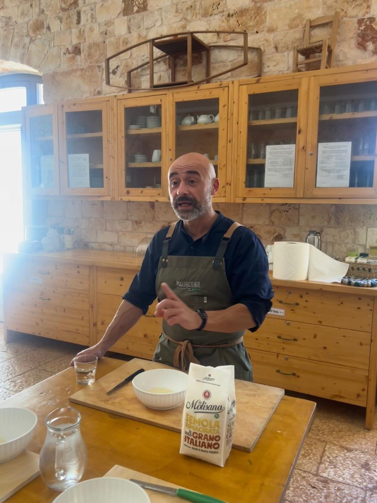

Spelling first, because food deserves that much respect: the pasta is **orecchiette** — "little ears" — not orchietti. This companion note belongs beside the [Courgette Zucchini Cream Sauce](courgette-zucchini-cream-sauce-cooking-class.qmd) recipe because the sauce is only half the lesson. The other half is the flour.

The flour in the cooking-class discussion was **La Molisana Semola Rimacinata di Grano Italiano**: re-milled Italian durum-wheat semolina. This is not the coarse yellow semolina that often turns up in U.S. supermarkets. It is a much finer durum flour, used across southern Italy for fresh pasta, orecchiette, cavatelli, focaccia, and some breads.

{fig-alt="Domenico Bianco stands at a wooden cooking-class table in a stone-walled kitchen, wearing an apron and gesturing while explaining the recipe, with bowls, a knife, water glasses, and a bag of semolina flour in front of him."}

For handmade Pugliese pasta, the useful target is therefore **semola rimacinata** — finely re-milled durum wheat. If the flour is too coarse, the dough can feel gritty and reluctant. If it is too soft and wheat-flour-like, it may lose the firm chew that makes orecchiette worth the trouble.

## Source

- **Ingredient-source note:** Shared ChatGPT conversation, “Semolina Flour Substitutes US,” identifying the cooking-class flour as **La Molisana Semola Rimacinata di Grano Italiano** and listing U.S. substitutes: <https://chatgpt.com/s/t_6a3a7ec104d48191aa1af57943827c8b>.
- **Trip context:** June 18, 2026 cooking class / food experience during the Strada Toscana Puglia tour; Columbus itinerary context: `daily_itineraries/day-14-2026-06-18-puglia.qmd` and `regions/puglia.qmd`.
- **Related recipe post:** [Courgette Zucchini Cream Sauce](courgette-zucchini-cream-sauce-cooking-class.qmd).

## Best U.S. Substitutes

### 1. Caputo Semola Rimacinata

This is the cleanest match: imported Italian **semola rimacinata**, fine enough for fresh pasta and close to the flour used in Puglia. If the goal is to reproduce the class as closely as possible, buy this first and stop fussing.

### 2. Central Milling Organic Fine Durum Flour

A strong specialty alternative. It is very finely milled and therefore much closer to Italian rimacinata than ordinary coarse semolina. Good choice when ordering flour online or when buying from a serious baking/pasta supplier.

### 3. King Arthur Semolina Flour

A workable, accessible option. It is generally finer than some supermarket semolina flours and useful for pasta and bread, though it is not quite the same thing as Italian semola rimacinata.

### 4. Bob's Red Mill Semolina Flour

Common and usable, but usually a little coarser than the Italian flour. It can still make pasta, but the dough may need a little extra water and a little patience. These are not moral failings, merely consequences.

## Practical Ranking for Orecchiette

For trying to reproduce the Puglia cooking-class pasta at home, use this order:

1. **Caputo Semola Rimacinata** — best match.
2. **Central Milling Organic Fine Durum Flour** — excellent fine-durum alternative.
3. **King Arthur Semolina Flour** — good practical substitute.
4. **Bob's Red Mill Semolina Flour** — acceptable, but coarser; adjust water as needed.

## Kitchen Notes

- Look for the words **semola rimacinata** or **fine durum flour**.
- Avoid assuming that every bag labeled “semolina” has the same texture. It does not.
- If the dough feels dry, sandy, or unwilling to come together, add water gradually rather than dumping it in like a barbarian.
- If using a coarser U.S. semolina, expect to knead a little longer and hydrate a little more.
- For orecchiette, the flour should help produce a firm, resilient dough that can be dragged, cupped, and turned without collapsing into paste.
