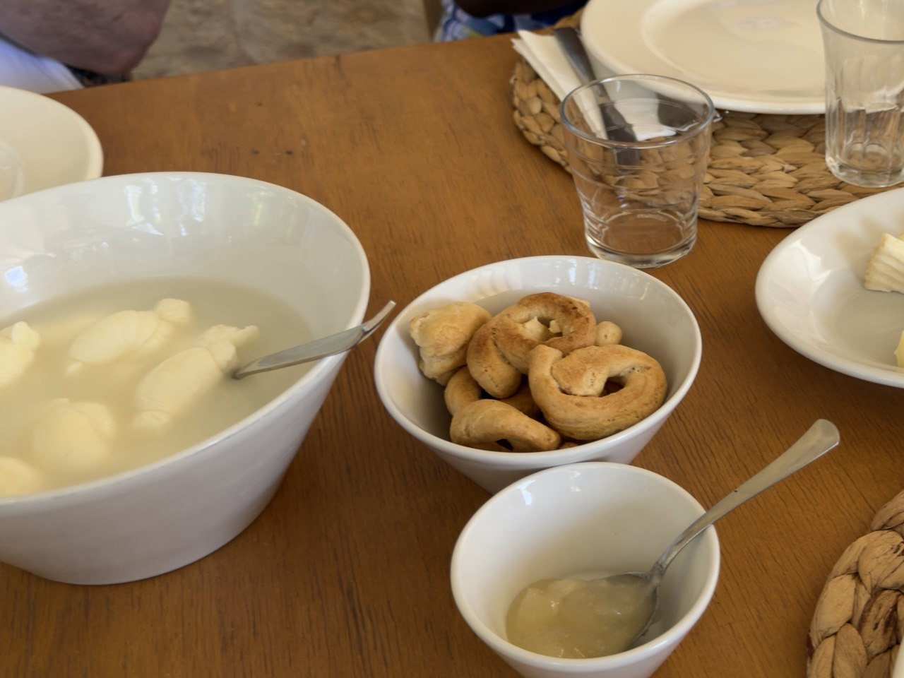
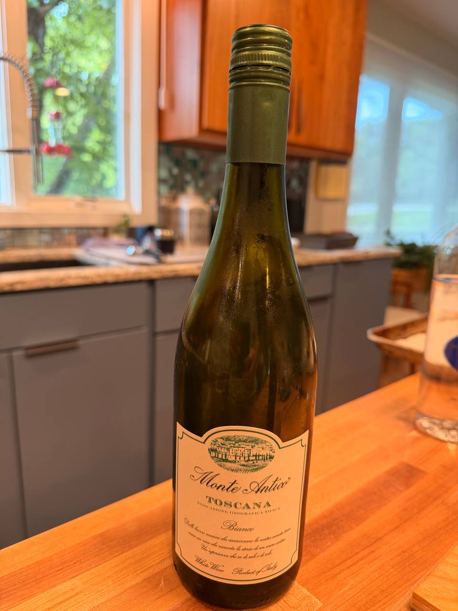
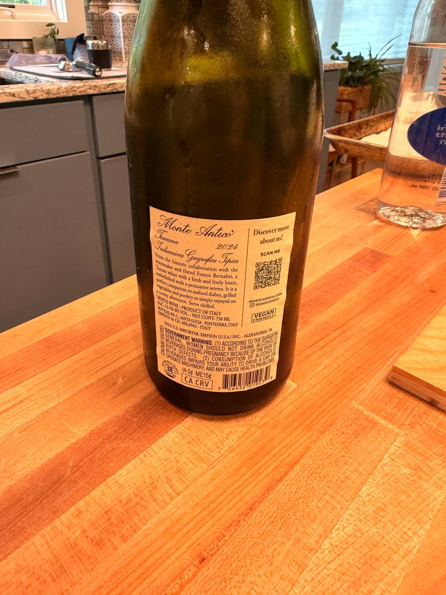

Taralli are the sort of snack that make industrial crackers look ashamed of themselves: rings of flour, olive oil, white wine, and salt, shaped by hand, boiled, dried, and baked until crisp. This version comes from the June 18 Puglia cooking class / food experience.

{fig-alt="A white bowl of golden-brown ring-shaped taralli sits on a wooden table beside a large white bowl with pale food in liquid, a smaller bowl with a spoon, drinking glasses, white plates, and woven placemats."}

## Source

- **Original class recipe source:** Domenico Bianco, “Taralli,” in **PK recipes**, PDF created in Canva, dated May 8, 2026.
- **Additional classic plain taralli recipe:** Giovanni Siracusa.
- **Wine note:** [Monte Antico Bianco Toscana IGT](https://monteantico.com/monte-antico-bianco/) technical sheet, consulted for varietals and producer notes.
- **Trip context:** June 18, 2026 cooking class / food experience during the Strada Toscana Puglia tour; Columbus itinerary context: `daily_itineraries/day-14-2026-06-18-puglia.qmd` and `regions/puglia.qmd`.
- **Original PDF:** [PK Taralli recipe](files/pk-taralli-recipe.pdf)

## Ingredients

- 500 g flour — a mix of not-strong flours, such as whole wheat flour, type 1 flour, and 00 flour
- 180 g extra-virgin olive oil — about 35–38% of the flour weight
- 200 g white wine — about 40% of the flour weight; the source notes to add 20 g more because some may be reduced during boiling
- 10 g salt

The source notes that the oil and wine quantities can change depending on the flour. If using more whole wheat flour relative to 00 flour, reduce the oil to about **150 g** and increase the wine to about **220 g**.

## Preparation

### 1. Make the dough

In a large bowl, pour in the flour, olive oil, and salt. Add the wine while mixing with a fork or by hand.

When the dough comes together in the bowl, move it to a kneading board. Work the dough with strength but slowly until it is smooth. Cover with kitchen film and a tea towel.

### 2. Rest and shape

After the dough rests for **10 minutes**, take a piece of dough and roll it by hand on the board into a large, thick rope.

Cut the rope into large cube-like pieces. Roll each piece by hand into a rope about as thick as a middle finger, then close it into a ring.

Put the shaped taralli on a large tray covered with baking foil. Continue until all the dough is shaped.

### 3. Boil

In a large saucepan, bring **5 litres water** to a boil.

Once boiling, add about **10 taralli at a time**. Stir gently with a spoon. Wait for the taralli to rise naturally to the surface, then quickly remove them from the water.

Place the boiled taralli on a large surface covered with baking paper — a baking tray, large plate, or kneading board. Continue boiling the taralli in batches of 10.

### 4. Dry

Leave the boiled taralli to dry in a ventilated place, or in the kitchen with a slightly open window, for at least **2 hours**, until quite dry.

### 5. Bake

Bake at **190°C** for **20–30 minutes**, depending on the oven.

## Giovanni Siracusa's classic plain taralli

Giovanni Siracusa's version is the classic plain taralli formula: 00 flour, dry white wine, extra-virgin olive oil, and sea salt. The base recipe can take fennel seeds, black pepper, rosemary, or chili flakes if you want a flavored batch. This quantity makes around **100 taralli**.

### Ingredients

- 1000 g 00 flour
- 360 g dry white wine
- 220 g extra-virgin olive oil
- 20 g sea salt

### Directions

1. Add the flour to a large bowl and create a well in the center. Mix the olive oil, white wine, and salt together, then pour into the well and start incorporating the flour.
2. If using a stand mixer, add the oil, wine, and salt first, then gradually add the flour.
3. Work the dough for about **10 minutes**, until smooth. Let it rest for **10 minutes**.
4. Roll small pieces of dough into thin ropes and shape them into rings.
5. Flash-boil the taralli in batches for about **1 minute**, then drain them on a cloth.
6. Transfer to a parchment-lined baking sheet and bake at **375°F (190°C)** for **25–30 minutes**, until golden and crispy.

## Wine note: Monte Antico Bianco Toscana IGT 2024

Dan marked this as a good taralli wine, with the important household warning that drinking it gives him a massive headache. The bottle in the photos is **Monte Antico Bianco Toscana IGT 2024**, 12.5% ABV, imported by Empson (U.S.A.) Inc. The producer's technical sheet identifies the blend as **Trebbiano, Malvasia, and Vermentino**. That makes sense with taralli: Trebbiano for lemony acidity, Vermentino for salt and coastal snap, and Malvasia for the aromatic lift.

{fig-alt="Front view of a green screwcap bottle labeled Monte Antico Toscana Bianco Indicazione Geografica Tipica on a wooden kitchen counter."}

{fig-alt="Back view of the Monte Antico Bianco Toscana IGT 2024 bottle showing label text, a QR code, 12.5 percent alcohol by volume, 750 ml, importer information, and a government warning."}

## Notes

- The boil-and-dry step is not ornament. It gives taralli their proper texture.
- The dough should be smooth before shaping; rough dough will make a rough ring, and then everyone must pretend not to notice.
- Flour choice matters. Whole wheat absorbs differently, so the recipe gives sensible room to adjust oil and wine.
- Giovanni Siracusa's plain version uses all 00 flour and a larger batch size; the cooking-class version above keeps the flour mix more flexible.
- Monte Antico Bianco is a useful pairing note, but not a painless one for Dan. File under “good with taralli; approach with suspicion.”
