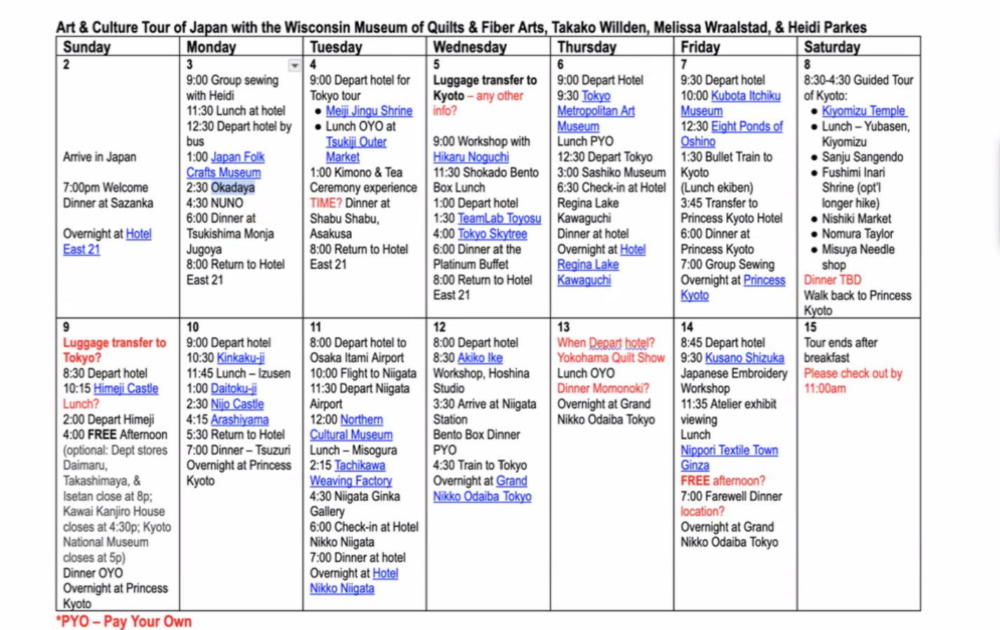

# Art & Culture Tour of Japan

### **Wisconsin Museum of Quilts & Fiber Arts, Takako Willden, Melissa Wraalstad, & Heidi Parkes**

(This schedule is preliminary as of September 22, 2025)

## Week 1

### Sunday, November 2

-   **Arrive in Japan**
-   7:00pm Welcome Dinner at Sazanka
-   Overnight at Hotel East 21

### Monday, November 3

-   9:00 Group sewing with Heidi
-   11:30 Lunch at hotel
-   12:30 Depart hotel by bus
-   **Japan Folk Crafts Museum**
-   2:30 Okadaya
-   4:30 NUNO
-   6:00 Dinner at Tsukishima Monja Jugoya
-   8:00 Return to Hotel East 21

### Tuesday, November 4

-   9:00 Depart hotel for Tokyo tour
-   **Meiji Jingu Shrine**
-   Lunch OYO at Tsukiji Outer Market
-   1:00 Kimono & Tea Ceremony experience
-   **TIME? Dinner at Shabu Shabu, Asakusa**
-   8:00 Return to Hotel East 21

### Wednesday, November 5

-   **Luggage transfer to Kyoto** - any other info?
-   9:00 Workshop with Hikaru Noguchi
-   11:30 Shokado Bento Box Lunch
-   1:00 Depart hotel
-   1:30 **TeamLab Toyosu**
-   4:00 **Tokyo Skytree**
-   6:00 Dinner at the Platinum Buffet
-   8:00 Return to Hotel East 21

### Thursday, November 6

-   9:00 Depart Hotel
-   9:30 **Tokyo Metropolitan Art Museum**
-   Lunch PYO
-   12:30 Depart Tokyo
-   3:00 **Sashiko Museum**
-   6:30 Check-in at Hotel Regina Lake Kawaguchi
-   Dinner at hotel
-   Overnight at Hotel Regina Lake Kawaguchi

### Friday, November 7

-   9:30 Depart hotel
-   10:00 **Kubota Itchiku Museum**
-   12:30 **Eight Ponds of Oshino**
-   1:30 Bullet Train to Kyoto (Lunch ekiben)
-   3:45 Transfer to Princess Kyoto Hotel
-   6:00 Dinner at Princess Kyoto
-   7:00 Group Sewing
-   Overnight at Princess Kyoto

### Saturday, November 8

-   8:30-4:30 Guided Tour of Kyoto:
    -   **Kiyomizu Temple**
    -   Lunch – Yubasen, Kiyomizu
    -   **Sanju Sangendo**
    -   **Fushimi Inari Shrine** (opt'l longer hike)
    -   **Nishiki Market**
    -   **Nomura Taylor**
    -   **Misuya Needle shop**
-   **Dinner TBD**
-   Walk back to Princess Kyoto

## Week 2

### Sunday, November 9

-   **Luggage transfer to Tokyo**
-   8:30 Depart hotel
-   10:15 **Himeji Castle**
-   Lunch?
-   2:00 Depart Himeji
-   4:00 **FREE Afternoon** (optional: Dept stores Daimaru, Takashimaya, & Isetan close at 8p; Kawai Kanjiro House closes at 4:30p; Kyoto National Museum closes at 5p)
-   Dinner OYO
-   Overnight at Princess Kyoto

### Monday, November 10

-   9:00 Depart hotel
-   10:30 **Kinkaku-ji**
-   11:45 Lunch – Izusen
-   1:00 **Daitoku-ji**
-   2:30 **Nijo Castle**
-   4:15 **Arashiyama**
-   5:30 Return to Hotel
-   7:00 Dinner – Tsuzuri
-   Overnight at Princess Kyoto

### Tuesday, November 11

-   8:00 Depart hotel to Osaka Itami Airport
-   10:00 Flight to Niigata
-   11:30 Depart Niigata Airport
-   12:00 **Northern Cultural Museum**
-   Lunch – Misogura
-   2:15 **Tachikawa Weaving Factory**
-   4:30 **Niigata Ginka Gallery**
-   6:00 Check-in at Hotel Nikko Niigata
-   7:00 Dinner at hotel
-   Overnight at Hotel Nikko Niigata

### Wednesday, November 12

-   8:00 Depart hotel
-   8:30 **Akiko Ike Workshop, Hoshina Studio**
-   3:30 Arrive at Niigata Station
-   **Bento Box Dinner PYO**
-   4:30 Train to Tokyo
-   Overnight at Grand Nikko Odaiba Tokyo

### Thursday, November 13

-   **When Depart hotel?**
-   **Yokohama Quilt Show**
-   Lunch OYO
-   **Dinner Momonoki?**
-   Overnight at Grand Nikko Odaiba Tokyo

### Friday, November 14

-   9:45 Depart hotel
-   9:30 **Kusano Shizuko Japanese Embroidery Workshop**
-   11:35 Atelier exhibit viewing
-   Lunch
-   **Nippori Textile Town Ginza**
-   **FREE afternoon?**
-   7:00 **Farewell Dinner location?**
-   Overnight at Grand Nikko Odaiba Tokyo

### Saturday, November 15

-   **Tour ends after breakfast**
-   Please check out by 11:00am

------------------------------------------------------------------------

**Note:** *PYO = Pay Your Own*

**Items in red text from original:** Times and locations marked as tentative or requiring confirmation
