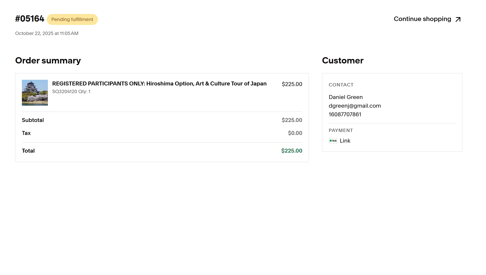

## Hello Everyone!

I'm excited to be bringing this group on the Hiroshima option. It'll be a whirlwind (and brief!) trip, but I think it'll be an exciting one. There are 8 of us going on this optional excursion.

**Registration Link:** <https://www.wiquiltmuseum.com/products/japan-trip-nov-2025-hiroshima-option>

Please pay using this link as soon as possible. Fortunately, the exchange rates and bullet train tickets were not as expensive as we initially anticipated, so the cost per person is only **\$225**, not \$275 as we initially thought.

## Important Information

1.  We are all still seeing Himeji Castle. When the main group heads to lunch after the Castle visit, we will head to the train station to catch our train to Hiroshima.

2.  We will be getting Bento box lunches at the train station (I'll give you yen).

3.  Our itinerary for the day is pretty tight in order to see the Hiroshima Peace Memorial Museum, Peace Park, and Hiroshima Castle. We'll all agree on times to be back at our meeting places. Please be sure to be on time. See below for details.

4.  Bullet trains do not wait very long. It is crucial we have our belongings/trash from lunch gathered before our stop.

5.  We'll be sharing taxis from the train station to our various stops. I'll provide yen as we'll need to split into a few smaller groups (all going to the same places though!).

6.  Dinner is on your own. You may either pick up another Bento box at the train station or wait until you get back to Kyoto. The train ride is approximately 1.5 hours. Unfortunately, we won't have time to eat in Hiroshima.

7.  Our day officially ends back at the hotel in Kyoto.

## Itinerary

**12:46** - Departing Himeji Station on bullet train

**13:42** - Arriving in Hiroshima

-   Take a taxi (10 min) to the Memorial Museum
-   Group will divide into 2 or 3 taxis (I'll give you yen for ride)

**14:00-15:30** - Peace Memorial Museum

-   Ticket entry time is 14:00

**15:30-16:00** - Peace Park & Atomic Bomb Dome

-   10 min walk from the museum

**16:30-17:30** - Hiroshima Castle

-   Take a taxi (10 min) from Peace Park
-   Group will again divide into 2 or 3 taxis (I'll give you yen for ride)

**17:45** - Depart Hiroshima Castle (latest)

-   Take a taxi (10 min) back to Hiroshima Station

**18:29** - Departing Hiroshima Station on bullet train

**20:13** - Arriving in Kyoto

-   Taxi back to hotel (group will divide into 2 or 3 taxis & I'll give you yen for ride)

## DJG Trip Receipt

